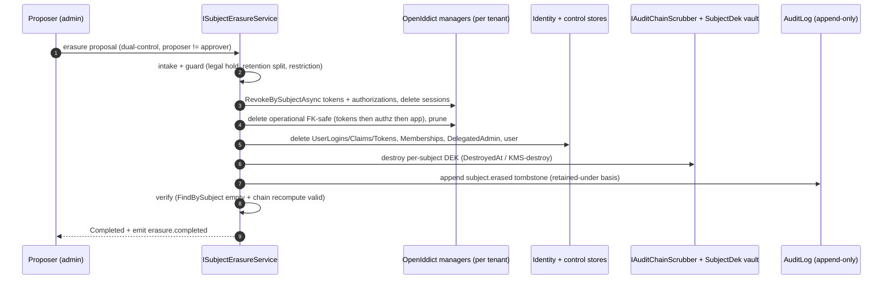
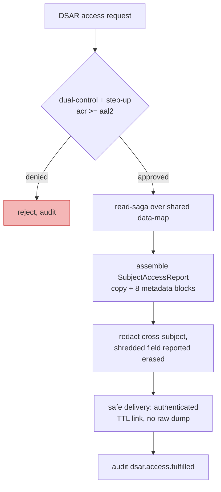
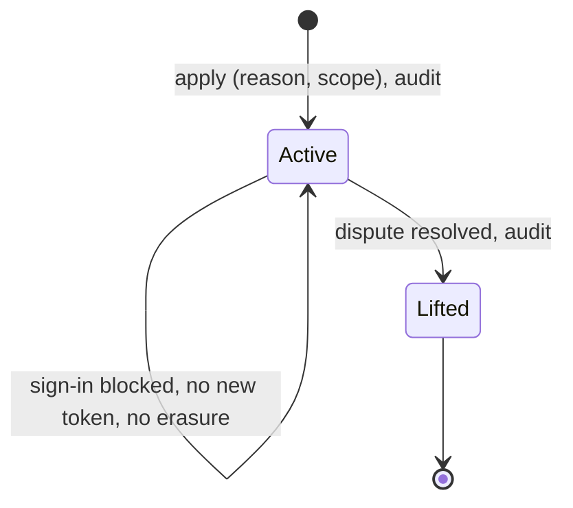

# Erasure and data-subject rights (detailed design)

## Purpose and scope

How Nami satisfies a data subject's rights against an append-only, hash-chained
audit plane that cannot be deleted, and how it produces the evidence the operator's
privacy obligations require. This design builds the **mechanism only**; it does
**not** claim GDPR (or any regime's) compliance, and the controlling policy is
whatever the DPO and Legal ratify (ADR-0016, ADR-0053, ADR-0054).

In scope: the right-to-erasure orchestration (`ISubjectErasureService`) and how it
drives the audit crypto-shred without breaking tamper-evidence; the data-subject-rights
suite (access, portability, rectification, restriction, objection); demonstrable
consent receipts; the breach and record-keeping hooks (Art.33/34/30/35); and the
cross-border transfer register and jurisdiction profile.

Out of scope, referenced not redefined: the audit hash-chain, the `IAuditChainScrubber`
three-mode model, and the `SubjectDek` vault schema ([03 audit](03-audit.md),
[02 data](02-data.md)); the dual-control proposal state machine and executor registry
([12 Admin API](15-admin-api.md)); key escrow, destruction, and the DP-key
delete-is-irreversible caveat ([09 key management](12-key-management.md)); the
revoke-by-subject and force-logout primitives ([10 revocation](13-revocation-caching.md),
[08 UI](11-login-consent-ui.md)); the self-service profile-edit and change-email
mechanics ([06 user management](08-user-management.md)); and tenant
provisioning, deprovisioning, suspension, and residency-aware **placement**
([13 tenant lifecycle](18-tenant-lifecycle.md)).

## Decisions realized

| Decision | What this design applies |
|---|---|
| ADR-0016 | Chain-over-commitments erasure: hard-delete the identity/control/operational planes; on the audit plane, crypto-shred (default) or keep PII outside the chain (schema target), never delete a row; the `ISubjectErasureService` saga order |
| ADR-0053 | The data-subject-rights suite (Art.15/16/18/20/21), consent receipts (Art.7(1)), and the breach/record hooks (Art.33/34/30/35), all reusing the erasure data-map, the audit chain, dual-control, and email |
| ADR-0054 | The cross-border transfer register and the per-jurisdiction profile (transfer rule, sensitive-data categories, breach authority/deadline) that bounds what personal data crosses a border |
| ADR-0008 (ref) | The append-only chain, `RecordHash` format, and INSERT/SELECT-only grant that the crypto-shred must preserve |
| ADR-0013 (ref) | Step-up (RFC 9470) required before an access export or a sensitive rectification |

## Component and interface design

### The shared subject data-map

Erasure and access walk the **same** data-map, so it is defined once and shared by
`ISubjectErasureService` and `ISubjectDataExportService`. Nami is **not**
event-sourced (only the audit log is append-only), so the first three planes
hard-delete and only the audit plane needs special handling.

| Plane | Store (DbContext) | Personal data | Disposition |
|---|---|---|---|
| Global identity | `IdentityDbContext`: AspNetUsers, UserClaims, UserLogins, UserTokens | yes | hard delete |
| Global control | `ControlPlaneDbContext`: Memberships, DelegatedAdmin, ServerSideSessions | yes | delete / revoke |
| Tenant operational | `OpenIddictDbContext` per Pool/Silo: Authorizations (consent), Tokens | yes | revoke then prune |
| Audit | `ControlPlaneDbContext`: AuditLog (append-only hash-chain) | yes (subject-bearing columns) | crypto-shred, never delete |

### `ISubjectErasureService` (idempotent, resumable saga)

The order is load-bearing (ADR-0016) and each step is check-then-act with a per-plane
checkpoint so a retry resumes rather than repeats:

1. **Intake and guard.** Record an `ErasureRequest { RequestId, SubjectId, RequestedAtUtc, Status }`. Consult legal holds, unexpired retention, and any active `ProcessingRestriction`; split the subject's data into an erase-set and a retain-set (the retain-set carries an Art.17(3) basis per record; the split itself is a DPO-policy decision point).
2. **Dual-control gate.** Erasure is destructive and touches PII, so it runs as a non-cascading `data_export`/`iam_change`-class capability with proposer not equal to approver, gated and audited through the proposal workflow ([12 Admin API](15-admin-api.md), [05 authorization](07-authorization.md)). Never autonomous.
3. **Revoke live access first.** For each tenant the subject belongs to (via global Memberships), set the tenant context (Pool filter or Silo connection) and call `RevokeBySubjectAsync` on the authorization and token managers, then delete the subject's server-side sessions. This runs before any delete because an OpenIddict application's tokens have no cascade and would keep validating if the row were removed first ([02 data](02-data.md)); revoke-before-delete is a security requirement, not cleanup.
4. **Delete tenant-operational data**, FK-safe and in one transaction: tokens then authorizations then application, per Pool/Silo ([02 data](02-data.md)), with a Quartz prune to finalize (the prune's `MinimumTokenLifespan` exceeds the 8h refresh ceiling, at least 24 hours, [04 core protocol](04-core-protocol.md)).
5. **Delete global identity and control data**: UserLogins/UserClaims/UserTokens, Memberships, DelegatedAdmin, then AspNetUsers.
6. **Scrub the audit plane (no row deletion).** Destroy the subject's data-encryption key so the ciphertext in every retained audit row (and every copy of it) becomes permanently unintelligible, then append a `subject.erased` tombstone (subject ref, erased fields, retained-under Art.17(3) basis, timestamp) as chained proof of the erasure. The scrub delegates to the `IAuditChainScrubber` owned by [03 audit](03-audit.md); this saga owns only the ordering and the DEK-destroy trigger.
7. **Verify (mandatory before Completed).** Re-run the subject lookup across every plane and confirm it is empty for the erase-set, and recompute the audit chain to confirm it still validates. Set `Status = Completed` and emit `erasure.completed`.

A tenant that is mid-migration or 503-gated is skipped and retried, never partially erased.

### Audit crypto-shred and the per-subject key

The audit scrub is realized as **key destruction, never a row edit** so the
INSERT/SELECT-only grant and tamper-evidence hold. Three modes are owned and ranked
by [03 audit](03-audit.md) and are not re-ranked here:

- **Crypto-shred (runtime default).** Subject-bearing audit columns (`ActorSub`, `OnBehalfOfSubject`, `ApproverSub`, `ActorChainJson`) are written as ciphertext at insert, so `RecordHash = HMAC_k(PrevHash || canonical(fields))` is computed over the ciphertext and does **not** change when the key is destroyed. Erasure destroys the per-subject key; the chain still verifies.
- **PII-outside-the-chain (schema design target).** Where an event can carry an opaque `SubjectRef` plus a separately deletable mapping instead of embedding PII, it should; the chain then never hashed real PII.
- **Anonymise-in-place (deferred).** A `NotImplemented` opt-in stub only, never the default: keeping the original hash of erased PII is itself a re-identification vector and conflicts with the append-only grant, so it is dominated on every axis and not built in v1.

The per-subject key lives in the `SubjectDek` vault defined by [02 data](02-data.md)
(`SubjectRef` PK, `WrappedDek`, `CreatedAt`, `DestroyedAt`): one DEK per subject,
generated lazily on first audit PII, wrapped by the ADR-0006 keyring master key, and
**never** written to the audit store, its backup, SIEM, or WORM (those hold only
ciphertext). This is a spec that ADR-0006 does not itself define; it is fixed in
[02 data](02-data.md)/[03 audit](03-audit.md), which this design relies on rather than
restates. Destroying the DEK (setting `DestroyedAt`, or a KMS destroy) is what renders
every copy unintelligible, which is how Recital-66 (erasure extends to copies/replicas)
is satisfied without touching a WORM row.

**Legal framing, stated precisely (DPO/Legal ratify).** Crypto-shred is NIST SP 800-88
Rev.2 Cryptographic Erase (the sole Purge-level technique; Rev.1 was withdrawn on
2025-09-26). EDPB Guidelines 02/2025 recognize that destroying the decryption key can
render data unintelligible, but that guidance is a **public-consultation draft**, is
**blockchain-specific**, and is **conditional** (it holds only until the algorithm is
broken or the key is compromised, and it states plainly that "encrypted personal data
is still personal data"); the route the EDPB actually endorses is anonymizing by
deleting the off-chain identifying data. Treating key destruction as Article 17 erasure
in general is therefore the controller's reasoned position for DPO/Legal to ratify, not
a settled data-protection-authority rule, and the residual ciphertext remains personal
data until the key is destroyed. Do not rely on the de-listed older EDPB opinion, and
treat any secondary "authority recognizes crypto-shred" claim as unverified.

### `ILegalHoldService` and `IRetentionPolicy`

The retention schedule that step 1 splits against (identity for the life of the
account; tokens by TTL plus prune; audit obligation-bound under Art.17(3)(b)/(e) and
Recital 65; diagnostic logs short and redacted; replica/SIEM per Recital 66). The
windows and the legal-hold workflow themselves are DPO ratifications; these ports
carry the mechanism.

### Data-subject rights beyond erasure

- **Access (Art.15).** `ISubjectDataExportService` is a read-saga over the shared
  data-map that assembles a `SubjectAccessReport` (JSON): a copy of the personal data
  per store plus the eight metadata blocks (purposes, categories, recipients,
  retention, rights, right-to-complain, source, automated decision-making). A field
  that has been crypto-shredded reports as "erased". It runs under dual-control and
  step-up (acr at least aal2), audits `dsar.access.fulfilled`, redacts any cross-subject
  data, and delivers safely (an authenticated download link with a TTL, never a raw
  email dump).
- **Portability (Art.20).** `SubjectPortabilityExport` is a narrow subset of the access
  report: only the data the subject **provided** (profile fields, consents) under a
  consent or contract basis and processed automatically, as structured machine-readable
  JSON. It excludes derived, audit, and security data. Direct transmission to another
  controller is optional and skipped in v1.
- **Rectification (Art.16).** Identity and profile data is mutable and is corrected
  through the self-service custom endpoints and admin-assisted edits owned by
  [06 user management](08-user-management.md) (dual-control for sensitive fields,
  the hardened change-email flow), propagated to derived read-models and caches. The
  audit hash-chain is **never rewritten**: rectification appends a `subject.rectified`
  correction-note rather than editing the original row.
- **Restriction (Art.18).** A `ProcessingRestriction` state (defined below) puts the
  subject into store-only mode: `CanSignInAsync` is false, no new token is issued, and
  the data is neither processed further nor erased. It is the alternative to erasure
  while a dispute is contested, so the erasure saga's intake consults it; lifting it is
  audited.
- **Objection (Art.21).** Core authentication is contract or legal-obligation based,
  where Art.21 does not apply; an objection flag stops **optional** processing
  (analytics, non-essential notifications, marketing) while essential authentication
  continues. Direct marketing is an absolute stop and reuses the email suppression list
  ([07 email](10-email-notification.md)); any legitimate-interest balancing is routed to
  the DPO.

### Consent receipts (Art.7(1))

On granting consent, [08 UI](11-login-consent-ui.md) emits an immutable, hash-chained
consent-receipt event through the audit sink; this design owns the **receipt schema and
the policy-version governance**. The payload is
`{ subject, client_id, tenant, scope_set, purpose, legal_basis, policy_version_hash,
consent_ts, ui_locale, method }`; revocation emits `consent.revoked`. The mutable
OpenIddict authorization is the current state; the receipt chain is the historical
evidence (consent itself has no expiry).

### Breach and record hooks (Art.33/34/30/35)

A **breach-scope assembler** queries the audit hash-chain and the security-event
taxonomy (mass-revoke, key-compromise per ADR-0007, force-logout) to compute the breach
nature and the affected-subject count and pre-fill the Art.33 authority notice (the
roughly 72-hour deadline), backed by an append-only **breach register**. An **Art.34
severity gate** notifies affected subjects on high risk but is exempt where the data is
unintelligible (encrypted or crypto-shredded), fanning out through the email priority
lane. An **Art.30 record-of-processing stub** is pre-filled from what the system knows
(mandatory here, since health-adjacent special-category data has no small-organization
exemption), and a **DPIA-needed flag** ships an input-pack for the DPO to execute. The
notification content, thresholds, and filing are DPO/Legal determinations.

### Cross-border transfer register and jurisdiction profile

Every flow of personal data across a jurisdiction boundary is recorded (data
categories, origin and destination jurisdiction, purpose, legal basis or transfer
mechanism, timestamps) and appended to the audit chain, so the operator can produce and
periodically update whatever assessment a jurisdiction requires. A **jurisdiction
profile** carries the transfer rule, the sensitive-data categories, and the breach
authority and deadline in one place, shared with the breach hooks above:

- **GDPR profile:** transfer under an adequacy decision or a safeguard such as standard
  contractual clauses.
- **Vietnam profile** (from ADR-0054/ADR-0053, verified against current sources on
  2026-07-18, DPO/Legal to ratify; not in the imported corpus): a Cross-Border Transfer
  Impact Assessment filed with the Ministry of Public Security cybersecurity department
  (A05) within 60 days of the first transfer, periodically updated and retained by the
  operator (Law 91/2025/QH15 and Decree 356/2025/ND-CP); the breach authority is MPS/A05
  with a 72-hour deadline that, for sensitive, financial, biometric, or location data,
  also requires notifying affected subjects within 72 hours; and the sensitive-data
  categories add geographic location and credit-institution customer data. The Law on
  Data (60/2024/QH15) core/important-data export regime is out of scope for an identity
  provider's personal-data role.

The residency-aware **placement** that keeps a residency-bound tenant's data
in-jurisdiction (Silo pinning) is owned by [13 tenant lifecycle](18-tenant-lifecycle.md);
the audit-forward residency assertion is owned by [03 audit](03-audit.md). This design
owns the classification model, the transfer register, and the profile.

### Key libraries and licenses

| Library | Purpose | License | ADR |
|---|---|---|---|
| .NET BCL `System.Security.Cryptography` (AES-256-GCM) | Per-subject DEK wrap/unwrap for crypto-shred; no third-party crypto | MIT (.NET runtime) | ADR-0016, ADR-0026 |
| OpenIddict managers (`IOpenIddict*Manager`) | Revoke-by-subject and prune during erasure | Apache-2.0 | ADR-0004 |
| EF Core + Npgsql | The four DbContexts the data-map traverses | MIT / PostgreSQL License | ADR-0037 |

> **Patterns applied (ADR-0066).** Orchestration saga (idempotent, resumable,
> per-plane checkpoint) for erasure and the read-saga for access; ports and adapters
> (`ISubjectErasureService`, `ISubjectDataExportService`, `ILegalHoldService`,
> `IRetentionPolicy`, the breach-scope assembler) so the mechanism is testable and the
> policy is injected; append-only domain event (the `subject.erased` tombstone, consent
> receipts, the breach and transfer registers) so evidence is tamper-evident by
> construction.

## Data model

Every table this design operates on is defined in [02 data](02-data.md), which is the
schema source of record; this section states what the columns mean for the saga rather
than redefining them.

**`ProcessingRestriction`** (control-plane, tenant-columned) carries the Art.18
restriction:

| Column | Type | Notes |
|---|---|---|
| SubjectRef | uuid | the restricted subject; **primary key together with `TenantId`** |
| TenantId | uuid | tenant discriminator, and the second half of the primary key |
| Reason | text | accuracy-contested \| erasure-alt \| legal-claim \| objection-pending |
| Scope | text | which processing is restricted |
| StartedAt | timestamptz | when applied |
| LiftedAt | timestamptz NULL | null while active |

The key is composite rather than a surrogate `Id` on purpose: one live restriction per
subject per tenant is the invariant, and a surrogate key would permit duplicates that
the saga would then have to reconcile.

**`ErasureRequest`** (`RequestId` PK, `SubjectId`, `RequestedAtUtc`, `Status`,
`CheckpointJson`, `xmin`) carries the request itself, and its `CheckpointJson` is what
makes the saga resumable per plane.

Because the discriminator is a uuid, its row-level-security policy uses the uuid
predicate form `TenantId = NULLIF(current_setting('app.current_tenant', true), '')::uuid`
(the plain text form would raise `22P02` on an empty GUC); RLS is applied by a raw-SQL
migration, not the EF model ([02 data](02-data.md)).

Referenced, not defined here: `SubjectDek` and `AuditLog` (with the ciphertext-at-write
precondition on subject-bearing columns) live in [02 data](02-data.md)/[03 audit](03-audit.md);
the `DualControlProposals` fields the erasure and DSAR executors read/write
(`TargetETag`, `FailReason`/`FailDetail`, `PriorProposalId`, the 72-hour `ExpiresAt`,
timestamps) live in [02 data](02-data.md)/[12 Admin API](15-admin-api.md); the
`SuppressionEntry` table reused for objection lives in [07 email](10-email-notification.md).

## Runtime flows

### Erasure saga

### Access request (DSAR)

### Restriction state

## Edge cases and failure modes

- **Erasure is never automatic on offboard.** Offboard invokes the gated erasure saga, but erasure stays dual-control and Art.17/DPO-gated ([06 user management](08-user-management.md)); the saga can revoke and disable without erasing until the gate clears.
- **Legal hold or restriction overlaps the erase-set.** The intake split moves held/retained records to the retain-set with an Art.17(3) basis; an active `ProcessingRestriction` pauses erasure rather than deleting.
- **A tenant is mid-migration or 503-gated.** The saga skips that tenant and retries; the per-plane checkpoint makes the resume idempotent, never half-erased.
- **Crypto-shredded field surfaces in a DSAR.** The access report renders it as "erased" rather than failing.
- **Diagnostic/SIEM residual.** Erasure verify covers the primary planes; the diagnostic lane is reconciled by short-TTL expiry plus a redaction-assurance test (no erased-subject PII in diagnostic output), not by a per-row delete.
- **Audit reads are themselves audited** (`audit_read`), and the shared Pool audit store applies the tenant filter on read, so a DSAR audit-about-the-subject read cannot cross tenants.
- **Recital-66 invariant.** The mechanism is correct only if backups/WORM/SIEM hold ciphertext and never the DEK, and the `SubjectDek` vault backup is separately erasable (or a KMS destroy propagates to replicas); this is a ratify-only confirmation, not an open tension.

## Security considerations

- Erasure, bulk/unfiltered access export, and sensitive rectification are dual-control and step-up-gated (acr at least aal2); a DSAR delivers only through an authenticated TTL link.
- Cross-subject data is redacted from every access report; the audit-about-the-subject slice shows only what the subject is entitled to see.
- The per-subject DEK never leaves its vault and never appears in the audit store, its backups, SIEM, or WORM; destroying it is irreversible and does not touch an audit row.
- At-rest encryption and crypto-shred are a genuine lever that reduces the Art.34 notification obligation (unintelligible data is exempt).
- There is no global super-admin; a platform-level erasure operator is still a scoped or global-role grant anchored to a root tenant ([05 authorization](07-authorization.md)).

## Testing strategy

- Erase-set verification (a subject lookup returns empty on every plane) plus a chain-verify recompute run as a CI/acceptance gate.
- A redaction-assurance test asserts no erased-subject PII appears in diagnostic or SIEM output.
- DSAR completeness across every store in the data-map, with a no-cross-subject-leak assertion; portability returns the provided-data subset only.
- Consent receipts are immutable; a rectification appends a correction note rather than rewriting the chain; restriction blocks sign-in and token issuance; objection stops optional processing while leaving essential authentication.
- The breach-scope assembler is accurate against a seeded security-event set; the transfer register captures a cross-jurisdiction flow with its data-category and legal-basis fields on the chain.

## Open and build-time items

- **Net-new audit events**, raised as proposed additions to the ADR-0008 catalog rather than settled here: `subject.rectified`, `subject.restriction.applied`/`subject.restriction.lifted`, `dsar.access.fulfilled`, the consent receipt and `consent.revoked`, the breach-register event, `transfer.recorded`, and `audit_read` (audit reads are currently unaudited).
- **DPO/Legal ratifications** (tracked in the [Pre-GA ratification checklist](../PRE-GA-RATIFICATION-CHECKLIST.md)): whether crypto-shred satisfies Article 17 (residual ciphertext, backup/replica reconciliation); the audit retention window and per-record Art.17(3) basis; the legal-hold workflow; the anonymise-in-place interpretation (only if that mode is built post-v1); the Recital-66 backup/WORM/SIEM invariant confirmation; the Art.12 response SLAs; the Art.15 source and automated-decision wording; whether portability offers direct transmission; the Art.34 high-risk threshold and each jurisdiction's supervisory authority and deadline; the final Art.30 content; DPIA execution; consent policy-version governance; the Art.18 restriction scope and Art.21 legitimate-interest balancing; and, per ADR-0054, each tenant's residency classification and whether a given transfer is lawful.
- The gdpr subsystem was the least-mature module in the last full-source review; its mechanisms are complete, but the crypto parameters and every policy threshold above remain honest ratify items.

## References

- ADRs: ADR-0016 (right to erasure), ADR-0053 (data-subject-rights suite), ADR-0054 (cross-border transfer and residency), ADR-0008 (immutable audit), ADR-0013 (step-up), ADR-0007 (key-compromise, feeding the breach assembler), ADR-0005 (claim minimization), ADR-0038 (email suppression), ADR-0026 (permissive dependencies).
- Design docs: [02 data](02-data.md) (`SubjectDek`, `AuditLog`, `ProcessingRestriction` reference), [03 audit](03-audit.md) (`IAuditChainScrubber`, `RecordHash`), [12 Admin API](15-admin-api.md) (dual-control frame), [09 key management](12-key-management.md) (key destroy), [06 user management](08-user-management.md) (rectification surface), [07 email](10-email-notification.md) (suppression, priority lane), [13 tenant lifecycle](18-tenant-lifecycle.md) (residency placement, deprovision).
- [Architecture](../architecture/README.md); [Pre-GA ratification checklist](../PRE-GA-RATIFICATION-CHECKLIST.md).

---

[Prev: Admin App](16-admin-app.md) · [Index](README.md) · Next: [Tenant lifecycle](18-tenant-lifecycle.md)
