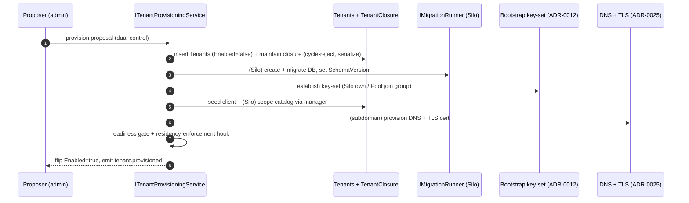
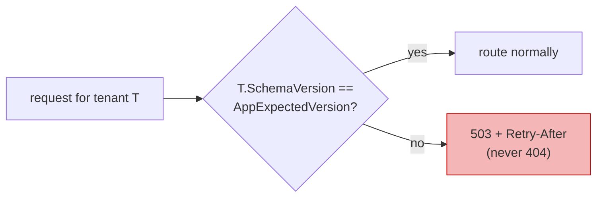
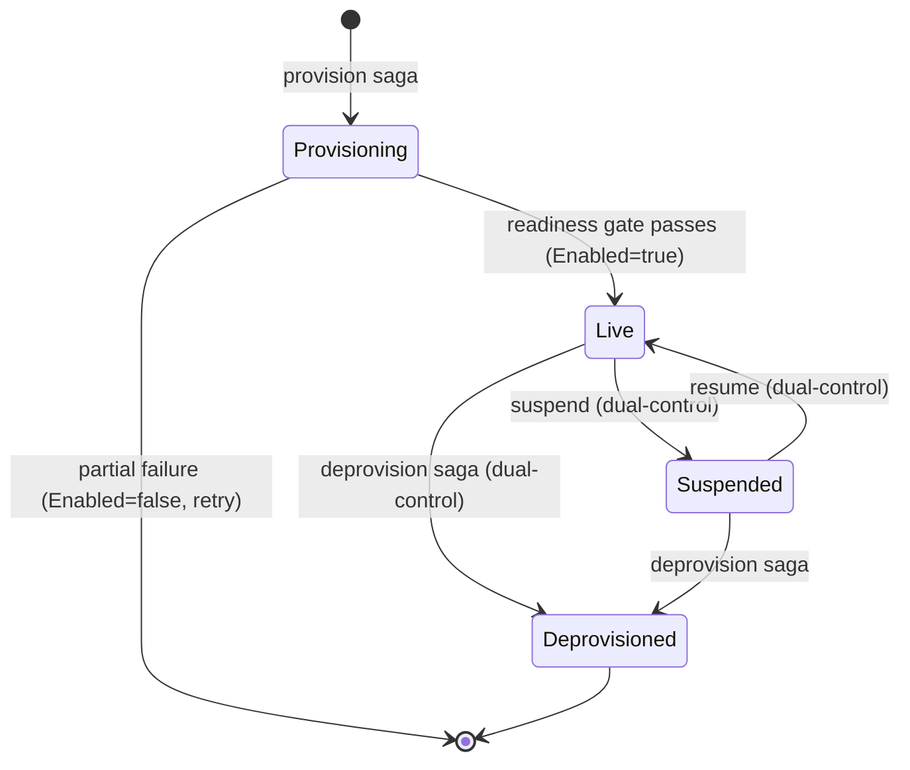

# Tenant lifecycle (detailed design)

## Purpose and scope

How a tenant is provisioned, migrated, suspended, renamed, re-homed, and
deprovisioned across the Tiered multi-tenant model, and how a residency-bound tenant
is placed so its personal data stays in-jurisdiction. Applying schema changes across N
tenant databases is an **operational fan-out, not an EF Core feature**, so the design
is a custom orchestrator, not a startup migrate (ADR-0017, ADR-0054).

In scope: the provision saga (`ITenantProvisioningService`), the Silo migration
fan-out (`IMigrationRunner`) and per-tenant version gate (`SchemaVersionGate`),
suspension/resume runtime semantics, identifier immutability and rename-as-migration,
the deprovision saga (`ITenantDeprovisioningService`), the re-home and re-parent saga
(`ITenantRehomeService`), and residency-aware placement.

Out of scope, referenced not redefined: the erasure saga the deprovision invokes and
the cross-border transfer register and jurisdiction profile
([13 erasure and DSR](17-erasure-and-data-subject-rights.md)); the key-set bootstrap,
escrow, destruction, and the DP-key delete-is-irreversible caveat
([09 key management](12-key-management.md)); the dual-control proposal workflow and the
`PUT /tenants` guards and problem codes ([12 Admin API](15-admin-api.md)); the
per-tenant issuer derivation from `Identifier` ([04 core protocol](04-core-protocol.md));
the tenant registry, closure table, Pool/Silo isolation, and forced RLS
([01 foundations](01-foundations.md), [02 data](02-data.md)); and the audit-forward
residency assertion ([03 audit](03-audit.md)).

## Decisions realized

| Decision | What this design applies |
|---|---|
| ADR-0017 | The provision, deprovision, and re-home/re-parent sagas; build-artifact migration fan-out with a per-tenant 503 version-gate and expand/contract; suspension semantics and identifier immutability |
| ADR-0054 | Residency-aware placement: a residency-bound tenant runs Silo pinned to an in-jurisdiction region; provisioning asserts region equals declared residency before going live |
| ADR-0001 (ref) | Pool/Silo tiers, the tenant registry and closure table, the Pool to Silo data-move reused by re-home, forced RLS |
| ADR-0012 (ref) | Key-set bootstrap auto-seed reused by the provision key-set step and the readiness gate |
| ADR-0025 (ref) | First-run DNS and TLS-cert provisioning for a subdomain issuer before the tenant goes live |

## Component and interface design

### `ITenantProvisioningService` (idempotent, resumable saga)

With a `ProvisioningRequest` checkpoint; partial failure leaves `Enabled=false` for
retry, never half-live:

1. **Register and maintain the closure.** Insert `Tenants { TenantId, ParentTenantId, Identifier UNIQUE, Name, IsolationMode, ConnectionString?, KeyScope, Enabled=false, SchemaVersion=null }` (optimistic concurrency via PostgreSQL `xmin`) and maintain `TenantClosure` in the same `ITenantService` transaction. Cycle-reject a move whose new parent is inside its own subtree, and serialize tree mutation (`SELECT ... FOR UPDATE` or SERIALIZABLE with retry). Closure maintenance is app-code, not a database trigger. Idempotent on the unique `Identifier`.
2. **(Silo) create and migrate the database** via `IMigrationRunner` into the tenant `ConnectionString`, then set `SchemaVersion`. Pool tenants skip this (they share the pool database, isolated by the TenantId filter plus forced RLS).
3. **Establish the key-set** by reusing the ADR-0012 bootstrap auto-seed: a Silo gets its own signing and encryption key-set in its own database; a Pool tenant joins the pool-group key-set.
4. **Seed idempotently through the manager, never raw SQL:** a per-tenant client via `IOpenIddictApplicationManager` (FindOrCreate), and, for a Silo only, the global scope catalog seeded once into the new database (Pool already has it in the shared database).
5. **(Subdomain issuer) provision DNS and a TLS certificate before going live** (ADR-0025): a wildcard certificate covering the tenant issuer subdomains (one cert, via Helm/IaC, the default) or a per-subdomain cert-manager/ACME certificate (more isolated); a path-based issuer is the fallback where subdomains cannot be provisioned (for example local dev).
6. **Flip `Enabled=true` only after the readiness gate:** `SchemaVersion == AppExpectedVersion`, the Silo keys load, the DNS/TLS certificate is ready, and the runtime residency-enforcement hook passes (below). Emit `tenant.provisioned`.

Tenant creation is an `iam_change`/`delete_tenant`-class non-cascading capability, so it
runs under dual-control ([12 Admin API](15-admin-api.md), [05 authorization](07-authorization.md)).

### `IMigrationRunner` and `SchemaVersionGate`

EF Core migrates one `DbContext` against one connection string, and Microsoft
discourages a startup `Database.Migrate()` in production (concurrency, elevated
permissions, no rollback); Finbuckle leaves migration to the developer and the ABP
migrator has a per-tenant gap. So migration is a **build artifact, not startup code**:

- CI produces a migration **bundle** (`dotnet ef migrations bundle`, run with `--connection <tenant>`) or an `--idempotent` SQL script; both check `__EFMigrationsHistory`, so a re-run is a no-op and the fan-out is resumable. The runtime application keeps a least-privilege connection with **no DDL rights** (a separate migration role).
- **`SchemaVersion` (fleet view) versus `__EFMigrationsHistory` (per-database truth).** The `SchemaVersionGate` refuses to route a request to any tenant whose `SchemaVersion != AppExpectedVersion`, returning **503 with `Retry-After`** (never 404, which would make relying parties purge cached discovery), so a migrating tenant is isolated without failing the fleet and new code never runs on an old schema.
- **Ordered ring rollout:** ring-0 internal, then a 5 to 10 percent canary, then waves, with bounded parallelism and halt-on-error per batch; per-tenant state is pending/in-progress/done/failed with the last error, and a failure is 503-gated and retried or rolled forward.
- **Expand/contract (parallel-change)** is real reversibility and, for the shared Pool database, the **sole coexistence mechanism**: ship backward-compatible migrations so old code and new schema coexist during the rollout window, and never ship a destructive change in the same release as the code that needs it. A CI additive-only check enforces this.

**Version-pinned behaviors (ADR-0021 contract-regression items, re-verify on each bump).**
EF Core 9+ acquires an exclusive database lock during migrate (`LOCK TABLE
"__EFMigrationsHistory" IN ACCESS EXCLUSIVE MODE` via the Npgsql history repository) as a
defense-in-depth backstop, but the single-runner orchestrator remains primary; wrapping
`Migrate` in an external transaction defeats the lock (dotnet/efcore #34439). EF Core 10
has an out-of-order regression (dotnet/efcore #37661): a migration inserted mid-history
makes the runtime migrator attempt a `Down`, so the discipline is a **linear migration
history** (re-scaffold a feature branch onto the tip, never insert mid-history) with a CI
ordering check. Prefer a unit-test `HasPendingModelChanges()` over the CLI
`has-pending-model-changes` (the CLI does not honor `--project` with a separate migration
assembly, dotnet/efcore #35637); in production use the bundle rather than
`dotnet ef database update` (Npgsql 10.0.x `ObjectDisposedException`, issue #3699 on
npgsql/efcore.pg), and separate the migration role from the query role (efcore.pg #3218). Pins:
Finbuckle 10.1.1, EF Core 10.0.9, Npgsql.EFCore.PostgreSQL 10.0.2, OpenIddict 7.5.0,
PostgreSQL 18 (SQL Server was rejected, so audit integrity is the manual hash-chain and
concurrency is `xmin`).

### Suspension, resume, and identifier immutability

`Enabled` carries **two** meanings on the same column: `Enabled=false` at provisioning
means never-went-live (a partial-failure remnant), while flipping `Enabled=false` on a
**live** tenant is **suspension**, a resumable, non-destructive hold (no data deleted,
no key touched). Suspension enforces on every surface, not just login:

| Surface | Suspended behavior |
|---|---|
| Token endpoint | reject `invalid_client` with a tenant-suspended detail (all grants) |
| Authorize endpoint | reject with an error page, no code redirect |
| Discovery + JWKS | 503 with `Retry-After` (never 404, which makes a relying party purge cached metadata) |
| Server-side sessions | force-revoke all at suspend (row delete) |
| Outstanding JWT access tokens | remain valid until they expire (at most about 15 minutes), an intentional, documented residual, since a self-contained JWT cannot be pulled mid-life |
| Refresh tokens / authorizations | not individually revoked (the token endpoint rejects at the door); resume keeps the grant and consent |
| Admin API (tenant-scoped) | still works, so an operator can inspect and resume |

Resume flips `Enabled=true` with no data loss. Both suspend and resume run through a
dual-control proposal (resume is security-sensitive because a suspension may follow a
compromise), and each emits a `tenant.suspended`/`tenant.resumed` audit event. A runtime
operation against a suspended tenant returns `409 tenant_suspended`
([12 Admin API](15-admin-api.md)).

The tenant `Identifier` is **immutable after provisioning** because it derives the
per-tenant issuer ([04 core protocol](04-core-protocol.md)); changing it would break
every issued token, the relying parties' Authority configuration, and back-channel
logout registrations. A "rename" is therefore provision-new plus migrate plus
deprovision-old, and `PUT /tenants/{id}` rejects any change to `Identifier` with
`400 tenant_identifier_immutable` rather than mutating it.

### Tenant deprovisioning (decommission): `ITenantDeprovisioningService` (idempotent, resumable saga)

The tenant end-of-life saga, the ordered inverse of provisioning. Nami reserves the
word "offboard" for a **user** (whose offboarding runs the erasure saga); the equivalent
for a **tenant** is **deprovisioning** (decommission), which is this saga. It is
dual-control, never autonomous, never half-erased; a partial failure halts at the
checkpoint for a manual, dual-controlled resume or rollback:

1. Flip `Enabled=false` with a 503 traffic-gate.
2. Revoke all tokens (access, refresh, authorization) and kill all sessions (the ticket store and the reference-token store).
3. Erase or archive the subject data through the erasure saga ([13 erasure and DSR](17-erasure-and-data-subject-rights.md)).
4. **Escrow then destroy** the key-set: short-term escrow per the retention window, then destroy; not an immediate destroy, and the destroy distinguishes a soft-delete under purge-protection from an irreversible hard-delete of a DP key ([09 key management](12-key-management.md)).
5. Retire the keys from the JWKS (stop advertising them).
6. Drop or archive the Silo database, or purge the Pool rows by tenant filter with forced row-level security.
7. Remove the tenant from the registry and the closure table. Because delegated-admin grants are subtree-scoped and rooted on a tenant (`RootTenantId` to `Tenants`, ADR-0010) and the ancestor lookup reads the closure ([05 authorization](07-authorization.md)), an ancestor-rooted grant stops resolving into the subtree once the tenant leaves the closure.
8. Release the secrets (connection-string and key references) from the secret store (dual-control).
9. Emit a `delete_tenant`-class, hash-chained audit event.

The escrow retention window and its residency are a DPO ratification (recommended,
pending), not fixed here.

### `ITenantRehomeService` (re-parent and Pool to/from Silo re-home)

- **Re-parent** (changing the parent in the closure table) recomputes and re-audits inherited delegated-admin grants (ADR-0010 model, ADR-0017 operation): grants inherited from the old parent branch are revoked, the new branch is recomputed, every changed grant is audited, and cycles are rejected and serialized as in provisioning.
- **Pool to/from Silo re-home** reuses the ADR-0001 data-move under dual-control. After the move it verifies **old-scope invisibility** and runs a **negative test** (a cross-scope read, JWE-decrypt, or JWKS lookup must **fail**) before flipping `Enabled=true` in the new scope, so there is no key-scope blast-radius leak. Old-scope teardown then runs the deprovision steps (revoke, escrow/destroy the old key, retire the old JWKS).

### Residency-aware placement

A residency-constrained tenant runs in the **Silo** tier pinned to an in-jurisdiction
region or cloud, with its own database and key-scope, so its personal data does not
leave the jurisdiction; the **Pool** tier is used only for tenants with no residency
constraint (or as an in-jurisdiction pool). Residency is recorded on the tenant registry
as a DPO-ratified attribute, and step 6 of provisioning includes a **runtime
residency-enforcement hook**: the saga asserts that the Silo database, key-store, and
SIEM-forward destination regions equal the declared residency before `Enabled=true`; a
mismatch fails the step and the tenant stays `Enabled=false`. The transfer register and
the jurisdiction profile that this placement serves are owned by
[13 erasure and DSR](17-erasure-and-data-subject-rights.md).

### Key libraries and licenses

| Library | Purpose | License | ADR |
|---|---|---|---|
| EF Core migrations + `dotnet ef migrations bundle` | Build-artifact migration fan-out | MIT | ADR-0017 |
| Npgsql / Npgsql.EFCore.PostgreSQL | PostgreSQL provider; migration lock; RLS | PostgreSQL License / MIT | ADR-0037 |
| Finbuckle.MultiTenant | Connection-string-per-tenant resolution (reference baseline) | Apache-2.0 | ADR-0001 |
| OpenIddict managers | Idempotent seed and revoke during provision/deprovision | Apache-2.0 | ADR-0004 |

> **Patterns applied (ADR-0066).** Orchestration saga (idempotent, resumable,
> checkpointed) for provision, deprovision, and re-home; expand/contract (parallel
> change) for reversible schema evolution; version-gate / circuit-break
> (`SchemaVersionGate` 503) to isolate a migrating tenant; ports and adapters
> (`IMigrationRunner`, `ITenantService`) so the fan-out is testable.

## Data model

No new tables. This design operates on `Tenants` and `TenantClosure`
([02 data](02-data.md)): `Tenants(TenantId PK, ParentTenantId NULL FK, Identifier
UNIQUE, Name, IsolationMode, ConnectionString NULL, KeyScope, Enabled, SchemaVersion)`
with `xmin` concurrency, and `TenantClosure(AncestorId, DescendantId, Depth,
PK(AncestorId, DescendantId))` with a reverse index. The residency attribute is a
ratified column on the registry (ADR-0054). The `DualControlProposals` fields the
lifecycle executors read/write live in [02 data](02-data.md)/[12 Admin API](15-admin-api.md).

## Runtime flows

### Provision saga

### Migration version gate

### Tenant states

## Edge cases and failure modes

- **Partial provisioning failure** leaves `Enabled=false` with the registry and any created database intact for retry or cleanup, never half-live.
- **Concurrent migration runners** are backstopped by the EF9+ exclusive lock, but the single-runner orchestrator is primary; a migration must not be wrapped in an external transaction or the lock is lost.
- **A merged feature branch with interleaved migrations** is re-scaffolded onto the tip (linear history) to avoid the EF10 out-of-order `Down` regression.
- **Rename attempts** are rejected at the API (`tenant_identifier_immutable`); the only path is provision-new plus migrate plus deprovision-old, with a coordinated relying-party cutover as the old tokens expire.
- **Deprovision partial failure** halts at the checkpoint; the escrow-then-destroy step never destroys a key while data it wrapped still needs recovery, and a DP-key hard-delete is distinguished from a soft-delete under purge-protection.
- **Re-home leak check** blocks the flip: if the cross-scope negative test resolves instead of failing, the new scope is not brought live.
- **Residency mismatch** at provisioning fails the readiness step; the tenant stays `Enabled=false` rather than going live in the wrong region.

## Security considerations

- Every destructive lifecycle operation (provision, suspend, resume, delete/deprovision, re-home) is dual-control and never autonomous; the runtime application holds a least-privilege, no-DDL connection.
- Suspension force-revokes sessions immediately; the only residual is the bounded JWT lifetime (about 15 minutes), documented rather than hidden, and a relying party needing instant cutoff uses reference tokens or per-request introspection.
- Re-home proves old-scope invisibility with a negative test before the new scope goes live, so a key-scope blast radius cannot leak across tenants.
- Deprovision escrows before destroying and retires keys from the JWKS before dropping data, so a mistaken teardown is recoverable within the escrow window.
- Residency-aware placement keeps a residency-bound tenant's data in-jurisdiction, and the provisioning hook refuses to go live on a region mismatch.

## Testing strategy

- A migration-version mismatch blocks via the traffic-gate (503), asserted as a CI acceptance test.
- A ring-rollout and partial-failure drill; a deprovision-saga partial-failure drill (halt-and-resume, no half-erased state).
- A re-home old-scope-invisibility negative test (a cross-scope read, JWE-decrypt, or JWKS lookup must fail) and a re-parent inherited-grant recompute audit test.
- A `HasPendingModelChanges()` unit test guards the expand/contract discipline; a linear-history ordering check runs in CI.
- A residency-enforcement test asserts a region-mismatched tenant does not flip `Enabled=true`.

## Open and build-time items

- **DPO/Legal and Security ratifications** (tracked in the [Pre-GA ratification checklist](../PRE-GA-RATIFICATION-CHECKLIST.md)): the Pool-versus-Silo classification criteria at onboarding; the deprovision key-escrow retention window and its residency; each tenant's residency classification (ADR-0054); and the accepted-risk Pool-shared key-set when re-homing into Pool (ADR-0033).
- **Net-new audit events** raised as proposed ADR-0008 additions rather than settled here: `tenant.provisioned`, `tenant.suspended`, `tenant.resumed` (the `delete_tenant`-class deprovision event already exists in the catalog).
- **Teardown of the deprovisioned tenant's own control-plane rows.** The 9-step saga removes the tenant from the registry and closure but does not itself specify deleting the `Memberships` and delegated-admin grants rooted on it (`RootTenantId` has no declared `ON DELETE`). Whether these are torn down by an explicit saga step or by an FK policy is raised here rather than settled, since the source does not fix it.
- The migration-role separation, the ring sizes, and the wildcard-versus-per-subdomain certificate choice are build-time items pinned in the implementation plan, not this design.

## References

- ADRs: ADR-0017 (tenant provisioning and Silo migration), ADR-0054 (cross-border transfer and data residency), ADR-0001 (Pool/Silo, registry, closure, data-move), ADR-0010 (tenant hierarchy and delegated admin, whose subtree-scoped grants re-parent recomputes and whose ancestor-rooted grants stop resolving into a deprovisioned subtree), ADR-0012 (key bootstrap), ADR-0016 (erasure saga reused in deprovision), ADR-0025 (first-run DNS/TLS), ADR-0021 (pin-and-re-verify discipline), ADR-0033 (key-scope isolation).
- Design docs: [02 data](02-data.md) (`Tenants`, `TenantClosure`, RLS, `SchemaVersion`), [13 erasure and DSR](17-erasure-and-data-subject-rights.md) (the erasure saga, transfer register, jurisdiction profile), [09 key management](12-key-management.md) (key bootstrap, escrow, destroy), [12 Admin API](15-admin-api.md) (the `PUT /tenants` guards, suspend/resume, provision endpoints), [04 core protocol](04-core-protocol.md) (per-tenant issuer from `Identifier`), [03 audit](03-audit.md) (audit-forward residency assertion).
- [Architecture](../architecture/README.md); [Pre-GA ratification checklist](../PRE-GA-RATIFICATION-CHECKLIST.md).

---

[Prev: Erasure and data-subject rights](17-erasure-and-data-subject-rights.md) · [Index](README.md) · Next: [Observability, capacity, and SLO](19-observability-capacity-slo.md)
