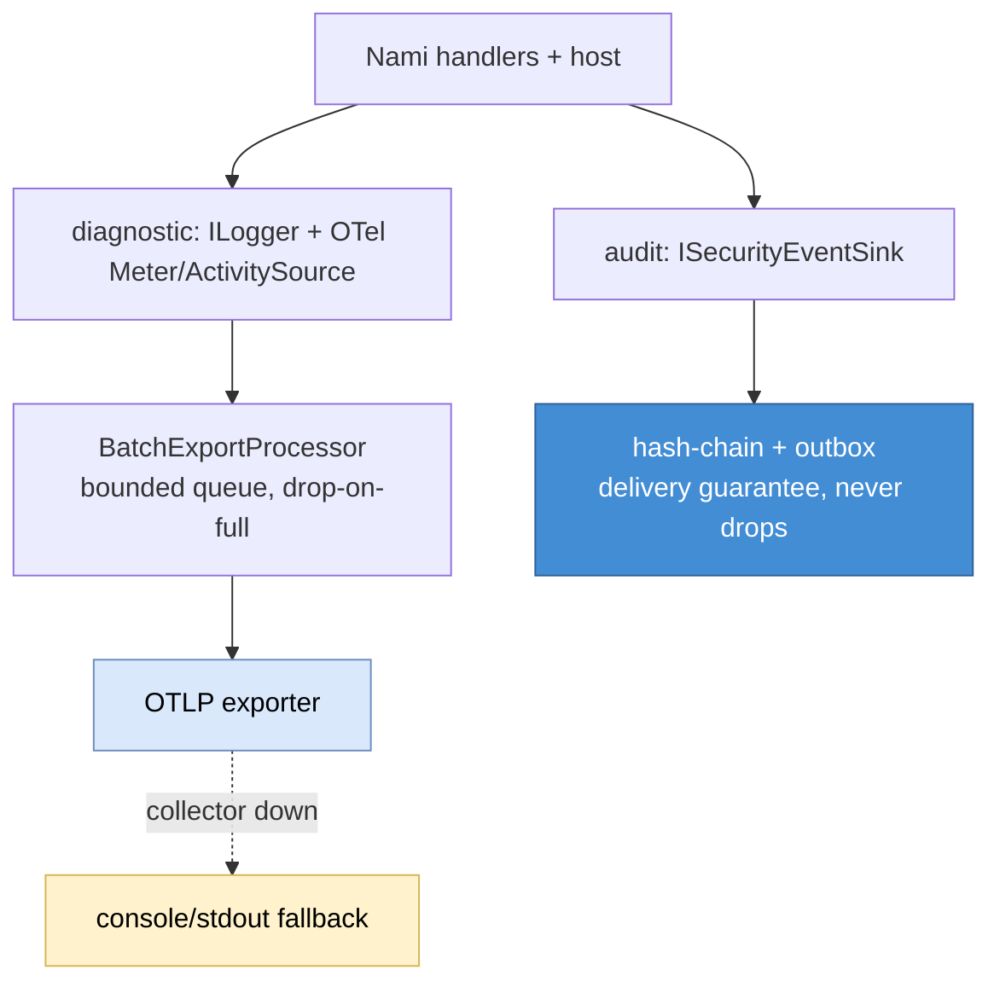
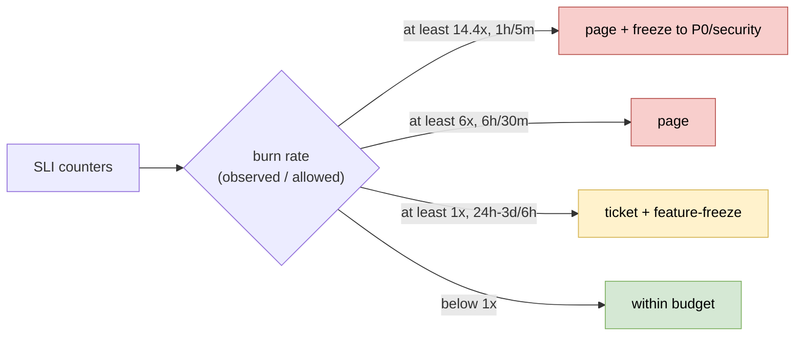
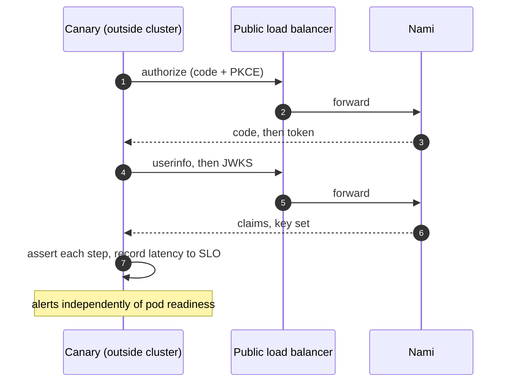

# Observability, capacity, and SLO (detailed design)

## 1. Decisions realized

| Decision | What this design applies |
|---|---|
| ADR-0022 | Native `ILogger` plus OpenTelemetry (OTLP) for logs, metrics, and traces; Serilog dropped; PII redaction via the Microsoft telemetry packages; audit kept on its own lane |
| ADR-0041 | Self-load-tested NFR targets; the SLO as a CI release gate; error-budget freeze; multi-window multi-burn-rate alerting; an external synthetic canary; and the crypto-path throughput gate considered and rejected for v1 |
| ADR-0063 | Production observability backend is operator-chosen (Nami bundles none); a self-hosted Grafana stack for local development only; shipped artifacts stay permissive |
| ADR-0077 | The metric-dimension rule: an allow-list of bounded tags, exemplars for drill-down, per-metric cardinality caps, and a test that each cap is actually attached |
| ADR-0040 (ref) | Parameter E, which owns the lossy-not-blocking export invariant, and the rate-limiting meter as the way load-shedding is observed |
| ADR-0021 (ref) | OpenIddict emits no telemetry (issue #1345 open with no milestone as of 2026-07-04); the custom meter is a build-interim carrying a replace-when-native marker |
| ADR-0008 (ref) | The audit lane the diagnostic pipeline must never absorb |

## 2. Purpose and scope

How Nami is measured, sized, and held to a reliability target: the diagnostic
telemetry pipeline, the capacity model behind the roughly 10k-concurrent-user goal,
and the service-level objectives with the release gate, error-budget freeze,
burn-rate alerting, and external canary that enforce them (ADR-0022, ADR-0041,
ADR-0063). This is a design and a methodology, not a set of verified production
numbers: every absolute throughput or latency figure is load-test-determined, and the
SLO table and workload parameters are ratifications pending before GA.

In scope: the diagnostic OpenTelemetry pipeline (logs, metrics, traces) and the custom
instrumentation seam; the capacity model, bottlenecks, and load-test methodology; the
SLO/SLI model, CI release gate, error-budget freeze, multi-window burn-rate alerting,
incident routing, and the external synthetic canary; and the observability-backend
posture (operator-chosen production, a dev-only Grafana stack).

**Where the numbers live.** This design does not own the SLO figures. ADR-0041
parameter A holds them as the decision, and
[architecture 20, the NFR catalogue](../architecture/20-nfr-catalogue.md) carries them as
rows N1 to N5 for the whole system. Both are restated here because an implementer needs
them next to the gate that enforces them, and **a divergence between the three is a
defect in this file**, not a local variant. That is what "the single source of truth"
means everywhere below: ADR-0041 for the decision, architecture 20 for the catalogue.

Out of scope, referenced not redefined: the audit lane (`ISecurityEventSink`,
hash-chain, delivery guarantee) which is a **separate** lane from diagnostics
([03 audit](03-audit.md)); the keys-health gauges and JWKS availability target
([12 key management](12-key-management.md)); the `/health/ready` and `/health/live`
predicate ([01 foundations](01-foundations.md), extended in [12](12-key-management.md));
the authorization SLIs and their SLO ([07 authorization](07-authorization.md)); the
rate-limiting/load-shedding and revocation mechanisms
([13 revocation](13-revocation-propagation-and-caching.md), [14 advanced flows](14-advanced-flows.md),
[15 Admin API](15-admin-api.md)); the token-endpoint and pooling capacity levers
([04 core protocol](04-core-protocol.md), [02 data](02-data.md)); and RTO/RPO
(ADR-0006, ADR-0074), whose continuous-monitoring metrics this pipeline carries but
whose thresholds belong to [12](12-key-management.md). Content-Security-Policy
finalization is a security-hardening concern, not an observability one, and is deferred to
[20 testing](20-testing.md). **Corrected 2026-08-01:** this sentence continued "note that
**no ADR in this repository owns the policy values**, which 20 records as an open item rather
than a citation". That was true when written and is not now:
[ADR-0091](../adr/0091-browser-facing-response-headers.md) owns the values, the framing
posture, and the rest of the browser-facing set, and 20 section 10 records the item as closed.
One part of that decision belongs to **this** document rather than only to 20. ADR-0091
parameter H ships **no report collector**: a policy-violation report goes to an
operator-configured endpoint, so it is not a lane this pipeline carries. An unauthenticated
report sink on an identity provider would be a new ingest surface and a new personal-data
path, and it is named here so that nobody adds one on the assumption that violation reports
are observability.

## 3. Interfaces and contract

**Observability introduces no port.** The surface is a metric and trace catalogue plus
the health checks, wired at the handler seam; there is deliberately no metrics
abstraction to plug an implementation into. ADR-0077 rule F draws the line that makes
this section legitimate: the instrument **names** are a stable public contract owned by
ADR-0044 section G and ADR-0065, and their **dimensions** are owned by ADR-0077, so what
is left to this design is the **inventory**, which is a catalogue that moves with the
code rather than a decision.

### 3.1 Nami's own instruments

A single `System.Diagnostics.Metrics.Meter` and a single `ActivitySource`, both named
**`nami.identity`**, resolved through `IMeterFactory`. The name follows ADR-0065: meter
and metric names are `nami.`-rooted, and the lowercase product form `nami.identity` is
the shape ADR-0065 reserves for wire identifiers, distinct from the `Nami.Identity.*`
assembly form and the `Nami:...` configuration form. The design corpus writes the meter
as `Nami.Identity`; that is the assembly spelling and does not carry over to a meter
name, which is consumer-facing.

| Instrument | Type | Bounded tags |
|---|---|---|
| `nami.identity.tokens_issued` | counter | `grant_type`, `token_type`, `result` |
| `nami.identity.token_issue.duration` | histogram | `grant_type`, `token_type`, `result` |
| `nami.identity.validation_latency` | histogram | `result`, `error.type` |
| `nami.identity.revocations` | counter | `reason` |
| `nami.identity.login_outcomes` | counter | `outcome`, `factor` |
| `nami.identity.consent` | counter | `granted` or `denied` |
| `nami.identity.client_secret_validation` | counter | `result` |
| `nami.identity.user_logout` | counter | `scheme` |
| `nami.identity.key_rotations` | counter | none |
| `nami.identity.keys_loaded` | gauge | none |
| `nami.identity.signing_key_days_to_expiry` | observable gauge | `kid`, bounded by the key count |
| `nami.identity.abuse_detections` | counter | `rule`, `severity` |

The last four were **absent from this table while being referenced elsewhere**, three of
them unprefixed. ADR-0085 is the authority for the names and freezes them as public API;
ADR-0077 remains the authority for the tags. `nami.identity.abuse_detections` is the
ADR-0083 bridge, the bounded output of an unbounded input, which is how a per-principal
abuse finding reaches an on-call pager without a forbidden tag on this lane.

Built-in instruments are **never** prefixed: `http.server.request.duration`,
`aspnetcore.rate_limiting.*`, `aspnetcore.authentication.*` and the Kestrel meters are
semantic-convention names, and prefixing one is the clash the naming guidance warns about.
The rate-limiting meter carries only `policy` and `result` and exports no partition key, so
it is bounded by construction and usable here even though the limiter itself partitions by
user, address, or client.

`ActivitySource` spans wrap the same seams: authorize, token issuance,
introspection, and revocation. A rename or removal of any name above is a breaking
change under the SemVer policy, and a migration to native instrumentation if OpenIddict
issue #1345 lands is handled under the same deprecation window (ADR-0044 section G,
ADR-0021).

Key-health gauges (`nami.identity.key_rotations`, `nami.identity.keys_loaded`, and
`nami.identity.signing_key_days_to_expiry`, the last an `ObservableGauge` computing
`(keyExpiry - UtcNow).TotalDays`) are owned by [12](12-key-management.md); this design
consumes them for alerting and does not define them.

### 3.2 Built-in meters consumed

The .NET 10 built-in meters are used first, with no custom code, and they keep their
OpenTelemetry and ASP.NET Core standard names rather than taking the `nami.`-rooted
rule, which governs only Nami's own instruments.

| Meter | Instruments used | Why it matters here |
|---|---|---|
| `Microsoft.AspNetCore.Authentication` | `aspnetcore.authentication.*`, tags `scheme`, `result`, `error.type` | The concrete auth meter; there is no separate OpenTelemetry semantic convention for authentication, so this is the nearest standard |
| `Microsoft.AspNetCore.Authorization` | `aspnetcore.authorization.*`, tag `policy` | Policy-level outcomes |
| `Microsoft.AspNetCore.Hosting` | `http.server.request.duration`, `http.server.active_requests` | The RED duration signal, and the scale-out input |
| `Microsoft.AspNetCore.RateLimiting` | `aspnetcore.rate_limiting.*`, covering requests, queued requests, active leases, and time in queue | **This is how load-shedding is observed** (ADR-0040) |
| `Microsoft.AspNetCore.Server.Kestrel` | `tls_handshake.duration`, `rejected_connections`, `active_connections` | Saturation on a certificate-bearing front end |

Plus the HttpClient, EF Core/Npgsql, and .NET runtime instrumentation packages.

**The organizing frame is RED plus USE.** RED (request-level) is
`http.server.request.duration` with `token_issue.duration` and `tokens_issued`; USE
(resource-level) is the runtime CPU counters, the Kestrel queue and rejection counters,
and EF/Npgsql plus PgBouncer pool saturation.

### 3.3 Health-check surface

An `IHealthCheck` tagged `ready` backs `/health/ready`, so the platform holds traffic
until keys load; `/health/live` is separate and never gates on readiness. Both the
predicate and the keys-loaded condition are owned by [01](01-foundations.md) and
[12](12-key-management.md); this design consumes the failure as a page-severity alert.

## 4. Data and structure

This design defines **no tables**. It reads the operational and control-plane stores only
through the capacity model (schema in [02 data](02-data.md)) and emits metrics, traces,
and logs over OTLP; the audit store is the separate lane of [03 audit](03-audit.md).

**Cardinality is the structural concern in place of a schema.** A metric series is
identified by its instrument name plus the tuple of its tag values, so the tag
allow-list of section 8 is what bounds the shape of the emitted data, and the per-metric
`View` cap is what bounds its size.

## 5. Behaviour

### 5.1 Two lanes: diagnostic telemetry versus audit

Nami has two signal lanes that must not be conflated. The **diagnostic lane** (this
design) is `Microsoft.Extensions.Logging` (`ILogger`) plus OpenTelemetry, exported over
OTLP: operational logs, metrics, and traces, lossy and best-effort. The **audit lane**
([03 audit](03-audit.md)) is `ISecurityEventSink`, hash-chained with a delivery
guarantee, and is **never** routed through the OTel/`ILogger` pipeline (which has no
tamper-evidence and no delivery guarantee). The two lanes join only by a
correlation/trace id. Serilog is not used (ADR-0022): one pipeline, native trace-to-log
correlation, PII/secret redaction via `Microsoft.Extensions.Telemetry` and
`Microsoft.Extensions.Compliance.Redaction`.



### 5.2 Instrumentation seam

OpenIddict itself emits **no** telemetry (no `ActivitySource`, no `Meter`; the upstream
telemetry request, issue #1345, is open with no milestone as of the ADR-0021 roadmap
check on 2026-07-04), so Nami's own meter and `ActivitySource` are **gap-filling**,
placed inside Nami's own event handlers, not consuming a telemetry surface OpenIddict
does not have. This is a build-interim: if OpenIddict ships native telemetry, Nami
migrates and retires the custom meter (ADR-0021 decommission marker).

### 5.3 High-cardinality control (mandatory)

A metric tag value is **never** `tenant_id`, `sub`, an unbounded `client_id`,
`session.id`, `jti`, a raw token, or an IP. ADR-0077 rule A states this as an
**allow-list**, not a deny-list, so the permitted set is closed: `grant_type`,
`token_type`, `scheme`, `result`/`outcome`, `error.type`, `policy`. The reason the list
is closed rather than advisory is arithmetic: seven attributes at thirty values each
would be roughly 22 billion series.

Per-tenant or per-user investigation uses **exemplars**
(`SetExemplarFilter(ExemplarFilterType.TraceBased)`, attaching a trace id to a bucket)
plus traces and logs, never a high-cardinality tag. The OpenTelemetry SDK default
cardinality limit is 2000 per metric, and from SDK 1.10.0 an overflowing measurement is
aggregated under the `otel.metric.overflow` attribute rather than dropped; per-metric
caps are tightened with a `View`.

The `nami.identity.tokens_issued` cap is a `View` (a cardinality limit of 50) whose
instrument-name selector is the emitted name `"nami.identity.tokens_issued"`. The SDK
matches that selector case-insensitively, so casing is not the hazard; **a selector that
matches no instrument is**, because it is silently inert and the counter then falls back
to the 2000 default instead of failing. A test asserts the view is attached (ADR-0077
rule D, which carries the source evidence read at OpenTelemetry release tag
`core-1.17.0`).

### 5.4 Telemetry is lossy, never blocking

This is an invariant rather than a tuning choice, and it is owned by **ADR-0040
parameter E**, which classifies the diagnostic export path as fail-open for a different
reason than an ordinary cache: losing an observation is always cheaper than failing a
request. The diagnostic pipeline must never add latency to `/token` or fail an auth on a
slow or absent collector.

The OTLP exporter runs through a `BatchExportProcessor` with a bounded queue (default
2048) that **drops on full** rather than blocking the caller or growing unbounded; the
export runs off the request thread with a bounded timeout, does not retry on the request
path, and a failure is swallowed rather than thrown. When the OTLP endpoint is
unreachable, logging falls back to the native console (stdout), which 12-factor treats as
the event stream (ADR-0031); on-premises without a collector, the native console or file
provider is used. The audit lane is the counterpart and must **not** drop (its outbox
retains events, ADR-0008), which is exactly why ADR-0022 keeps the lanes separate. A
collector-outage load test proves p99 `/token` is unchanged when the collector is blocked.

### 5.5 Capacity model

The 10k concurrent-user goal is an architectural target to be proven by load test, not a
vendor-quoted number, and it is sized as RPS rather than raw CCU: Little's Law
(`L = lambda x W`) with the interactive response-time law
`lambda = N / (W + Z)`. Modeling all traffic as one 30-second-think-time tuple is wrong
for a machine-driven endpoint (a 30-second think time is a human clicking a UI, and it
overstates by tens of times), so the workload is decomposed (interim, product-owner
ratify pending; all RPS load-test-derived):

| Workload | Parameters | Interim RPS |
|---|---|---|
| Interactive login | N=10k, 3 logins/user/day, W=0.25s | ~1-3 |
| Silent refresh (dominant steady driver) | Z = access-token TTL 900s, N=10k, W=0.2s | ~11 steady, x3-x5 peak = 30-55 |
| M2M client-credentials (separate bursty ceiling) | default | 200 (or 0) |

**Sensitivity, which is what makes the model usable:** it is nearly insensitive to
logins per user per day, linear in N, inverse in the access-token TTL, and can be
**dominated by the M2M ceiling**, which is the term that actually sizes the crypto and
database tier. That is why the M2M figure is the one worth ratifying first.

Consistency note: each silent-refresh `/token` is a **double write** (insert the new
refresh token, revoke the old), because rolling rotation is retained (ADR-0004); the
self-contained JWT access token itself is a **zero-write**.

The proposed request mix, also ratify-pending, is what the mixed-blend load-test
scenario replays:

| Endpoint | Share | Cost |
|---|---|---|
| Discovery and JWKS | 25% | cache read, served from memory or a CDN |
| Local JWT validation (no network hop) | 35% | RSA verify, cheap |
| `/token` (code and refresh) | 20% | **sign plus DB write, the bottleneck** |
| `/userinfo` | 10% | claims read |
| `/authorize` | 7% | session plus render or redirect |
| `/introspect` and `/revoke` | 3% | DB read/write |

The bottlenecks, in the order they bind:

- **Signing CPU is not the binding constraint.** On RS256 (the baseline, ADR-0005), 10k CCU is roughly 0.07 of a signing core. Measured on .NET 10, RS256 signs at ~1,000-1,570/s/core and ES256 at ~4,300-4,800/s/core, so ES256 is only about 3-4x faster to sign (not the folklore 20x), while RS256 **verifies** about 6-9x faster than ES256, so defaulting to ES256 would push cost onto every resource server. ES256 stays a config-selectable option through the existing signing-credential source, not a default change. The JWE direction is asymmetric for the same reason: issuing encrypted is cheap (a public-key wrap plus symmetric content encryption), while an **inbound** encrypted request must be privately decrypted at roughly signing cost, so the expensive direction is receiving, not issuing ([04 core protocol](04-core-protocol.md) owns the algorithm choice).
- **DB write IOPS is the real hot-path cost.** The design rule is to issue a self-contained JWT access token (no write) and persist only the refresh token, which takes the write off roughly 80% of token traffic (silent refresh still double-writes, so it stays the dominant write driver); UUIDv7 primary keys (ADR-0036) reduce B-tree fragmentation on this path, and the operational store may sit on a higher-write tier than the read-heavy config store ([02 data](02-data.md), ADR-0037).
- **Connection pool is the multi-tenant ceiling.** Total connections are `tenants x pool-size x instances`, which a Silo fleet can blow past the PostgreSQL ceiling: 100 tenant databases at a pool of 100 across 3 instances is 30,000 connections, about 300x the PostgreSQL default. The mitigation is PgBouncer in transaction mode (mandatory for Silo, and highly available with at least two instances), a per-tenant Npgsql `Maximum Pool Size` of about 5-10, and a bounded acquisition timeout so pool exhaustion fails fast to a load-shed 503 rather than hanging a thread ([02 data](02-data.md), ADR-0018, ADR-0040). **Npgsql multiplexing is not the fourth lever:** it is out of scope for v1 and is **incompatible with the mandated PgBouncer**, so it must not be enabled behind it; it is recorded as a future option only if it stabilizes.

Sizing, every figure load-test-determined:

| Dimension | Pool | Silo (100 tenants) |
|---|---|---|
| Signing key | RS256 baseline | RS256 |
| Access token | self-contained JWT, no write | same |
| Instances | start at 3, scale on CPU and `http.server.active_requests` | 3 or more |
| Npgsql maximum pool size | 50-100 | **5-10 per tenant** |
| Connection broker | direct or PgBouncer | **PgBouncer transaction mode, mandatory** |
| PostgreSQL `max_connections` | ~200 fronted | ~200 behind PgBouncer |

### 5.6 Load-test methodology

Apache JMeter is the primary tool (ADR-0078), driven in an **open model** by the
`PreciseThroughputTimer` (Poisson arrivals, in JMeter core) rather than by a fixed thread
count, because a closed model driven by a fixed virtual-user count produces coordinated
omission: it backs off exactly when the server struggles, which hides tail latency. Where a
.NET-side gate is wanted it is a hand-written xUnit concurrency test, not a load-test library:
no permissively licensed .NET load-test library is taken (ADR-0026). A 2-to-5-minute
warm-up is discarded (tiered JIT, database and HttpClient pools, the signing-key and
JWKS caches, the discovery cache) and steady state measured, with cold start measured
separately. p50/p95/**p99** are reported, never the average, because a 120ms mean hides a
4-second p99, and throughput is only valid while the p99 SLO still holds.

The scenario set: code issuance (sign plus write); refresh rotation (double write);
validation and introspection; JWKS plus discovery (cache); the mixed blend of section
5.5; Silo multi-tenant fan-out across N pools behind PgBouncer; soak and spike; and the
telemetry-collector-outage scenario that proves section 5.4's invariant.

### 5.7 SLO, error budget, and the release gate

An SLI is a measured quantity (latency, error rate, availability); an SLO is its target;
an SLA is an SLO plus consequences. Because the identity provider is on the critical path
of every login, its SLO is higher than the services that depend on it, and 100% is the
wrong target. The mechanism is fixed; the numbers are interim starting points restated
from ADR-0041 and architecture 20, ratified with Product/Ops:

| SLI | Interim target | Window |
|---|---|---|
| Token-endpoint latency | p95 < 200ms, p99 < 500ms | trailing (28d proposed) |
| Local validation latency | p99 < 50ms | trailing |
| Availability (token + authorize) | **99.9% or 99.95%, unratified** | trailing |
| JWKS availability | ~99.99%, held higher than the service's own | trailing |
| Error budget | **`1 - SLO`, stated as a formula** | drives freeze |

**The error budget is written as a formula on purpose, and that is a decision rather
than an omission.** It is 0.1% at 99.9%, which is about 43.2 minutes a month, and 0.05%
at 99.95%, which is about 21.6 minutes a month. Because the budget drives the automatic
release freeze, quoting one figure while the availability target is still open would set
the freeze threshold **wrong by a factor of two** (ADR-0041 parameter A). This design
therefore refuses to pick one, and so should any dashboard built from it.

The SLO is a **formal release gate**: the load test enforces the thresholds in CI, so a
breach stops the build rather than being advisory.

```text
Thresholds, tool-agnostic, all enforced in CI:
  token endpoint    p95 < 200 ms   AND   p99 < 500 ms
  error rate        < 0.5%
  on breach         non-zero exit, the build fails
```

JMeter writes samples to a result file (`.jtl`); the gate computes the percentiles from that
file and exits non-zero on breach. **The concrete assertion mechanism is an M1 open item, not
specified here** (ADR-0078): JMeter has no direct equivalent of a declarative threshold block
with `abortOnFail`, so naming one would be inventing an API. What is fixed is the thresholds
above and the requirement that a breach fails the build; how the check is wired is decided when
the test plan lands. Where a .NET-side gate is wanted it is a hand-written xUnit concurrency
test computing its own percentile, not a library.

The error-rate threshold is part of the gate, not a separate report: a build that holds
p99 while failing 1% of requests has not met the objective. `abortOnFail` on the p99
threshold makes the run exit non-zero, which fails the step. Widening any target requires
re-ratifying at the single source of truth and propagating, never a local loosen in one
file. Overload controls (rate-limiting to 429, load-shedding to 503, ADR-0040) protect
the service within the SLO but are not the SLO.

**A second, component-level gate was considered and rejected for v1** (ADR-0041). The
design corpus specifies a crypto-path throughput floor on the signing and encryption
path, on the rationale that crypto is the hotspot; this repository's own capacity model
above contradicts that rationale, since signing is roughly 0.07 of a core at the modelled
load. The surviving argument for such a gate is different and worth keeping on file: the
CI gate here is a **system** threshold, so a library or key-size change could make signing
an order of magnitude slower without breaching p99 in CI and still fail at real peak. It
is still not adopted, because micro-benchmarks on shared runners are a known source of
flaky gates and a muted gate is worse than none.

### 5.8 Error-budget freeze and burn-rate alerting

Exhausting the error budget freezes feature releases (except P0/security) automatically,
as a consequence of the burn tier rather than a manual call. Alerting is on the **rate of
budget burn** (Google SRE multi-window multi-burn-rate), not on instantaneous latency or
error, and each tier requires a short-window confirm so the alert self-resolves on a flap:

| Tier | Burn rate | Long / confirm window | Budget spent in the window | Action |
|---|---|---|---|---|
| Fast-burn | at least 14.4x | 1h / 5m | ~2% per hour | page, tighten freeze to P0/security-only |
| Mid-burn | at least 6x | 6h / 30m | ~5% per 6h | page |
| Slow-burn | at least 1x | 24h-3d / 6h | long-term leak | ticket, freeze feature releases |

The slow-burn trigger is **1x by derivation and 1.5-2x in practice**: alerting at exactly
the budget-consumption rate fires on ordinary noise, so the deployed threshold is the
pragmatic one. Burn rate is computed from the existing
`http.server.request.duration` and `nami.identity.tokens_issued` series plus the error-rate
series, adding no new metric. The same multiplier formula applies to every SLI that has a
budget, with the threshold moving as that SLI's target moves.



**Incident routing** is a fixed rule/severity/action mapping, and **every page-severity
alert must link a runbook: a page without a runbook is a defect blocked in CI.** The
runbook identifiers are placeholders here; their content lives with operations, and what
this design fixes is the constraint, not the prose.

| Rule | Severity | Action | Runbook |
|---|---|---|---|
| Fast or mid-burn on token latency or availability | page | page on-call, auto-freeze | `rb-slo-burn` |
| JWKS-availability burn | page | page on-call (JWKS down breaks every verify) | `rb-jwks-down` |
| `nami.identity.keys_loaded` false, or readiness failing | page | page on-call | `rb-keys-not-loaded` |
| `nami.identity.signing_key_days_to_expiry` low | ticket | ticket key-ops | `rb-key-rotation` |
| Data Protection cannot read its own keyring: `XmlKeyManager` logs an `Error` processing a key element, or `DefaultKeyResolver` logs a `Warning` that a key is ineligible because `CreateEncryptor` failed | **page** | page key-ops; the protecting root is gone or wrong, and every cookie and DP-wrapped signing key is already undecryptable | `rb-keyring-unreadable` |
| Data Protection created a key outside a change window: `XmlKeyManager` logs `Information` "Creating key {kid}" with no rotation or bootstrap in flight | ticket | ticket key-ops; **expect this to fire on a legitimate cold start too**, see below | `rb-keyring-key-created` |
| Stale scheduler run heartbeat (no successful run in more than two intervals) | ticket | ticket | `rb-scheduler-stale` |
| Slow burn on any SLI | ticket, plus feature freeze | ticket | `rb-slo-budget` |
| Sustained rate-limit or load-shed 503 spike | ticket, escalating to page | investigate saturation | `rb-load-shed` |

Alerts are deduplicated by `(rule, deployment, tenant-scope)`, so many pods with one
symptom become one incident rather than one page per pod, with a grouping window (about
5 minutes) before paging; flap suppression is already covered by the short-window confirm.

**The two keyring rows are deliberately asymmetric, and the weaker one is kept anyway.**
`rb-keyring-unreadable` is unambiguous: the framework only emits those lines when it has a
keyring it cannot decrypt, so it is a page. `rb-keyring-key-created` is not, and the reason
is measured rather than assumed ([Data Protection regeneration probe](../kb/notes/data-protection-keyring-regeneration-log-levels.md)):
a **lost** keyring and a **legitimate first boot** produce identical log output, down to the
same two `Information` lines, so nothing in the log distinguishes them. That row is
therefore a ticket, it is expected to fire on every genuine cold start, and it must never be
described as the keyring-loss detector. The detector is the readiness `kid`-match gate
(ADR-0012, ADR-0031), which compares the active key against an **expected persisted** value
and so can tell "no ring" from "no ring yet". These alerts shorten the time to notice; they
do not replace the gate, and tuning them to fire less often would only make them slower at
the one thing they are good for.

**The abuse and recovery alert family shares this infrastructure and is owned
elsewhere.** It is routed here because the dedup key, the severity ladder, and the
runbook-linkage rule above apply to it unchanged, and it is listed rather than
disclaimed because [03 audit](03-audit.md) points here for where its event taxonomy is
alerted on. Each row's owner is named so the pointer resolves:

| Rule | Severity | Owner |
|---|---|---|
| Login-failure or credential-stuffing spike, per user/IP/client | ticket, escalating | ADR-0042, [08](08-user-management.md) |
| MFA-code failure spike, per user/IP/tenant | ticket | ADR-0042, [08](08-user-management.md) |
| `invalid_grant` or `invalid_client` rate spike | ticket | ADR-0042, [04](04-core-protocol.md) |
| **Refresh-token reuse detected** | **page** | ADR-0004, [04](04-core-protocol.md); reuse outside the leeway is a theft signal, not a client bug |
| Token-issuance spike from one client or tenant | ticket | ADR-0042 |
| Lockout denial-of-service on one account | ticket | ADR-0042, [08](08-user-management.md); distinct from brute force, because the lockout is the attacker's goal |
| **Key rotation plus keyring access from an unknown source** | **page** | ADR-0007, [12](12-key-management.md) |
| Clock drift past the threshold | ticket | ADR-0031; fires before drift consumes the skew tolerance |
| Recovery-point breach: archiving lag, backup age, or replication lag | page or ticket | ADR-0006, ADR-0074, [12](12-key-management.md) |

Two of those are the reason the family is worth enumerating rather than leaving to a
generic anomaly rule: refresh reuse and unknown keyring access are the only alerts whose
first interpretation should be a compromise rather than a bug.

### 5.9 Operational metrics the capacity model needs

The SLIs above are the contract; these are the saturation signals that make the
bottlenecks of section 5.5 observable, and each is consumed rather than defined here.
Operational-store write latency and token-write IOPS (the hot write path);
load-shed 503 count and concurrency-limiter saturation, plus 429 rate
(ADR-0040 through the `rate_limiting.*` meter); connection-pool saturation and
acquisition-timeout-to-503 count; Redis fail-open count
([13](13-revocation-propagation-and-caching.md)); the clustered-runner
last-successful-run heartbeat for prune and rotation; synthetic-canary latency and
success; node clock offset against the NTP source; and the recovery-point trio of
WAL-archiving lag, backup age, and replication lag ([12](12-key-management.md), ADR-0074).
Cache hit ratio, login-failure rate, and database latency complete the operational
dashboard.

### 5.10 External synthetic canary

A scheduled probe (about every minute) runs the full authorization-code-plus-PKCE,
token, userinfo, JWKS chain through the public/load-balancer path from **outside** the
cluster, asserting each step and alerting independently of pod readiness. It catches
configuration, certificate, DNS, JWKS-publication, and keyring failures that an internal
readiness probe cannot see from the outside, and its end-to-end latency feeds the SLO
gate. It complements, and does not replace, the internal `/health/ready` probe
([01](01-foundations.md), [12](12-key-management.md)).

**The canary is also the measurement for two NFR rows that have no other instrument**:
configuration-propagation time and revocation freshness (architecture 20, N8 and N9).
Both are stated as time bounds rather than mechanisms, and a bound that nothing measures
from the outside is an assertion; the canary is what turns them into observations. Where
a deployment is multi-tenant, the probe uses the cross-scope JWKS assertion.



## 6. Dependencies and wiring

Metrics, traces, and logging are registered on one `AddOpenTelemetry()` builder and one
OTLP exporter. The metrics path adds the ASP.NET Core, HttpClient, and runtime
instrumentation, adds the `nami.identity` meter, attaches the per-metric cardinality
`View` (selector equal to the emitted instrument name, section 5.3), and sets the
trace-based exemplar filter. The tracing path adds the same instrumentation plus the
`nami.identity` source. Logs go through `builder.Logging.AddOpenTelemetry()` with scopes
included, with redaction applied on the log pipeline; instruments are obtained through
`IMeterFactory` and tags are built as a bounded `TagList`.

The collector topology (agent versus gateway) is an operator decision and is documented
rather than chosen (ADR-0063); on-premises without a collector uses the native console
provider.

### Observability backend posture

Production is **backend-neutral**: Nami emits OTLP and mandates no backend, bundling none
in the reference host or Helm chart. It ships the OTLP export configuration and the
connection documentation. Local development runs an opt-in docker-compose profile: the
OpenTelemetry Collector receives OTLP and fans out to Prometheus for metrics, Loki for
logs, and Tempo for traces, with Grafana as the UI, so a developer gets all three signals
with one command; it is a profile so a pure unit-test run need not start it. Grafana,
Loki, and Tempo are AGPLv3 (relicensed from Apache-2.0 in 2021), which is acceptable
**here** only because they are unmodified upstream container images run as separate
services Nami talks to over OTLP: they are dev tooling, not a dependency, so ADR-0026's
permissive-only rule (which governs compiled/shipped dependencies) is not tripped, and
Nami's shipped artifacts (NuGet packages, reference host image, Helm chart) bundle no
AGPL. The .NET Aspire dashboard (MIT) is the lighter, framework-native alternative and
remains available.

### Key libraries and licenses

Verified at package metadata in the local cache:

| Library | Purpose | License | ADR |
|---|---|---|---|
| `OpenTelemetry` and `OpenTelemetry.Exporter.OpenTelemetryProtocol` | Metrics, traces, logs over one OTLP pipeline | Apache-2.0 (read at 1.16.0) | ADR-0022 |
| `OpenTelemetry.Instrumentation.AspNetCore` | The built-in meters of section 3.2 | Apache-2.0 (read at 1.15.2) | ADR-0022 |
| `Microsoft.Extensions.Logging` (source-generated `LoggerMessage`) | Diagnostic logging | MIT | ADR-0022 |
| `Microsoft.Extensions.Telemetry` | PII/secret redaction and enrichment | MIT (read at 10.6.0) | ADR-0022 |

Licenses stated from their project's own terms and **not verified offline** here, to be
confirmed by the ADR-0026 license-scan gate when the solution lands:

| Library | Purpose | License as stated | ADR |
|---|---|---|---|
| `Microsoft.Extensions.Compliance.Redaction` | The redaction primitives the pipeline calls | MIT (not in the local cache) | ADR-0022 |
| Apache JMeter | Load-test tool, open arrival-rate model, executed as an external binary | **Apache-2.0**, read at `apache/jmeter` `master` `LICENSE` on 2026-08-01 | ADR-0078 |

> **JMeter is an external tool, so it sits outside the ADR-0026 section C gate by
> construction.** That gate reads the license of every package from the NuGet restore graph;
> JMeter runs as a separate process and is not in the graph, so the gate cannot see it and its
> silence is not evidence of compliance. This is a property of every external tool here,
> including the OIDF conformance suite image, not of JMeter specifically. Two things cover it
> instead: the license is read at source and recorded with its date in
> [`DEPENDENCY-LICENSES.md`](../DEPENDENCY-LICENSES.md), and JMeter is an Apache Software
> Foundation project, whose third-party policy forbids distributing Category X components
> (GPL and AGPL among them) in a release. ADR-0078 records why the two previously named tools
> failed here and how each was found.

Dev-stack container images, licenses as verified in ADR-0063 on 2026-07-18 and not
re-verified here:

| Image | Purpose | License | ADR |
|---|---|---|---|
| OpenTelemetry Collector, Prometheus | Dev-stack collection and metrics store | Apache-2.0 | ADR-0063 |
| Grafana, Loki, Tempo | Dev-only dashboards, log search, trace view | AGPLv3 (unmodified upstream dev images, not a shipped dependency) | ADR-0063 |

> **Patterns applied (ADR-0066).** Ports and adapters at the OTLP boundary (the operator
> plugs in any backend; the app depends only on the exporter); bounded-queue with
> load-shedding for the export path (drop-on-full, never block the hot path); circuit-break
> / bulkhead thinking for the capacity model (fail-fast to 503 on pool exhaustion); and a
> single source of truth for the SLO numbers so the gate cannot be loosened piecemeal.

## 7. Error handling, edge cases, invariants

- **Collector outage.** Telemetry drops on full; p99 `/token` is unchanged and no auth fails; logging falls back to stdout. The audit lane does not drop (ADR-0040 parameter E, ADR-0008).
- **Cardinality overflow.** A stray high-cardinality tag would explode series; it is prevented by the closed tag allow-list, the per-metric `View` cap, and the `otel.metric.overflow` signal, with exemplars for drill-down.
- **A `View` whose selector matches nothing.** The cap is silently inert and the instrument falls back to the 2000 default, which reads identically to a working cap in configuration and in the SDK's own log message. Only the attachment test distinguishes them.
- **Pool exhaustion under load.** The bounded acquisition timeout fails fast to a 503 with `Retry-After` rather than hanging threads, and the pool-ceiling load test asserts a graceful 503 with no cascade.
- **Green pods, broken externally.** A certificate, DNS, or JWKS-publication failure is invisible to readiness but caught by the external canary, which pages independently.
- **Signing is not the ceiling.** Sizing on signing CPU would over-provision; the DB write path and connection pool bind first at 10k CCU.
- **A widened SLO by local edit.** Blocked: the gate reads the single source of truth (ADR-0041, architecture 20), and loosening requires a re-ratify plus propagation, not a per-file change.
- **Multiplexing enabled behind PgBouncer.** Unsupported by construction: Npgsql multiplexing is out of scope for v1 and incompatible with the mandated transaction-mode PgBouncer.
- **A closed-model load test.** Reports a flattering tail through coordinated omission; the arrival-rate model is mandatory for the gate to mean anything.

## 8. Security and multi-tenancy notes

- Diagnostic logs, traces, and **metric tags** are redacted of PII/secrets; audit stays on its own tamper-evident lane and never enters this pipeline.
- **The tag rule is a data-protection control, not only a cardinality one**, and ADR-0077 rule E records it as one. A metric series that carried a `sub` or a `tenant_id` would place a personal identifier in a store that **erasure, retention, and the audit chain all miss** ([17 erasure](17-erasure-and-data-subject-rights.md)). That, rather than dashboard cost, is why the allow-list is closed and why drill-down goes through an exemplar into a trace, which is where retention and redaction actually live.
- Metric tags therefore carry no `sub`, `tenant_id`, `jti`, token, or IP, so telemetry cannot be turned into a tracking or enumeration surface either.
- Per-tenant investigation uses exemplars and traces, so multi-tenancy is preserved without a tenant dimension on any series.
- The telemetry pipeline cannot be a denial-of-service lever on authentication: bounded queue, drop-on-full, export off the request thread.
- The dev observability stack is local-only and never shipped; production stays backend-neutral, so no telemetry is sent anywhere the operator did not configure. This is operator-facing operational telemetry to the operator's own backend, and is distinct from the opt-in vendor phone-home of ADR-0032, which is a different signal to a different destination and is not covered by the rules here.
- Overload controls (429/503) are observable as SLIs, so an attack that drives load-shedding is visible rather than silent.

## 9. Testing

- The SLO load-test gate (Apache JMeter, p95 < 200ms / p99 < 500ms / error rate < 0.5%, non-zero exit) fails the build on breach, run in an open arrival-rate model against a discarded warm-up (ADR-0078).
- A collector-outage test proves p99 `/token` is unchanged and the audit lane does not drop; a `View`-attached assertion proves the cardinality cap is live.
- **Redaction assurance** runs after an erasure saga for a subject and scans the diagnostic, log, trace, and metric-tag output **including the SIEM forward lane**, asserting no PII of the erased subject remains; the short-TTL expiry of the diagnostic lane reconciles the residual rather than a second erasure pass ([17](17-erasure-and-data-subject-rights.md)).
- The external canary fails and pages when JWKS publication, a certificate, or DNS breaks even while all pods report ready; a game-day injects error to drive the budget fast (page plus freeze) and slow (ticket plus feature-freeze); a CI check confirms every page-severity alert links a runbook.
- The Silo fan-out scenario asserts the connection count stays inside `max_connections` behind PgBouncer, and `nami.identity.keys_loaded=false` fails `/health/ready` so the platform holds traffic.
- Chaos scenarios measure SLO impact under fault: AZ loss, PostgreSQL and PgBouncer failover, pod-kill mid-issuance, and a Redis outage under load that verifies **the carve-out rather than a blanket fail-open**, namely that ordinary caches fail open while the distrusted-kid set and the DPoP `jti` store fail **closed** (ADR-0040, ADR-0039; [13](13-revocation-propagation-and-caching.md), [06](06-sender-constrained-tokens.md)).
- A mixed-version rolling-deploy compatibility test, and a JWKS output-cache eviction-after-rotation test which must also show that the cache TTL and eviction do not stretch the out-of-JWKS window past the 5-minute break-glass SLO of ADR-0007.

## 10. Open and build-time items

- **Product/Ops ratification** (tracked in the [Pre-GA ratification checklist](../PRE-GA-RATIFICATION-CHECKLIST.md) as "SLO numeric table plus error-budget policy"): the SLO numeric table and error-budget freeze policy, which includes the availability choice (99.9% versus 99.95%, and therefore the budget) and the trailing-window length (28 days proposed). Every absolute throughput/latency number stays load-test-determined until proven on the target infrastructure. The authorization SLO (ADR-0047, owned by [07](07-authorization.md)) and RTO/RPO (ADR-0006, ADR-0074, owned by [12](12-key-management.md)) are ratified elsewhere and only referenced here.
- **Capacity-model inputs, not yet a checklist row.** The workload parameters (logins per user per day, the peak factor, and the M2M ceiling) are product-owner ratifications, and they are **not** covered by the SLO checklist row above, which speaks only to the SLO table and the budget policy. They are the inputs that size the tier rather than targets on it, so they need their own entry.
- **Ops**: the on-call and escalation roster (recommended, pending Ops); the collector agent-versus-gateway topology for the reference host (the ADR-0022 open item, restated by ADR-0063).
- **Architect**: the RS256-versus-ES256 default (RS256 is the baseline; ES256 is a config option worth revisiting if the M2M mint-rate profile exceeds the low thousands of RPS).
- **Verify before build**: the load-test gate on the target hardware; the per-core RSA and ECDSA signing rate measured on the target node rather than quoted; PgBouncer pool tuning under the Silo fan-out scenario; and the exact .NET 10 API surface of `Microsoft.Extensions.Telemetry` and `Microsoft.Extensions.Compliance.Redaction`, which ADR-0022 also lists as pending.
- **Decommission marker (ADR-0021)**: retire the custom meter for native instrumentation if OpenIddict issue #1345 lands.
- **Consumer monitoring and metrics reference (build-time, M1)**: publish an operator-facing reference that documents enablement and OTLP export configuration and then catalogs every emitted metric (name, instrument type, unit, description, and its bounded attributes) plus the standard attributes, so an operator can point their own Collector at Nami and know exactly what it provides. The metrics themselves are the stable contract fixed by ADR-0044 section G and named per ADR-0065; the reference is finalized against the real instruments when code lands, with a docs-code-sync check asserting every emitted instrument appears in it.
- **Cross-doc consistency (with [12](12-key-management.md)): resolved 2026-08-01 by ADR-0085.** This bullet used to record the key-health gauge names as unprefixed, correctly attribute the rule to ADR-0065, and defer the rename. The attribution was right and the deferral is why it never closed: ADR-0065 states that metric names are contract under a `nami.`-rooted scheme and points at ADR-0022 and ADR-0044, ADR-0044 section G says the names are versioned without saying which names, and ADR-0022 scopes itself out. **Three ADRs asserted the rule and none held the list**, so there was nothing to rename *against*. ADR-0085 supplies the catalogue and all sixteen unprefixed occurrences are now fixed. The cost of leaving it was concrete rather than cosmetic: the cap below attaches by name, and a view selector matching no instrument is silently inert.

## 11. Sources

- ADRs: ADR-0022 (logging and observability stack), ADR-0041 (NFR targets, the SLO release gate, the burn tiers, the canary, and the rejected crypto-path gate), ADR-0063 (observability backend and dev visualization), ADR-0077 (the metric-dimension allow-list, the per-metric cap, and the view-attachment rule), ADR-0040 (rate-limiting and load-shedding, whose parameter E owns the lossy-not-blocking export invariant), ADR-0039 (revocation propagation and the fail-closed distrusted-kid set), ADR-0018 (connection pooling), ADR-0037 (PostgreSQL write path), ADR-0074 (database HA and the recovery-point metrics), ADR-0008 (the separate audit lane), ADR-0006 (RTO/RPO), ADR-0007 (the break-glass out-of-JWKS window), ADR-0005 (RS256 baseline), ADR-0004 (rolling refresh rotation and the reuse signal), ADR-0042 (the abuse-alert family), ADR-0021 (OpenIddict version adaptation and the decommission marker), ADR-0031 (12-factor logs, clock drift, readiness), ADR-0026 (permissive dependencies), ADR-0044 (public-API stability and SemVer, whose section G makes emitted metric names a versioned contract), ADR-0065 (the `nami.`-rooted telemetry naming scheme), ADR-0062 (the ASVS baseline that finalizes the CSP), ADR-0032 (the distinct opt-in vendor phone-home, not this operator-facing lane).
- Architecture: [16 observability and monitoring](../architecture/16-observability-monitoring.md) (the cross-cutting view this design implements), [20 NFR catalogue](../architecture/20-nfr-catalogue.md) (rows N1 to N5, the SLO catalogue, and N8/N9 which the canary measures), [21 performance and scalability](../architecture/21-performance-scalability.md), [03 drivers and constraints](../architecture/03-drivers-and-constraints.md) (the quality-attribute targets).
- Design docs: [03 audit](03-audit.md) (the audit lane and the event taxonomy the abuse rules alert on), [12 key management](12-key-management.md) (keys-health gauges, JWKS target, readiness, recovery-point monitoring), [01 foundations](01-foundations.md) (health endpoints), [07 authorization](07-authorization.md) (authorization SLIs), [04 core protocol](04-core-protocol.md) (token-endpoint capacity levers and the JWE algorithm choice), [02 data](02-data.md) (pooling, write path), [13 revocation](13-revocation-propagation-and-caching.md) (rate-limit and Redis posture, the fail-closed carve-out), [17 erasure](17-erasure-and-data-subject-rights.md) (the erasure reach that a metric dimension escapes), [20 testing](20-testing.md) (the suites this design owns, and the CSP finalization deferred to it).
- [Pre-GA ratification checklist](../PRE-GA-RATIFICATION-CHECKLIST.md).
- Reconciled against the design corpus on 2026-07-29: its capacity and observability mini-spec, the NFR document's observability and DR sections, the testing and deployment phase document, the observability digest, and the SLO/error-budget ratification dossier. Corrections made rather than transcribed: the error budget is a formula, not the 0.05% figure the corpus and digest both state, because the availability target is unratified (ADR-0041); the meter name follows ADR-0065's lowercase wire form rather than the corpus's assembly spelling; and the corpus and digest both cite an origin research file that **does not exist on disk**, so the provenance of the capacity figures is the mini-spec and its resolution brief, which is stated here rather than passed on as a citation.

---

[Prev: Tenant lifecycle](18-tenant-lifecycle.md) · [Index](README.md) · Next: [Testing](20-testing.md)
