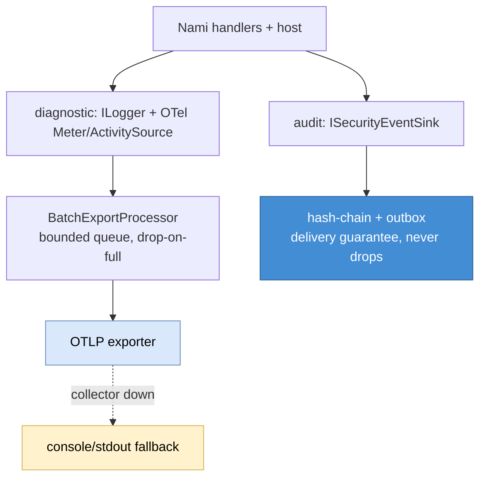
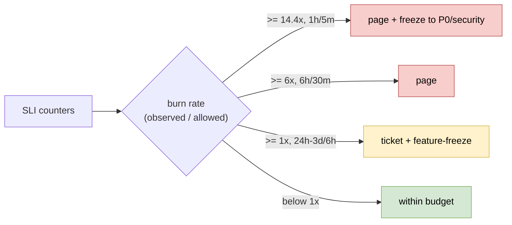
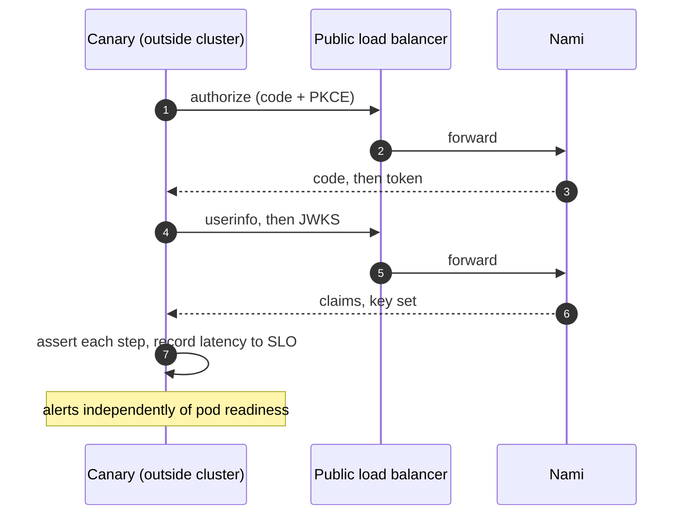

# Observability, capacity, and SLO (detailed design)

## Purpose and scope

How Nami is measured, sized, and held to a reliability target: the diagnostic
telemetry pipeline, the capacity model behind the roughly 10k-concurrent-user goal,
and the service-level objectives with the release gate, error-budget freeze,
burn-rate alerting, and external canary that enforce them (ADR-0022, ADR-0041,
ADR-0063). This is a design and a methodology, not a set of verified production
numbers: every absolute throughput or latency figure is load-test-determined, and the
SLO table and workload parameters are Product/Ops ratifications pending before GA.

In scope: the diagnostic OpenTelemetry pipeline (logs, metrics, traces) and the custom
instrumentation seam; the capacity model, bottlenecks, and load-test methodology; the
SLO/SLI model, CI release gate, error-budget freeze, multi-window burn-rate alerting,
incident routing, and the external synthetic canary; and the observability-backend
posture (operator-chosen production, a dev-only Grafana stack).

Out of scope, referenced not redefined: the audit lane (`ISecurityEventSink`,
hash-chain, delivery guarantee) which is a **separate** lane from diagnostics
([03 audit](03-audit.md)); the keys-health gauges and JWKS availability target
([09 key management](12-key-management.md)); the `/health/ready` and `/health/live`
predicate ([01 foundations](01-foundations.md), extended in [09](12-key-management.md));
the authorization SLIs and their SLO ([05 authorization](07-authorization.md)); the
rate-limiting/load-shedding and revocation mechanisms
([10 revocation](13-revocation-caching.md), [11 advanced flows](14-advanced-flows.md),
[12 Admin API](15-admin-api.md)); the token-endpoint and pooling capacity levers
([04 core protocol](04-core-protocol.md), [02 data](02-data.md)); and RTO/RPO
(ADR-0006). Content-Security-Policy finalization is a security-hardening concern
(design #15), not observability, and is not settled here.

## Decisions realized

| Decision | What this design applies |
|---|---|
| ADR-0022 | Native `ILogger` plus OpenTelemetry (OTLP) for logs, metrics, and traces; Serilog dropped; PII redaction via the Microsoft telemetry packages; audit kept on its own lane |
| ADR-0041 | Self-load-tested NFR targets; the SLO as a CI release gate; error-budget freeze; multi-window multi-burn-rate alerting; an external synthetic canary |
| ADR-0063 | Production observability backend is operator-chosen (Nami bundles none); a self-hosted Grafana stack for local development only; shipped artifacts stay permissive |
| ADR-0021 (ref) | OpenIddict emits no telemetry (issue #1345 open); the custom meter is a build-interim carrying a replace-when-native marker |
| ADR-0008 (ref) | The audit lane the diagnostic pipeline must never absorb |

## Component and interface design

### Two lanes: diagnostic telemetry versus audit

Nami has two signal lanes that must not be conflated. The **diagnostic lane** (this
design) is `Microsoft.Extensions.Logging` (`ILogger`) plus OpenTelemetry, exported over
OTLP: operational logs, metrics, and traces, lossy and best-effort. The **audit lane**
([03 audit](03-audit.md)) is `ISecurityEventSink`, hash-chained with a delivery
guarantee, and is **never** routed through the OTel/`ILogger` pipeline (which has no
tamper-evidence and no delivery guarantee). The two lanes join only by a
correlation/trace id. Serilog is not used (ADR-0022): one pipeline, native trace-to-log
correlation, PII/secret redaction via `Microsoft.Extensions.Telemetry` and
`Microsoft.Extensions.Compliance.Redaction`.

### Instrumentation seam

The .NET 10 built-in meters are used first: `aspnetcore.authentication.*` and
`aspnetcore.authorization.*`, `http.server.request.duration` and
`http.server.active_requests`, `aspnetcore.rate_limiting.*` (how load-shedding is
observed), and the Kestrel TLS/rejected-connection meters. OpenIddict itself emits **no**
telemetry (no `ActivitySource`, no `Meter`; the upstream telemetry request, issue #1345,
is open with no milestone), so Nami's own `System.Diagnostics.Metrics.Meter` and
`ActivitySource` are **gap-filling**, placed inside Nami's own event handlers, not
consuming a telemetry surface OpenIddict does not have. This is a build-interim: if
OpenIddict ships native telemetry, Nami migrates and retires the custom meter (ADR-0021
decommission marker). There is no metrics port abstraction; it is a plain meter at the
handler seam.

Nami's own instruments follow the `nami.`-rooted naming scheme and are a **stable,
versioned public contract** that consumers build dashboards and alerts on (ADR-0065,
ADR-0044 §G): `nami.identity.tokens_issued` (counter) and
`nami.identity.token_issue.duration` (histogram, tags `grant_type`/`token_type`/`result`);
`nami.identity.validation_latency`; `nami.identity.revocations` (tag `reason`);
`nami.identity.login_outcomes` (tags `outcome`/`factor`); `nami.identity.consent`
(tag `granted`/`denied`); `nami.identity.client_secret_validation`; and
`nami.identity.user_logout`. The built-in meters above keep their OpenTelemetry and
ASP.NET Core standard names; the `nami.`-rooted rule governs Nami's own instruments. A
rename or removal is a breaking change under the SemVer policy, and a migration to native
instrumentation if OpenIddict issue #1345 lands is handled under the same deprecation
window (ADR-0044 §G, ADR-0021). Key-health gauges (`key_rotations`, `keys_loaded`,
`signing_key_days_to_expiry`) are owned by [09](12-key-management.md); this design consumes
them for alerting.

### High-cardinality control (mandatory)

A metric tag value is **never** `tenant_id`, `sub`, an unbounded `client_id`,
`session.id`, `jti`, a raw token, or an IP (both a PII leak and a cardinality explosion).
Only bounded tags are allowed: `grant_type`, `token_type`, `scheme`, `result`/`outcome`,
`error.type`, `policy`. Per-tenant or per-user investigation uses **exemplars**
(`SetExemplarFilter(ExemplarFilterType.TraceBased)`, attaching a trace id to a bucket)
plus traces and logs, never a high-cardinality tag. The OpenTelemetry SDK default
cardinality limit is 2000 per metric; per-metric caps are tightened with a `View`. The
`nami.identity.tokens_issued` cap is a `View` (a cardinality limit of 50) whose
instrument-name selector is the emitted name `"nami.identity.tokens_issued"`. The SDK
matches that selector case-insensitively, so casing is not the hazard; a selector that
matches no instrument is, because it is silently inert and the counter then falls back to
the 2000 default instead of failing. A test asserts the view is attached (ADR-0077 rule D,
which carries the source evidence).

### Telemetry is lossy, never blocking

The diagnostic pipeline must never add latency to `/token` or fail an auth on a slow or
absent collector: better to lose telemetry than to block a request. The OTLP exporter
runs through a `BatchExportProcessor` with a bounded queue (default 2048) that
**drops on full** rather than blocking the caller or growing unbounded; the export has a
bounded timeout and does not retry forever on the hot path, and a failure is swallowed,
not thrown. When the OTLP endpoint is unreachable, logging falls back to the native
console (stdout), which 12-factor treats as the event stream (ADR-0031); on-premises
without a collector, the native console or file provider is used. The audit lane, by
contrast, must **not** drop (its outbox retains events, ADR-0008). A collector-outage
load test proves p99 `/token` is unchanged when the collector is blocked.

### Capacity model

The 10k concurrent-user goal is an architectural target to be proven by load test, not a
vendor-quoted number, and it is sized as RPS rather than raw CCU. Modeling all traffic as
one 30-second-think-time tuple is wrong for a machine-driven endpoint (it overstates by
tens of times), so the workload is decomposed (interim, product-owner ratify pending; all
RPS load-test-derived):

| Workload | Parameters | Interim RPS |
|---|---|---|
| Interactive login | N=10k, 3 logins/user/day, W=0.25s | ~1-3 |
| Silent refresh (dominant steady driver) | Z = access-token TTL 900s, N=10k, W=0.2s | ~11 steady, x3-x5 peak = 30-55 |
| M2M client-credentials (separate bursty ceiling) | default | 200 (or 0) |

Consistency note: each silent-refresh `/token` is a **double write** (insert the new
refresh token, revoke the old), because rolling rotation is retained (ADR-0004); the
self-contained JWT access token itself is a **zero-write**. The bottlenecks, in the order
they bind:

- **Signing CPU is not the binding constraint.** On RS256 (the baseline, ADR-0005), 10k CCU is roughly 0.07 of a signing core. Measured on .NET 10, RS256 signs at ~1,000-1,570/s/core and ES256 at ~4,300-4,800/s/core, so ES256 is only about 3-4x faster to sign (not the folklore 20x), while RS256 **verifies** about 6-9x faster than ES256, so defaulting to ES256 would push cost onto every resource server. ES256 stays a config-selectable option through the existing signing-credential source, not a default change.
- **DB write IOPS is the real hot-path cost.** The design rule is to issue a self-contained JWT access token (no write) and persist only the refresh token, taking the write off the access-token path entirely (silent refresh still double-writes, so it stays the dominant write driver); UUIDv7 primary keys (ADR-0036) reduce B-tree fragmentation on this path, and the operational store may sit on a higher-write tier than the read-heavy config store ([02 data](02-data.md), ADR-0037).
- **Connection pool is the multi-tenant ceiling.** Total connections are `tenants x pool-size x instances`, which a Silo fleet can blow past the PostgreSQL ceiling. The mitigation is PgBouncer in transaction mode (mandatory for Silo, and highly available with at least two instances), a per-tenant Npgsql `Maximum Pool Size` of about 5-10, and a bounded acquisition timeout so pool exhaustion fails fast to a load-shed 503 rather than hanging a thread ([02 data](02-data.md), ADR-0018, ADR-0040).

Load-test methodology: k6 as the primary tool in an **open model**
(`constant-arrival-rate`/`ramping-arrival-rate`), because a closed model produces
coordinated omission that hides tail latency; NBomber as the .NET-gate complement. Warm-up
is discarded and steady state measured; p50/p95/**p99** are reported, never the average.

### SLO, error budget, and the release gate

An SLI is a measured quantity (latency, error rate, availability); an SLO is its target;
the error budget is `1 - SLO` over a trailing window. Because the identity provider is on
the critical path of every login, its SLO is higher than the services that depend on it,
and 100% is the wrong target. The mechanism is fixed; the numbers are interim starting
points from a single source of truth, ratified with Product/Ops:

| SLI | Interim target | Window |
|---|---|---|
| Token-endpoint latency | p95 < 200ms, p99 < 500ms | trailing (28d proposed) |
| Local validation latency | p99 < 50ms | trailing |
| Availability (token + authorize) | 99.9%+ (99.95% proposed) | trailing |
| JWKS availability | ~99.99% | trailing |
| Error budget | 1 - SLO (~0.05%) | drives freeze |

The SLO is a **formal release gate**: the load test enforces the threshold in CI (k6
`abortOnFail` on the p99 threshold, a non-zero exit fails the build), so a breach stops
the build rather than being advisory. Widening a target requires re-ratifying at the
single source of truth and propagating, never a local loosen in one file. Overload
controls (rate-limiting to 429, load-shedding to 503, ADR-0040) protect the service
within the SLO but are not the SLO.

### Error-budget freeze and burn-rate alerting

Exhausting the error budget freezes feature releases (except P0/security) automatically,
as a consequence of the burn tier rather than a manual call. Alerting is on the **rate of
budget burn** (Google SRE multi-window multi-burn-rate), not on instantaneous latency or
error, and each tier requires a short-window confirm to prevent flap:

| Tier | Burn rate | Long / confirm window | Action |
|---|---|---|---|
| Fast-burn | >= 14.4x | 1h / 5m | page, tighten freeze to P0/security-only |
| Mid-burn | >= 6x | 6h / 30m | page |
| Slow-burn | >= 1x | 24h-3d / 6h | ticket, freeze feature releases |

Burn rate is computed from existing counters, adding no new metric. Every page-severity
alert must link a runbook, and a page without a runbook is a defect blocked in CI. The
incident routing is a fixed rule/severity/action mapping: fast or mid-burn latency or
availability pages and auto-freezes; a JWKS-availability burn pages (JWKS down breaks
every verify); `keys_loaded=false` or a readiness failure pages; a low
`signing_key_days_to_expiry` or a stale scheduler heartbeat tickets; a slow burn tickets
and freezes; a sustained rate-limit/load-shed 503 spike escalates from ticket to page.
Alerts are deduplicated by `(rule, deployment, tenant-scope)` so many pods raise one
incident. The abuse-alert ruleset (login and 2FA-failure spikes, refresh replay, 429/503
bursts, key-access anomalies, clock drift, RPO breach) shares this alerting
infrastructure but belongs to the security and DR postures, not this design.

### External synthetic canary

A scheduled probe runs the full authorization-code-plus-PKCE, token, userinfo, JWKS chain
through the public/load-balancer path from **outside** the cluster, asserting each step
and alerting independently of pod readiness. It catches configuration, certificate, DNS,
JWKS-publication, and keyring failures that an internal readiness probe cannot see from
the outside, and its end-to-end latency feeds the SLO gate. It complements, and does not
replace, the internal `/health/ready` probe ([01](01-foundations.md),
[09](12-key-management.md)).

### Observability backend posture

Production is **backend-neutral**: Nami emits OTLP and mandates no backend, bundling none
in the reference host or Helm chart. It ships the OTLP export configuration and the
connection documentation, and documents the collector agent-versus-gateway topology.
Local development runs an opt-in docker-compose profile: the OpenTelemetry Collector
(Apache-2.0) receives OTLP and fans out to Prometheus (Apache-2.0) for metrics, Loki for
logs, and Tempo for traces, with Grafana as the UI, so a developer gets all three signals
with one command. Grafana, Loki, and Tempo are AGPLv3, which is acceptable **here** only
because they are unmodified upstream container images run as separate services Nami talks
to over OTLP: they are dev tooling, not a dependency, so ADR-0026's permissive-only rule
(which governs compiled/shipped dependencies) is not tripped, and Nami's shipped artifacts
(NuGet packages, reference host image, Helm chart) bundle no AGPL. The .NET Aspire
dashboard (MIT) is the lighter, framework-native alternative and remains available.

### Key libraries and licenses

| Library | Purpose | License | ADR |
|---|---|---|---|
| OpenTelemetry .NET (SDK + OTLP exporter) | Metrics, traces, logs over one OTLP pipeline | Apache-2.0 | ADR-0022 |
| `Microsoft.Extensions.Logging` (source-generated `LoggerMessage`) | Diagnostic logging | MIT | ADR-0022 |
| `Microsoft.Extensions.Telemetry` / `Microsoft.Extensions.Compliance.Redaction` | PII/secret redaction and enrichment | MIT | ADR-0022 |
| k6 / NBomber | Load-test tools (open-model; .NET CI gate) | AGPLv3 (k6, dev-time tool) / Apache-2.0 (NBomber) | ADR-0041 |
| OpenTelemetry Collector, Prometheus | Dev-stack collection and metrics store | Apache-2.0 | ADR-0063 |
| Grafana, Loki, Tempo | Dev-only dashboards, log search, trace view | AGPLv3 (unmodified upstream dev images, not a shipped dependency) | ADR-0063 |

> **Patterns applied (ADR-0066).** Ports and adapters at the OTLP boundary (the operator
> plugs in any backend; the app depends only on the exporter); bounded-queue with
> load-shedding for the export path (drop-on-full, never block the hot path); circuit-break
> / bulkhead thinking for the capacity model (fail-fast to 503 on pool exhaustion); and a
> single source of truth for the SLO numbers so the gate cannot be loosened piecemeal.

## Data touchpoints

This design defines no tables. It reads the operational and control-plane stores only
through the capacity model (schema in [02 data](02-data.md)) and emits metrics/traces/logs
over OTLP; the audit store is the separate lane of [03 audit](03-audit.md).

## Runtime flows

### Two-lane signal separation

### Burn-rate to freeze and alert

### External canary path

## Edge cases and failure modes

- **Collector outage.** Telemetry drops on full; p99 `/token` is unchanged and no auth fails; logging falls back to stdout. The audit lane does not drop.
- **Cardinality overflow.** A stray high-cardinality tag would explode series; it is prevented by the bounded-tag rule, the per-metric `View` cap, and the SDK overflow signal, with exemplars for drill-down.
- **Pool exhaustion under load.** The bounded acquisition timeout fails fast to a 503 with `Retry-After` rather than hanging threads, and the pool-ceiling load test asserts a graceful 503 with no cascade.
- **Green pods, broken externally.** A certificate, DNS, or JWKS-publication failure is invisible to readiness but caught by the external canary, which pages independently.
- **Signing is not the ceiling.** Sizing on signing CPU would over-provision; the DB write path and connection pool bind first at 10k CCU.
- **A widened SLO by local edit.** Blocked: the gate reads the single source of truth, and loosening requires a re-ratify plus propagation, not a per-file change.

## Security considerations

- Diagnostic logs, traces, and **metric tags** are redacted of PII/secrets; audit stays on its own tamper-evident lane and never enters this pipeline.
- Metric tags carry no `sub`, `tenant_id`, `jti`, token, or IP, so telemetry cannot be turned into a tracking or enumeration surface.
- The dev observability stack is local-only and never shipped; production stays backend-neutral, so no telemetry is sent anywhere the operator did not configure.
- Overload controls (429/503) are observable as SLIs, so an attack that drives load-shedding is visible rather than silent.

## Testing strategy

- The SLO load-test gate (k6/NBomber, p95 < 200ms / p99 < 500ms, `abortOnFail`, non-zero exit) fails the build on breach.
- A collector-outage test proves p99 `/token` is unchanged and the audit lane does not drop; a `View`-attached assertion proves the cardinality cap is live; a redaction-assurance test proves no PII reaches logs, traces, or tags.
- The external canary fails and pages when JWKS publication, a certificate, or DNS breaks even while all pods report ready; a game-day burns the budget fast (page plus freeze) and slow (ticket plus feature-freeze); a CI check confirms every page-severity alert links a runbook.
- Chaos scenarios (AZ loss, PostgreSQL and PgBouncer failover, Redis outage fail-open, pod-kill mid-issuance), a mixed-version rolling-deploy compatibility test, and a JWKS output-cache eviction-after-rotation test measure SLO impact under fault.

## Open and build-time items

- **Product/Ops ratifications** (tracked in the [Pre-GA ratification checklist](../PRE-GA-RATIFICATION-CHECKLIST.md), the SLO row): the SLO numeric table and error-budget freeze policy; the workload parameters (logins/user/day, peak factor, and the M2M ceiling); the availability figure (99.9% versus 99.95%); and the trailing-window length (28 days proposed). Every absolute throughput/latency number stays load-test-determined until proven on the target infrastructure. The authorization SLO (ADR-0047, owned by [05](07-authorization.md)) and RTO/RPO (ADR-0006, owned by [09](12-key-management.md)) are ratified elsewhere and only referenced here.
- **Ops**: the on-call and escalation roster (recommended, pending Ops); the collector agent-versus-gateway topology for the reference host (the ADR-0022 open item).
- **Architect**: the RS256-versus-ES256 default (RS256 is the baseline; ES256 is a config option worth revisiting if the M2M mint-rate profile justifies it).
- **Decommission marker (ADR-0021)**: retire the custom meter for native instrumentation if OpenIddict issue #1345 lands.
- **Consumer monitoring and metrics reference (build-time, M1)**: publish an operator-facing reference that documents enablement and OTLP export configuration and then catalogs every emitted metric (name, instrument type, unit, description, and its bounded attributes) plus the standard attributes, so an operator can point their own Collector at Nami and know exactly what it provides. The metrics themselves are the stable contract fixed by ADR-0044 §G and named per ADR-0065; the reference is finalized against the real instruments when code lands, with a docs-code-sync check asserting every emitted instrument appears in it. (This is operator-facing operational telemetry to the operator's own backend, distinct from the opt-in vendor phone-home of ADR-0032.)
- **Cross-doc consistency (with [09](12-key-management.md))**: the keys-health gauge names owned by 09 (`key_rotations`, `keys_loaded`, `signing_key_days_to_expiry`) do not carry the `nami.`-rooted prefix that the telemetry-naming rule (ADR-0065) requires, and should, for full contract conformance; raised here, to be reconciled when 09 is next revised, rather than renamed across a committed doc from here.

## References

- ADRs: ADR-0022 (logging and observability stack), ADR-0041 (NFR targets and SLO release gate), ADR-0063 (observability backend and dev visualization), ADR-0040 (rate-limiting and load-shedding), ADR-0018 (connection pooling), ADR-0037 (PostgreSQL write path), ADR-0008 (the separate audit lane), ADR-0006 (RTO/RPO), ADR-0005 (RS256 baseline, claim minimization), ADR-0021 (OpenIddict version adaptation and the decommission marker), ADR-0031 (12-factor logs), ADR-0026 (permissive dependencies), ADR-0044 (public-API stability and SemVer, whose §G makes emitted metric names a versioned contract), ADR-0065 (the `nami.`-rooted telemetry naming scheme), ADR-0032 (the distinct opt-in vendor phone-home, not this operator-facing lane).
- Design docs: [03 audit](03-audit.md) (the audit lane), [09 key management](12-key-management.md) (keys-health gauges, JWKS target, readiness), [01 foundations](01-foundations.md) (health endpoints), [05 authorization](07-authorization.md) (authorization SLIs), [04 core protocol](04-core-protocol.md) (token-endpoint capacity levers), [02 data](02-data.md) (pooling, write path), [10 revocation](13-revocation-caching.md) (rate-limit/Redis posture).
- [Architecture](../architecture/README.md); [Pre-GA ratification checklist](../PRE-GA-RATIFICATION-CHECKLIST.md).

---

[Prev: Tenant lifecycle](18-tenant-lifecycle.md) · [Index](README.md) · Next: [Testing](20-testing.md)
