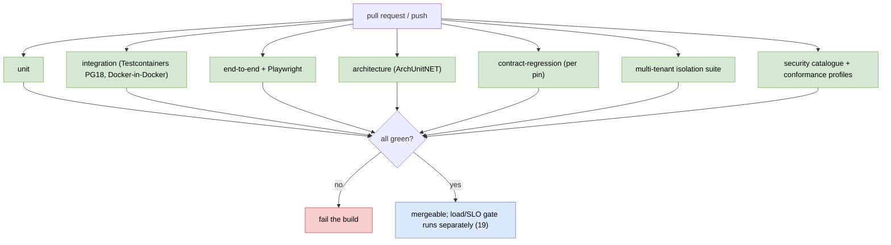

# Testing strategy (detailed design)

## 1. Decisions realized

| Decision | What this design applies |
|---|---|
| ADR-0060 | The consolidated test taxonomy (citing each type's owner), the behavior-first / Given-When-Then convention as living documentation, and test-first for protocol/security code |
| ADR-0062 | OWASP ASVS as the security-verification baseline: ASVS 5.0 Level 2 (Level 3 for key/token/dual-control/tenant-isolation), the API Security Top 10 (2023) mapping, the rule that a security test names the ASVS requirement it verifies, and the independent penetration test as a pre-GA gate |
| ADR-0027 (ref) | Parameter F, which owns the OpenID conformance profile set, the suite running in CI, the re-certification trigger, and certification as a pre-public-release step |
| ADR-0043 (ref) | The startup secure-invariant table this design tests against; its table is the authority, this file restates it |
| ADR-0058 (ref) | Behavior-first tests as an application of Separation of Concerns |
| ADR-0021/0030 (ref) | Contract-regression runs on every OpenIddict and .NET bump |
| ADR-0049 (ref) | The tenant-isolation binding the isolation suite proves |

## 2. Purpose and scope

How Nami is tested: the test taxonomy as one strategy, the behavior-first convention
that keeps tests useful, the security-verification catalogue, the multi-tenant isolation
gate, the OpenID conformance gate, and the ASVS baseline. Most of the per-feature test
*content* already lives in the feature designs; this doc is the taxonomy that organizes
and references them, plus the net-new testing decisions (behavior-first, test-first, the
security-invariant self-check).

In scope: the seven-type taxonomy and its tools; the behavior-first / Given-When-Then
convention and the test-first rule; the ASVS-requirement-identifier rule; the startup
secure-invariant self-check; the security-test catalogue (RFC 9700, ASVS L2, IDOR/BOLA,
fuzzing); the multi-tenant isolation suite as a blocking gate; the OpenID conformance CI
gate; the test-data and environment rules; the spike-to-regression map; the entry and
exit criteria; and the acceptance-test catalog that maps to the feature docs.

Out of scope, referenced not redefined: the load/SLO gate, the external canary, the
collector-outage test, and the chaos suite ([19 observability](19-observability-capacity-slo.md));
the CI job graph, the release pipeline, and the deployment tests
([21 CI/CD and deployment](21-cicd-and-deployment.md)); the migration and expand/contract
CI checks ([18 tenant lifecycle](18-tenant-lifecycle.md)); the foundational CI-gate set
([01 foundations](01-foundations.md)); and every per-feature assertion, which stays owned
by its feature doc (cited below).

## 3. Interfaces and contract

### 3.1 The test taxonomy

Seven types, one strategy; each is owned by the ADR in parentheses and this doc names it
rather than re-deciding it.

| Type | What it covers | Tools | Owner |
|---|---|---|---|
| Unit | Domain logic and handlers in isolation, no container | xUnit | ADR-0025 |
| Integration | The real pipeline (multi-tenant filter, RLS, applied migrations) via `WebApplicationFactory<Program>` against Testcontainers PostgreSQL 18; Redis Testcontainers for backplane/replay | Testcontainers, WebApplicationFactory | ADR-0025 |
| End-to-end | Protocol path (issuance, validation, revocation, introspection, tenant-isolation negative) and the admin UI | xUnit + WebApplicationFactory + Testcontainers; Playwright | ADR-0025 |
| Architecture | The dependency rule and slice decoupling | `Nami.Identity.ArchitectureTests` (TngTech.ArchUnitNET) | ADR-0024 |
| Contract-regression | Each OpenIddict seam's behavior on the pinned version, on every OpenIddict/.NET bump | xUnit | ADR-0021, ADR-0030 |
| Load and soak | The NFR targets on p95/p99; the SLO CI gate and canary | k6 / NBomber | ADR-0041 (owned by [19](19-observability-capacity-slo.md)) |
| Conformance | OpenID certification profiles | OIDF conformance suite (self-hosted) | ADR-0027 parameter F |

**SQLite is never substituted** for the database in any test: row-level security,
`xmin` concurrency, and `uuidv7()` are PostgreSQL-specific, so dev equals test equals the
production engine (PostgreSQL 18). The assertion library is an open build-time pick under
the permissive-only policy (ADR-0026); FluentAssertions is excluded because it became
commercially licensed, so an MIT/BSD assertion library is chosen when the test projects
land.

### 3.2 What a test must state

Two rules make the suite readable as a contract rather than only runnable.

**Given / When / Then naming and structure** (ADR-0060), so the suite reads as the
requirements. The Nami-real exemplars:

- *Given* a proposal created by one admin, *when* a second admin approves it with step-up MFA, *then* the action executes and no token is exposed to the browser.
- *Given* an access token issued to a client, *when* the client revokes it, *then* introspection reports it inactive on every node within the freshness bound.
- *Given* a token issued for tenant A, *when* it is presented to tenant B's resource, *then* validation fails on the issuer and tenant binding.

**A security test names the ASVS requirement it verifies** (ADR-0062, binding). The
identifier is part of the test, not of a side spreadsheet, so the suite doubles as ASVS
coverage evidence and a reviewer can see which requirements are exercised without running
anything. The two existing security negatives, the spoofed client-certificate rejection
and the cross-tenant validation failure, are the first entries.

## 4. Data and structure

This design defines no tables. Tests run against the schema owned by
[02 data](02-data.md) through Testcontainers, which spin PostgreSQL 18 (and a broker for
the v2 change-event feature) per run and are disposed after.

**The fixture rules are constraints, not conventions.**

- **Synthetic data only, and neutral tenant names.** `tenant-a` and `tenant-b`, never an illustrative company name. This is the repository's own naming rule (a real organization is never named in a committed file) expressed where it is easiest to break it, since a fixture feels private and is not.
- **No secret and no real personal data in a fixture.** Keys, certificates, and client secrets used in tests are generated for the test, never real material, so a test tree can never become a credential leak or a subject-access problem.
- **The database engine is the production engine**, per section 3.1: a fixture that passes on a substituted engine has proven nothing about row-level security.

## 5. Behaviour

### 5.1 Behavior-first as living documentation (net-new, binding)

A test asserts **observable behavior** through a public entry point and never asserts
private internals, call counts, or structure; a test that breaks on a behavior-preserving
refactor is a defect in the test. Protocol and security code is written **test-first**
(the failing behavior test precedes the implementation), and the security negatives are
first-class, not optional: a client-set client-certificate header must be rejected and
never treated as mTLS-authenticated, and a token issued for one tenant must fail
validation at another tenant's resource.

### 5.2 Startup secure-invariant self-check (fail-fast)

The host asserts its security invariants at startup and refuses to serve traffic on a
mismatch, so a configuration drift cannot silently weaken security. The invariants:
PKCE is mandatory for public/code clients; implicit and hybrid-implicit grants are off;
rolling refresh with reuse detection is on (that is, `DisableRollingRefreshTokens` is
false); there is no symmetric signing key (asymmetric only); the PKCE code-challenge
methods exclude `plain` (S256 only); the JWE content-encryption is
`Aes256CbcHmacSha512` (A256CBC-HS512, the algorithm OpenIddict supports through its
standard API, not A256GCM) with `RSA1_5` key-management forbidden; the core cookies
carry `Secure`, `HttpOnly`, a pinned `SameSite`, and the `__Host-` prefix; OpenIddict
degraded mode is off in any token-issuing environment; the HSTS middleware is registered
with at least the product `max-age` outside Development; no explicitly configured TLS
protocol below 1.2 is permitted where the application terminates TLS itself; and
`DisableTransportSecurityRequirement` is off outside Development (the last three from
ADR-0076). Eleven in total, and the list here is a restatement: **ADR-0043's table is the
one to diff against**, since this enumeration has already fallen behind it once. It does
**not** assert access-token encryption, which is intentionally off by design (ADR-0005).

### 5.3 The multi-tenant isolation suite (blocking gate)

Cross-tenant isolation is the property with the largest blast radius, so its tests are a
**merge-blocking gate** rather than one suite among many, and they are grounded in spike
A-4 (17/17, V25). Five assertions, and two of them are counterintuitive enough that an
implementer who guesses will guess wrong:

- **Pool filter.** A tenant-A query cannot read or stamp tenant-B rows in the shared store.
- **Silo connection.** A Silo tenant uses its own connection, with no leak to another database.
- **Fail-closed, not fail-open.** No ambient tenant returns zero rows or throws (A-4/T13), never the full set; the de-privileged database role confines both reads and a bulk `DELETE` at the database level (A-4/T14); and the `NULLIF` cast does not crash on an empty pooled session variable.
- **Composite `(TenantId, ClientId)`.** Two Pool tenants **may** register the same `client_id` and **both succeed** (A-4/T8-T9), because the composite index overrides the global uniqueness; client lookup stays tenant-isolated.
- **Scope is the inverse of the client rule.** A scope is a **global catalog**: `Name` is globally unique, so two tenants cannot create the same scope name, and a scope is visible to every tenant (V25/T15). Assuming scope behaves like `client_id` is the mistake this row exists to prevent.

### 5.4 The security-test catalogue (ADR-0062)

- **RFC 9700 (OAuth 2.0 Security BCP):** PKCE bypass, open redirect, token replay, mix-up, CSRF/state, authorization-code injection, refresh-reuse detection.
- **OWASP ASVS 5.0 Level 2** as the product-wide floor, with Level 3 depth for the highest-assurance components: key management and signing, token issuance and validation, the dual-control admin path, and tenant isolation. Coverage is **self-assessed and recorded**; ASVS is a self-verification standard and Nami claims no external certification it has not undergone. The chapters exercised are authentication, session management (including a cookie-attribute test), errors and logging, data protection, and communications. **Those chapter labels are deliberately written out rather than numbered**: the familiar `V2`/`V3`/`V7`/`V8`/`V9` numbering is the ASVS **4.x** scheme, and ADR-0062 records that the 4.x numbers must be mapped to their 5.0 equivalents when the tests are written, so carrying the old numbers under a 5.0 heading would encode a stale mapping as a fact.
- **OWASP API Security Top 10 (2023)** mapped onto decisions already made: object-level and object-property-level authorization (API1/API3) onto per-tenant authorization and the access-check engine (ADR-0047) plus resource-server tenant isolation (ADR-0049); broken authentication (API2) onto credential hardening and MFA (ADR-0028, ADR-0013) and the startup invariants (ADR-0043); unrestricted resource consumption (API4) onto rate-limiting and abuse defense (ADR-0040, ADR-0042); improper inventory management (API9) onto the versioned public-API seam and self-service registration (ADR-0044, ADR-0035).
- **IDOR/BOLA on the admin API:** object-level authorization negatives (a tenant-A caller cannot read/modify/delete a tenant-B resource; a non-admin cannot reach an admin object).
- **Fuzzing:** `/token` (grant_type, code, client params, malformed/oversized/encoded bodies) with no crash, no 5xx, no leak, extended in breadth to `/authorize`, PAR, device, introspection, the JWKS/JWT parser (malformed JWK, oversized `kid`, nested JWE), and the back-channel `logout_token` receiver.
- **The audit hash-chain integrity test:** a mutated or deleted mid-chain record must be detected by the verify job.

**The baseline tracks the current stable OWASP edition.** On a major OWASP release the
mapping is redone, the same pinned-and-tracked discipline the stack of record uses
(ADR-0062, ADR-0061).

### 5.5 OpenID conformance gate

The OpenID Foundation conformance suite runs self-hosted (a Docker image, not the public
hosted service) as a CI gate on three named profiles: **OP Basic**, **OP Config**, and
**OP FormPost**; CI fails if any profile fails. The profile set, the CI run, and the
re-certification trigger are ADR-0027 parameter F, not this design's call.

**Conformance and certification are separate things**, and conflating them makes a
go-to-market step look like a build blocker. Passing the suite in CI is the engineering
gate above. Formal OpenID **certification** submission is a pre-public-release step owned
by Product, is not an MVP blocker, and is redone on a major version or a
protocol-affecting change. Its one open precondition is a stable public reference host,
whose ownership, hosting, patch cadence, and cost are pending Ops ratification.

Not gated for v1: Hybrid and Implicit profiles, certified only if a client actually needs
them; Dynamic Client Registration, deferred until OpenIddict ships it natively at 8.0;
FAPI 2.0, whose message-signing profiles (JAR, JARM, RAR) are de-scoped by ADR-0014 and
whose demand-driven adoption is ADR-0056 (proposed); back-channel logout, interim now and
native at 8.0; and sender-constrained conformance, which follows once the DPoP and mTLS
paths are stable and proven.

### 5.6 The spike-to-regression map

Where a spike proved a mechanism, its assertions become **permanent regression tests**:
the harness is copied and the tests are kept, so a mechanism that was proven once cannot
quietly stop being true.

| Spike / verification | Becomes the regression basis for |
|---|---|
| A-1 and A-3 (V18) | DPoP sender-constraint ([06](06-sender-constrained-tokens.md)) |
| A-2 (V19) | No-restart key rotation ([12](12-key-management.md)) |
| A-4 (17/17, V25) | Pool isolation, RLS, `Include` row-loss, migration DDL ([02](02-data.md), and section 5.3) |
| A-5 (V20) | Per-tenant issuer, with no static issuer set ([04](04-core-protocol.md)) |
| A-6 (V26) | Prune performance and default-schema adequacy ([02](02-data.md)) |
| A-7 (4/4, V27) | Resource-server per-tenant validation, and that a shared key does not isolate ([05](05-resource-server-validation.md)) |
| A-8 (8/8, V28) | Dynamic scheme provider and RFC 9207 `iss` enforcement ([09](09-federation-and-claims-profile.md)) |
| A-9 (10/10, V29) | Outbox atomicity, at-least-once delivery, `SKIP LOCKED`, and the RLS write path (ADR-0071, v2) |

**mTLS is the gap in this map and is called out rather than assumed.** It was never
spiked, so its regression basis is the spoofed-client-certificate-header negative test in
section 5.4, not A-1 or A-3. Reading the DPoP spike as covering mTLS would leave the
header-spoofing path with no proven test at all.

### 5.7 The acceptance-test catalog (map to owners; confirm at M1)

The behavior tests are cataloged here but specified and owned by their feature docs; this
doc references them rather than restating the assertions. Every threat in the
[threat model](../architecture/14-threat-model.md) must reach at least one row below,
because that view states test obligations (`S5` carries an explicit v1 test obligation)
and an obligation with no suite is an assertion.

| Area | Owner doc |
|---|---|
| Cross-tenant / RLS isolation (the blocking gate of section 5.3) | [02](02-data.md), [07](07-authorization.md), [04](04-core-protocol.md), [18](18-tenant-lifecycle.md) |
| PKCE, discovery, per-tenant issuer, claims | [04](04-core-protocol.md) |
| `id_token` claim shape: `auth_time` as a JSON number, `amr` as a JSON array, neither duplicated | [04](04-core-protocol.md), [09](09-federation-and-claims-profile.md) |
| Refresh concurrency inside and outside the reuse leeway, and family-revoke | [04](04-core-protocol.md) |
| mTLS spoofed-header rejection, DPoP | [06](06-sender-constrained-tokens.md), [04](04-core-protocol.md) for the issuance-side wiring |
| Resource-server per-tenant validation, shared-key-does-not-isolate | [05](05-resource-server-validation.md) |
| Device backoff, PAR flood and PAR enforcement | [14](14-advanced-flows.md) |
| Revocation propagation, distrusted-kid, config propagation, and that a revoke is single-token and does not kill sibling tokens | [13](13-revocation-propagation-and-caching.md) |
| Session and consent: `prompt=none` against a revoked session or authorization, force-logout by subject, the concurrent-session cap | [08](08-user-management.md), [11](11-login-consent-ui.md) |
| Back-channel logout: `sid` present on the `id_token`, one session ended not all of a subject's, and `logout_token` shape and replay guard | [11](11-login-consent-ui.md) |
| Admin API: optimistic-concurrency 409 on a stale ETag, application-delete revoking before delete, client-secret rollover with no downtime | [15](15-admin-api.md) |
| Dual-control (proposer not approver, step-up, target changed, BOLA) | [15](15-admin-api.md), [07](07-authorization.md) |
| Audit hash-chain integrity, delivery, two-lane independence | [03](03-audit.md) |
| Playwright admin end-to-end (propose, second-user step-up approve, no token in browser) | [16 app](16-admin-app.md) |
| Erasure erase-set plus chain-verify gate | [17 erasure](17-erasure-and-data-subject-rights.md) |
| Federation security (SSRF egress, RFC 9207 `iss` and mix-up, anti-takeover linking, external-claim allow-list) | [09](09-federation-and-claims-profile.md) |
| Breached-password check with fail-open behavior | [08](08-user-management.md) |
| Abuse defense (risk-triggered challenge, lockout-DoS scoping) | [11](11-login-consent-ui.md) |
| Load/SLO gate, external canary, collector-outage, chaos | [19](19-observability-capacity-slo.md) |

Because the taxonomy is confirmed against the real suites when the test projects land at
M1 (ADR-0060), it is a strategy and a naming convention here, not a frozen list.

### 5.8 Where each test type runs

### 5.9 Entry and exit criteria

**Entry to a test cycle:** the feature is code-complete and its unit tests pass, and the
design it implements has been read rather than inferred.

**Exit, the definition of done:** every applicable level passes; the isolation gate of
section 5.3 and the conformance profiles of section 5.5 are green; the security-catalogue
items that apply to the feature pass; and coverage meets the agreed line on the
security-relevant paths.

**Defect handling is part of the contract.** A security-relevant defect blocks the
release. A regression **re-opens the spike-parity test that should have caught it**,
rather than being fixed in place, because a regression that escaped means the permanent
test of section 5.6 was not asserting what it claimed.

## 6. Dependencies and wiring

A merge is blocked unless the build and the analyzers pass, the public-API diff is clean,
the unit and integration suites pass, the **multi-tenant isolation suite** (section 5.3)
passes, the **conformance gate profiles** (section 5.5) pass, and coverage stays at or
above the agreed line on the security-relevant paths (token issuance, isolation, keys,
audit), each of which carries an explicit test. The static-analysis, dependency-scan,
secret-scan, container-scan, and dynamic-scan stages, and the configuration test that
forbids dangerous toggles outside Development, are pipeline stages owned by
[21 CI/CD and deployment](21-cicd-and-deployment.md); the load and SLO gate is
[19](19-observability-capacity-slo.md)'s separate job. The specific analyzers are an
open, replaceable choice and are not pinned here (ADR-0062).

### Key libraries and licenses

Verified at package metadata in the local cache:

| Library | Purpose | License | ADR |
|---|---|---|---|
| xUnit | Unit/integration/e2e test framework | Apache-2.0 (read at v3 3.2.2) | ADR-0025, ADR-0060 |
| Testcontainers for .NET | Real PostgreSQL 18 / Redis in tests | MIT (read at 4.13.0) | ADR-0025 |
| `Microsoft.Playwright` | Admin UI end-to-end | **MIT** (read at 1.59.0, from the `playwright-dotnet` repository; the JavaScript `playwright` project is Apache-2.0, and the two are not the same package) | ADR-0025 |
| TngTech.ArchUnitNET | Architecture (dependency-rule) tests | Apache-2.0 (read at 0.13.3) | ADR-0024 |

Not verified offline, to be confirmed by the ADR-0026 license-scan gate:

| Component | Purpose | License as stated | ADR |
|---|---|---|---|
| OIDF conformance suite | OpenID conformance gate (self-hosted container image, not a compiled dependency) | Apache-2.0 | ADR-0027 |
| (assertion library) | Fluent assertions | MIT/BSD, chosen at M1 (not FluentAssertions, now commercial) | ADR-0026 |

> **Patterns applied (ADR-0066).** Behavior-first tests as an application of Separation
> of Concerns (assert the contract, not the internals); the test pyramid (many unit, fewer
> integration, fewest e2e); fail-fast guard clause (the startup secure-invariant
> self-check); and the golden-master / conformance-suite pattern for the OpenID profiles.

## 7. Error handling, edge cases, invariants

- **A refactor breaks a passing test without changing behavior:** treated as a defect in the test, not the code, per the behavior-first rule.
- **A white-box test is genuinely needed** (a hash-chain link, a handler order): allowed as the deliberate exception, with behavior-first the default.
- **A configuration drift weakens security:** the startup self-check fails fast and the host refuses traffic, rather than serving in a weakened posture.
- **The conformance suite lags a spec the product implements:** the three gated profiles remain the bar; new profiles are added when their prerequisites land.
- **The taxonomy names a suite the code does not yet have:** expected before M1; the taxonomy is confirmed against the real suites when they exist.
- **A spike is read as covering more than it proved:** the map in section 5.6 is the boundary, and mTLS is the worked example of a mechanism that has no spike behind it.
- **An ASVS chapter is cited by its 4.x number:** the mapping to 5.0 is done when the test is written, so a 4.x number under a 5.0 label is a stale mapping presented as a fact.

## 8. Security and multi-tenancy notes

- The security-test catalogue and the cross-tenant and audit-integrity gates make the security posture continuously verified, not asserted, and each security test carries its ASVS requirement identifier so coverage is readable rather than claimed.
- The startup secure-invariant self-check is a fail-closed backstop against a configuration that would weaken PKCE, grant types, refresh rotation, signing keys, or cookie attributes.
- Negative tests (spoofed client-cert header, cross-tenant token) are first-class, so the isolations that matter most are proven, not assumed.
- **The isolation suite blocks the merge**, which is the difference between multi-tenancy as a design property and multi-tenancy as a tested one.
- **The fixture rules of section 4 are a security control**, not housekeeping: a test tree holding real key material or real personal data is a leak with a long half-life and no erasure path.
- **An independent penetration test is a pre-GA release gate** (ADR-0062), because self-assessment cannot find what the assessor did not think to look for. Its scope is the full authentication surface: the protocol endpoints, the admin API and admin application, tenant isolation including the cross-tenant and Pool shared-keyset cases, and the break-glass paths. It runs against a dedicated pre-production environment on synthetic data under agreed rules of engagement, with volumetric denial of service out of scope because that surface is answered by overload protection rather than application code (ADR-0040). **The gate is that the test has been run and its findings ratified or accepted as risks**; publishing a report is a separate Product question and is deliberately not gated.

## 9. Testing

This design *is* the testing strategy, so its own confirmation is external: the suites
above run green in CI (with the load/SLO gate and canary as
[19](19-observability-capacity-slo.md)'s separate job), the threat model's obligations
each resolve to a row in section 5.7, and the taxonomy is reconciled to the real test
projects at M1.

## 10. Open and build-time items

- The **coverage line**, meaning the exact percentage gate on the security-relevant paths, is a build-time pick made when the test projects land, not a figure this design invents.
- The assertion library is chosen at M1 under the permissive-only policy (not FluentAssertions).
- The public reference host required for OpenID **certification listing** is a pre-GA ratification (Ops); its ownership, hosting, patch cadence, and cost are unresolved. Tracked in the [Pre-GA ratification checklist](../PRE-GA-RATIFICATION-CHECKLIST.md) against ADR-0027.
- **Additional conformance profiles** (back-channel logout, Dynamic OP if DCR ships, FAPI 2.0 under ADR-0056) are a Product and Security ratification, not a v1 gate.
- The **ASVS 5.0 Level 2 self-assessment** coverage (Level 3 for key/token/dual-control/tenant-isolation) and the API Security Top 10 mapping are a pre-GA ratification, and part of that work is **mapping the ASVS 4.x chapter numbers used in earlier records onto their 5.0 equivalents** rather than assuming they carried over (ADR-0062).
- The **independent penetration test** is a pre-GA release gate scoped and owned by Security (ADR-0062, detailed in section 8); GA is blocked until both it and the ASVS self-assessment are ratified.
- **The concrete Content-Security-Policy values have no ADR home.** They are deferred here from [11](11-login-consent-ui.md), which defers them without naming an owner, while [16](16-admin-app.md) requires a strict policy with no `unsafe-inline`. No ADR in this repository mentions Content-Security-Policy: an earlier revision of this file cited ADR-0062 for it, which that ADR does not support. Finalizing the header values is a build-time task, but the policy that governs them needs either an ADR or a checklist entry rather than a citation to an ADR about something else.
- The taxonomy and the behavior-first guidance are confirmed against the real suites at M1 (ADR-0060).

## 11. Sources

- ADRs: ADR-0060 (testing strategy, the taxonomy, behavior-first and test-first), ADR-0062 (the ASVS and API Top 10 baseline, the ASVS-identifier rule, the self-assessment posture, and the penetration-test gate), ADR-0027 parameter F (the conformance profile set, the CI run, re-certification, and certification as a pre-public-release step), ADR-0043 (the startup secure-invariant table this file tests against), ADR-0076 (the three transport invariants), ADR-0058 (Separation of Concerns), ADR-0021 and ADR-0030 (contract-regression per bump), ADR-0024 (architecture tests), ADR-0025 (Testcontainers, end-to-end, CI), ADR-0041 (the load/SLO gate, owned by 19), ADR-0049 (the tenant-isolation binding the gate proves), ADR-0047 and ADR-0033 (the authorization engine and shared-keyset case in the isolation and penetration scope), ADR-0026 (permissive dependencies), ADR-0040 (overload protection, why volumetric denial of service is out of the penetration scope), ADR-0014 and ADR-0056 (the FAPI de-scope and its demand-driven successor), ADR-0061 (the pinned-and-tracked discipline the OWASP-edition rule reuses), ADR-0071 (the v2 outbox the A-9 regression covers).
- Architecture: [14 threat model](../architecture/14-threat-model.md) (the threats whose test obligations section 5.7 must resolve), [20 NFR catalogue](../architecture/20-nfr-catalogue.md) (the targets the load and SLO suites are measured against).
- Design docs: [21 CI/CD and deployment](21-cicd-and-deployment.md) (the pipeline that runs these suites and owns the scan stages), [19 observability](19-observability-capacity-slo.md) (load/SLO gate, canary, chaos, collector outage), [18 tenant lifecycle](18-tenant-lifecycle.md) (migration CI checks), [01 foundations](01-foundations.md) (the foundational CI gates), and the feature docs cited in the acceptance-test catalog.
- [Pre-GA ratification checklist](../PRE-GA-RATIFICATION-CHECKLIST.md).
- Reconciled against the design corpus on 2026-07-29: its testing and deployment phase document (the test-type table, the startup-invariant section, the acceptance tests traced to the native-versus-build audits, and the production-parity additions) and its consolidated test-strategy document (the isolation suite, the spike-to-regression map, the merge gates, the fixture rules, and the entry and exit criteria). Corrections made rather than transcribed: the corpus labels its ASVS mapping **v4**, so the chapter numbers are written out instead of renumbered silently under 5.0; the conformance gate is attributed to ADR-0027 parameter F rather than to this document; and the corpus's threat identifiers belong to its own threat model, so the obligations here are traced to this repository's view instead.

---

[Prev: Observability, capacity, and SLO](19-observability-capacity-slo.md) · [Index](README.md) · Next: [CI/CD and deployment](21-cicd-and-deployment.md)
