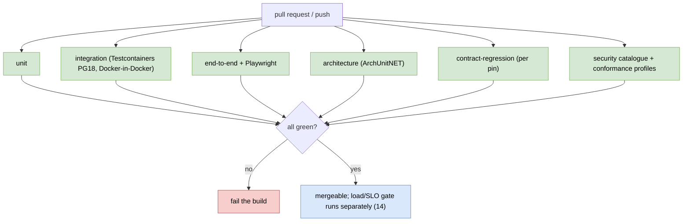

# Testing strategy (detailed design)

## Purpose and scope

How Nami is tested: the test taxonomy as one strategy, the behavior-first convention
that keeps tests useful, the security-verification catalogue, the OpenID conformance
gate, and the ASVS baseline. Most of the per-feature test *content* already lives in
the feature designs; this doc is the taxonomy that organizes and references them, plus
the net-new testing decisions (behavior-first, test-first, the security-invariant
self-check, the conformance and ASVS gates). It realizes ADR-0060 (testing strategy)
and ADR-0062 (OWASP ASVS baseline).

In scope: the seven-type taxonomy and its tools; the behavior-first / Given-When-Then
convention and the test-first rule; the startup secure-invariant self-check; the
security-test catalogue (RFC 9700, ASVS L2, IDOR/BOLA, fuzzing); the OpenID conformance
CI gate; the ASVS L2 baseline and the Content-Security-Policy finalization; and the
acceptance-test catalog that maps to the feature docs.

Out of scope, referenced not redefined: the load/SLO gate, the external canary, the
collector-outage test, and the chaos suite ([14 observability](19-observability-capacity-slo.md));
the CI job graph, the release pipeline, and the deployment tests
([15 CI/CD and deployment](21-cicd-and-deployment.md)); the migration and expand/contract
CI checks ([13 tenant lifecycle](18-tenant-lifecycle.md)); the foundational CI-gate set
([01 foundations](01-foundations.md)); and every per-feature assertion, which stays owned
by its feature doc (cited below).

## Decisions realized

| Decision | What this design applies |
|---|---|
| ADR-0060 | The consolidated test taxonomy (citing each type's owner), the behavior-first / Given-When-Then convention as living documentation, and test-first for protocol/security code |
| ADR-0062 | OWASP ASVS as the security-verification baseline: ASVS 5.0 Level 2 coverage (Level 3 for key/token/dual-control/tenant-isolation), the API Security Top 10 mapping, and the concrete Content-Security-Policy |
| ADR-0058 (ref) | Behavior-first tests as an application of Separation of Concerns |
| ADR-0021/0030 (ref) | Contract-regression runs on every OpenIddict and .NET bump |

## Component and interface design

### The test taxonomy

Seven types, one strategy; each is owned by the ADR in parentheses and this doc names it
rather than re-deciding it.

| Type | What it covers | Tools | Owner |
|---|---|---|---|
| Unit | Domain logic and handlers in isolation, no container | xUnit | ADR-0025 |
| Integration | The real pipeline (multi-tenant filter, RLS, applied migrations) via `WebApplicationFactory<Program>` against Testcontainers PostgreSQL 18; Redis Testcontainers for backplane/replay | Testcontainers, WebApplicationFactory | ADR-0025 |
| End-to-end | Protocol path (issuance, validation, revocation, introspection, tenant-isolation negative) and the admin UI | xUnit + WebApplicationFactory + Testcontainers; Playwright | ADR-0025 |
| Architecture | The dependency rule and slice decoupling | `Nami.Identity.ArchitectureTests` (TngTech.ArchUnitNET) | ADR-0024 |
| Contract-regression | Each OpenIddict seam's behavior on the pinned version, on every OpenIddict/.NET bump | xUnit | ADR-0021, ADR-0030 |
| Load and soak | The NFR targets on p95/p99; the SLO CI gate and canary | k6 / NBomber | ADR-0041 (owned by [14](19-observability-capacity-slo.md)) |
| Conformance | OpenID certification profiles | OIDF conformance suite (self-hosted) | this doc |

**SQLite is never substituted** for the database in any test: row-level security,
`xmin` concurrency, and `uuidv7()` are PostgreSQL-specific, so dev equals test equals the
production engine (PostgreSQL 18). The assertion library is an open build-time pick under
the permissive-only policy (ADR-0026); FluentAssertions is excluded because it became
commercially licensed, so an MIT/BSD assertion library is chosen when the test projects
land.

### Behavior-first as living documentation (net-new, binding)

A test asserts **observable behavior** through a public entry point and never asserts
private internals, call counts, or structure; a test that breaks on a behavior-preserving
refactor is a defect in the test. Tests are named and structured as **Given / When / Then**
scenarios so the suite reads as the requirements. The Nami-real exemplars:

- *Given* a proposal created by one admin, *when* a second admin approves it with step-up MFA, *then* the action executes and no token is exposed to the browser.
- *Given* an access token issued to a client, *when* the client revokes it, *then* introspection reports it inactive on every node within the freshness bound.
- *Given* a token issued for tenant A, *when* it is presented to tenant B's resource, *then* validation fails on the issuer and tenant binding.

Protocol and security code is written **test-first** (the failing behavior test precedes
the implementation), and the security negatives are first-class, not optional: a
client-set client-certificate header must be rejected and never treated as
mTLS-authenticated, and a token issued for one tenant must fail validation at another
tenant's resource.

### Startup secure-invariant self-check (fail-fast)

The host asserts its security invariants at startup and refuses to serve traffic on a
mismatch, so a configuration drift cannot silently weaken security. The invariants:
PKCE is mandatory for public/code clients; implicit and hybrid-implicit grants are off;
rolling refresh with reuse detection is on (that is, `DisableRollingRefreshTokens` is
false); there is no symmetric signing key (asymmetric only); the PKCE code-challenge
methods exclude `plain` (S256 only); the JWE content-encryption is
`Aes256CbcHmacSha512` (A256CBC-HS512, the algorithm OpenIddict supports through its
standard API, not A256GCM) with `RSA1_5` key-management forbidden; the core cookies
carry `Secure`, `HttpOnly`, a pinned `SameSite`, and the `__Host-` prefix; OpenIddict
degraded mode is off in any token-issuing environment; the HSTS middleware is registered
with at least the product `max-age` outside Development; no explicitly configured TLS
protocol below 1.2 is permitted where the application terminates TLS itself; and
`DisableTransportSecurityRequirement` is off outside Development (the last three from
ADR-0076). Eleven in total, and the list here is a restatement: **ADR-0043's table is the
one to diff against**, since this enumeration has already fallen behind it once. It does
**not** assert access-token encryption, which is intentionally off by design (ADR-0005).

### The security-test catalogue (ADR-0062)

- **RFC 9700 (OAuth 2.0 Security BCP):** PKCE bypass, open redirect, token replay, mix-up, CSRF/state, authorization-code injection, refresh-reuse detection.
- **OWASP ASVS 5.0 Level 2** across V2 (auth), V3 (session, including a cookie-attribute test), V7 (errors/logging), V8 (data protection), V9 (communications), with Level 3 depth for key, token, dual-control, and tenant-isolation surfaces, and the API Security Top 10 mapped. This ASVS baseline plus the concrete Content-Security-Policy are finalized here (the CSP values deferred from [08](11-login-consent-ui.md) and [14](19-observability-capacity-slo.md)).
- **IDOR/BOLA on the admin API:** object-level authorization negatives (a tenant-A caller cannot read/modify/delete a tenant-B resource; a non-admin cannot reach an admin object).
- **Fuzzing:** `/token` (grant_type, code, client params, malformed/oversized/encoded bodies) with no crash, no 5xx, no leak, extended in breadth to `/authorize`, PAR, device, introspection, the JWKS/JWT parser, and the back-channel `logout_token` receiver.
- **Cross-tenant negative test as a CI gate** and the **audit hash-chain integrity test** (a mutated or deleted record must be detected).

### OpenID conformance gate

The OpenID Foundation conformance suite runs self-hosted (a Docker image, not the public
hosted service) as a CI gate on three named profiles: **Basic OP**, **Config OP**, and
**Form Post OP**; CI fails if any profile fails. Not targets for v1: FAPI 2.0 (JARM and
RAR are out, ADR-0014); Dynamic Client Registration (waits for the OpenIddict 8.0 native
support); native back-channel logout (interim now, native at 8.0); and
sender-constrained conformance (once the DPoP handler is proven). Public certification
listing needs a stable, public reference host whose ownership is unresolved and is a
pre-GA ratification (Ops).

### The acceptance-test catalog (map to owners; confirm at M1)

The behavior tests are cataloged here but specified and owned by their feature docs; this
doc references them rather than restating the assertions:

| Area | Owner doc |
|---|---|
| Cross-tenant / RLS isolation | [02](02-data.md), [05](07-authorization.md), [04](04-core-protocol.md), [13](18-tenant-lifecycle.md) |
| PKCE, discovery, per-tenant issuer, claims | [04](04-core-protocol.md) |
| mTLS spoofed-header rejection, DPoP, device backoff, PAR flood | [04](04-core-protocol.md), [11](14-advanced-flows.md) |
| Revocation propagation, distrusted-kid, config propagation | [10](13-revocation-caching.md) |
| Dual-control (proposer not approver, step-up, target_changed, BOLA) | [12](15-admin-api.md), [05](07-authorization.md) |
| Audit hash-chain integrity, delivery, two-lane independence | [03](03-audit.md) |
| Playwright admin end-to-end (propose, second-user step-up approve, no token in browser) | [12 app](16-admin-app.md) |
| Erasure erase-set plus chain-verify gate | [13 erasure](17-erasure-and-data-subject-rights.md) |
| Federation security (SSRF egress, RFC 9207 iss/mix-up, anti-takeover, claim allow-list, HIBP fail-open) | [06](08-user-management.md) |
| Abuse defense (risk-triggered challenge, lockout-DoS scoping) | [08](11-login-consent-ui.md) |
| Load/SLO gate, external canary, collector-outage, chaos | [14](19-observability-capacity-slo.md) |

Because the taxonomy is confirmed against the real suites when the test projects land at
M1 (ADR-0060), it is a strategy and a naming convention here, not a frozen list.

### Key libraries and licenses

| Library | Purpose | License | ADR |
|---|---|---|---|
| xUnit | Unit/integration/e2e test framework | Apache-2.0 | ADR-0025, ADR-0060 |
| Testcontainers for .NET | Real PostgreSQL 18 / Redis in tests | MIT | ADR-0025 |
| Playwright | Admin UI end-to-end | Apache-2.0 | ADR-0025 |
| TngTech.ArchUnitNET | Architecture (dependency-rule) tests | Apache-2.0 | ADR-0024 |
| OIDF conformance suite | OpenID conformance gate (self-hosted) | Apache-2.0 | this doc |
| (assertion library) | Fluent assertions | MIT/BSD, chosen at M1 (not FluentAssertions, now commercial) | ADR-0026 |

> **Patterns applied (ADR-0066).** Behavior-first tests as an application of Separation
> of Concerns (assert the contract, not the internals); the test pyramid (many unit, fewer
> integration, fewest e2e); fail-fast guard clause (the startup secure-invariant
> self-check); and the golden-master / conformance-suite pattern for the OpenID profiles.

## Data touchpoints

None. Tests run against the schema owned by [02 data](02-data.md) through Testcontainers
PostgreSQL 18; this doc defines no tables.

## Runtime flows

### Where each test type runs

## Edge cases and failure modes

- **A refactor breaks a passing test without changing behavior:** treated as a defect in the test, not the code, per the behavior-first rule.
- **A white-box test is genuinely needed** (a hash-chain link, a handler order): allowed as the deliberate exception, with behavior-first the default.
- **A configuration drift weakens security:** the startup self-check fails fast and the host refuses traffic, rather than serving in a weakened posture.
- **The conformance suite lags a spec the product implements:** the three gated profiles remain the bar; new profiles (FAPI, DCR, sender-constrained) are added when their prerequisites land.
- **The taxonomy names a suite the code does not yet have:** expected before M1; the taxonomy is confirmed against the real suites when they exist.

## Security considerations

- The security-test catalogue (RFC 9700 + ASVS L2 + IDOR/BOLA + fuzzing) and the cross-tenant and audit-integrity CI gates make the security posture continuously verified, not asserted.
- The startup secure-invariant self-check is a fail-closed backstop against a configuration that would weaken PKCE, grant types, refresh rotation, signing keys, or cookie attributes.
- Negative tests (spoofed client-cert header, cross-tenant token) are first-class, so the isolations that matter most are proven, not assumed.

## Testing strategy

This design *is* the testing strategy; its own confirmation is that the suites above run
green in CI (with the load/SLO gate and canary as [14](19-observability-capacity-slo.md)'s
separate job), and that the taxonomy is reconciled to the real test projects at M1.

## Open and build-time items

- The assertion library is chosen at M1 under the permissive-only policy (not FluentAssertions).
- The public reference host required for OpenID **certification listing** is a pre-GA ratification (Ops); its ownership and hosting are unresolved. Tracked in the [Pre-GA ratification checklist](../PRE-GA-RATIFICATION-CHECKLIST.md).
- The **ASVS 5.0 Level 2 self-assessment** coverage (Level 3 for key/token/dual-control/tenant-isolation) and the API Security Top 10 mapping are a pre-GA ratification (ADR-0062).
- The external penetration test is scoped and owned by Security (a third party), ratified before GA.
- The taxonomy and the behavior-first guidance are confirmed against the real suites at M1 (ADR-0060).

## References

- ADRs: ADR-0060 (testing strategy), ADR-0062 (OWASP ASVS baseline), ADR-0058 (Separation of Concerns), ADR-0021/ADR-0030 (contract-regression per bump), ADR-0024 (architecture tests), ADR-0025 (Testcontainers/e2e/CI), ADR-0041 (load/SLO gate, owned by 14), ADR-0049 (tenant-isolation binding), ADR-0026 (permissive dependencies), ADR-0014 (FAPI de-scope).
- Design docs: [15 CI/CD and deployment](21-cicd-and-deployment.md) (the pipeline that runs these suites), [14 observability](19-observability-capacity-slo.md) (load/SLO gate, canary, chaos), [13 tenant lifecycle](18-tenant-lifecycle.md) (migration CI checks), [01 foundations](01-foundations.md) (the foundational CI gates), and the feature docs cited in the acceptance-test catalog.
- [Architecture](../architecture/README.md); [Pre-GA ratification checklist](../PRE-GA-RATIFICATION-CHECKLIST.md).

---

[Prev: Observability, capacity, and SLO](19-observability-capacity-slo.md) · [Index](README.md) · Next: [CI/CD and deployment](21-cicd-and-deployment.md)
