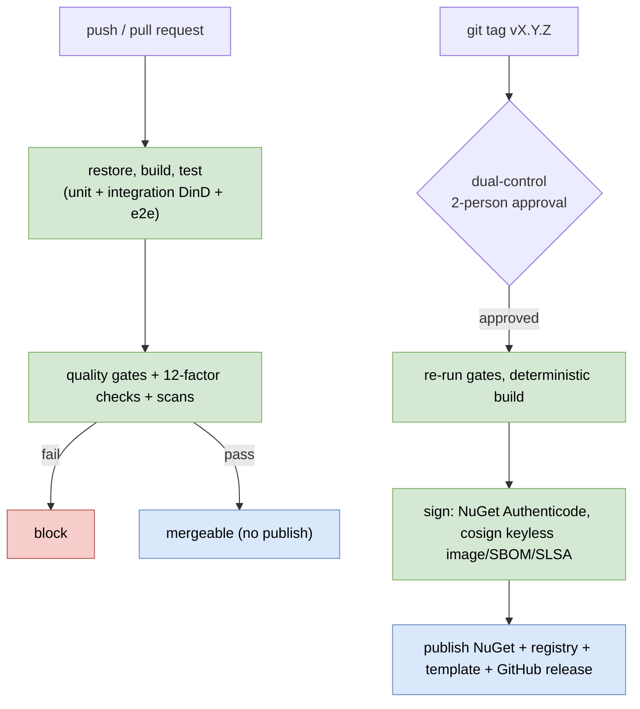
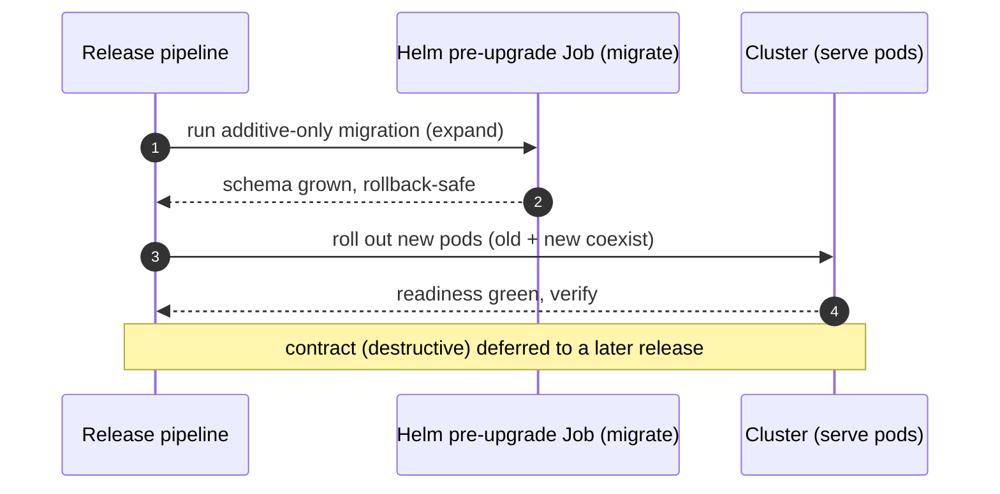

# CI/CD and deployment (detailed design)

## Purpose and scope

How Nami is built, verified, signed, shipped, and run: the two-pipeline CI/CD model,
the release supply chain, the local-development and first-run inner loop, the reference
host and its deployment (Docker, Helm, OpenTofu), and the 12-factor invariants that keep
it operable. It realizes ADR-0025 (local dev and first-run), ADR-0023 (OpenTofu IaC),
ADR-0031 (12-factor baseline), and ADR-0051 (release supply-chain integrity).

In scope: the PR and release pipelines and their quality gates; artifact versioning,
signing, SBOM, and provenance; the CD scans; the local docker-compose inner loop and the
ordered first run; the reference host image and template; the Helm-versus-OpenTofu
boundary and IaC state; deployment ordering (expand/contract, migration-as-a-job,
zero-downtime); the graceful-shutdown and HA knobs; the 12-factor invariants and their
enforcement; and the governance/repository files and docs/samples.

Out of scope, referenced not redefined: the test taxonomy and the security/conformance
gates ([20 testing](20-testing.md)); the migration fan-out, `SchemaVersionGate`, and
expand/contract mechanism ([18 tenant lifecycle](18-tenant-lifecycle.md)); the load/SLO
gate and canary ([19 observability](19-observability-capacity-slo.md)); the `/health/ready`
and `/health/live` predicate ([01 foundations](01-foundations.md), [12](12-key-management.md));
the DR restore drill and key break-glass runbook ([12](12-key-management.md)); and the
dual-control proposal machinery ([15 Admin API](15-admin-api.md)).

## Decisions realized

| Decision | What this design applies |
|---|---|
| ADR-0025 | docker-compose dependencies + multi-stage Dockerfiles + Testcontainers + the ordered first-run; no migrate-on-startup in production |
| ADR-0023 | OpenTofu as the IaC tool (MPL-2.0, drop-in, state encryption), Helm for the app, a per-cloud adapter |
| ADR-0031 | The 12/15-factor baseline with four tightened invariants (config, concurrency, disposability, logs) enforced by tests and a CI gate |
| ADR-0051 | Keyless cosign signing, SLSA provenance, a CycloneDX SBOM per release, digest-pinned base with a re-scan/re-sign cadence, and signing only in the dual-controlled release pipeline |
| ADR-0086 | Every `uses:` in a workflow is a commit SHA with the version as a trailing comment, and the markdownlint action's bundled linter version is coupled to the one contributors run locally |
| ADR-0046 (ref) | Dual-control (two-person approval) on the irreversible sign-and-publish step |

## Component and interface design

### Two pipelines

- **PR/CI (automatic on every push and pull request):** restore (Central Package Management) then build then test (unit, Testcontainers integration under Docker-in-Docker, and end-to-end) then the quality gates. It **never signs or publishes**.
- **Release (on a `vX.Y.Z` tag, under dual-control):** a protected environment with required two-person approval (ADR-0046) re-runs the full gates, does a deterministic build, **signs**, and publishes to NuGet plus the container registry plus the template, then attaches the SBOM and the GitHub release.

Versioning is git-tag lock-step through MinVer: one tag versions the whole package graph,
Central Package Management is the single version-declaration point, and a pre-release tag
yields a pre-release suffix. Builds are deterministic (`ContinuousIntegrationBuild`,
`Deterministic`, SourceLink, `.snupkg` symbols). The public API is locked by
`Microsoft.CodeAnalysis.PublicApiAnalyzers` (RS0016/RS0017/RS0037 at error) with
`PublicAPI.Shipped.txt`/`Unshipped.txt` promoted on release, SemVer with a two-step
deprecation (obsolete at a minor, remove only at the next major), and consumer-implemented
ports extended only by a default interface method or an `IXxxV2`, never a bare added
member.

### Quality gates (all must pass, or the release is blocked)

1. Tests: unit, Testcontainers integration, and Playwright end-to-end ([20 testing](20-testing.md)).
2. `PublicApiAnalyzers`: zero errors, `Unshipped` promoted, no obsolete-and-remove in one version.
3. Contract-regression on the current pins (and again when bumping OpenIddict/Finbuckle/EF/Npgsql), ADR-0021/0030.
4. OpenID conformance on the reference host (Basic, Config, Form Post profiles).
5. License-scan (permissive-only, ADR-0026) plus the CycloneDX SBOM.
6. A reproducible, deterministic build.
7. Container-scan: the base image is digest-pinned and passes a **Trivy** vulnerability scan (ADR-0092; Grype was the alternative and stays verified, not chosen).

These run alongside the foundational gates already owned by [01](01-foundations.md)
(build, test, license-scan, `PublicApiAnalyzers`, ArchUnitNET, `dotnet format
--verify-no-changes`, the docs guardrail), the "12-factor checks" gate (below), the
dependency-scan (blocking) and secret-scan (gitleaks) and DAST scans, and the load/SLO
gate that runs as [19](19-observability-capacity-slo.md)'s separate job. The migration
`has-pending-model-changes` and linear-history checks are [18](18-tenant-lifecycle.md)'s.

### Release supply chain (ADR-0051)

NuGet packages are signed with a publisher (Authenticode) certificate. The container
image, the SBOM, and the build provenance are signed **keyless** with cosign through
GitHub Actions OIDC (sigstore), so no static signing key is held anywhere, and SLSA
build-provenance is attested the same way. A CycloneDX SBOM (owned by ADR-0026) is
produced per release, attached to the GitHub release, and cosign-attested on the image.
The base image is digest-pinned (a `@sha256:` digest of a chiseled/distroless .NET 10
image, never a mutable tag) and is on a scheduled and on-CVE **rebuild then re-scan then
re-sign then re-attest** cadence (a dependency bot bumps the digest) so a base-image CVE
appearing after a release is caught rather than shipped silently. Signing happens only in
the gated release pipeline; pull-request CI never signs or publishes.

**The same never-a-mutable-tag rule applies one step earlier, to the actions themselves**
(ADR-0086). Every `uses:` is a full commit SHA with the version as a trailing comment,
because an action executes in the runner with the repository checked out, so it runs before
and with more access than the image the paragraph above pins. The rule was adopted after a
floating major tag on the markdown-lint action moved and silently changed the linter
version out from under the version this repository documents for local use.

The CD scans are fixed by [ADR-0092](../adr/0092-ci-security-scan-tooling.md), which
replaced the slash-alternatives this section used to carry. **SAST runs no third-party
engine**: it is the .NET SDK's own `AnalysisLevelSecurity` rule set at all-plus-error,
which is where the CA3xxx taint-analysis family lives, so the stage costs no dependency
and no licence and an adopter with a private fork runs the same gate. The **blocking**
dependency scan and the container scan are both **Trivy**, one tool for two stages so
there is one licence to re-verify rather than two. Secrets are **gitleaks**, whose owning
decision is now that ADR rather than this document. DAST is **OWASP ZAP** on staging,
classified `execute-only`, which is what makes it answerable given that seven of its
thirty bundled components sit outside the ADR-0026 permissive set.

One gap was deliberate and named rather than absent: the SDK analyzers read C#, so nothing
in this pipeline analyses what a workflow definition does with untrusted input, and ADR-0086
pins which action code runs without reaching that. **Ratified 2026-08-02 as ADR-0092 section
6, and with no sixth tool.** The guardrail job that already runs here gained two rules
instead: no `${{ }}` expression inside any `run:` script, since interpolating into a shell is
the vector and passing through `env:` is the mitigation, and no `pull_request_target` or
`workflow_run` trigger. It is a **regression guard rather than a finder**: measured on that
date, this repository's whole `.github/` tree carried zero expressions and zero such
triggers, so a tool bought then would have found nothing, while the release pipeline below
puts `id-token: write` on a job and Dependabot already opens weekly pull requests against the
workflow directory. The two rules cover two constructs and not workflow safety; what they do
not see is listed in ADR-0092 and in `scripts/README.md`. That ADR records the reversal
condition and deliberately names **no** candidate tool, because no licence has been read for
one and a name with no reading behind it would read as settled research.

A config test forbids dangerous toggles such as
`DisableTransportSecurityRequirement` outside development; it targets transport security,
**not** access-token encryption, which is intentionally off by design (ADR-0005).

### Local development and the ordered first run (ADR-0025)

The inner loop is docker-compose for dependencies plus `dotnet run` for the app, 100%
offline (the database-provider default holds keys and secrets in PostgreSQL). Compose
starts `postgres:18` (matching production), an optional Redis (degrading fail-open), a
dev-only admin UI, an optional OpenTelemetry collector, and the dev Grafana stack and
local TLS proxy from ADR-0063/ADR-0070. First run is an explicit order that avoids the
chicken-and-egg:

1. `docker compose up -d postgres redis`, then wait for `postgres` to be healthy.
2. Migrate with a one-shot migrator (a `migrator` compose service or `dotnet ef database update` per context, across the five DbContexts) - **never migrate-on-startup in production** (ADR-0017); development may enable it for convenience only.
3. Auto-seed the first key (ADR-0012): startup blocks until a signing and an encryption key exist with immediate activation and Data-Protection wrapping; `/health/ready` fails until then.
4. Seed dev clients and scopes idempotently.
5. Bootstrap the first admin through the audited break-glass path (ADR-0015), with a Production fail-fast on a weak or absent bootstrap value.
6. `dotnet run`; `/health/ready` passes.

A `make dev-up` wraps the sequence.

### The reference host, image, and template

The deployable is `Nami.Identity.Host` with a **four-mode** entrypoint: `serve` runs the
host, `migrate` applies the migration bundle and exits, `export` dumps the declarative
configuration without secrets or keys, and `prune` bulk-deletes expired tokens and
authorizations. `prune` is a mode rather than a hosted service inside `serve` because
ADR-0031 keeps bulk work off the request-serving path. Configuration is environment-first
(`Nami__ConnectionString` and `Nami__Issuer` are required; multi-tenancy, admin, key
store, and the OTLP endpoint are optional), and no secret or certificate is baked into
the image. The image is multi-stage: an SDK `build` stage and a chiseled, non-root
runtime stage with a `HEALTHCHECK` on `/health/live`, built multi-arch (amd64 and arm64)
and pushed to the container registry. A `docker-compose.demo.yml` (postgres, a `migrator`
that runs and exits, then the identity service) gives a five-minute quickstart. A
`dotnet new nami-identity` template scaffolds a customizable host (with `--admin`,
`--multi-tenant`, `--key-store`, `--dpop`, `--sample-clients`) and is CI-tested by
scaffolding then building. The reference host assumes it runs behind a WAF/CDN/reverse
proxy for the edge layer.

### IaC: Helm deploys the app, OpenTofu does the infrastructure

OpenTofu (MPL-2.0, drop-in Terraform-compatible HCL/state/CLI) is the IaC tool, with its
native state encryption (v1.7+) enabled because the IdP's state holds secrets and
connection strings; a per-cloud provider is reached through an adapter, and Bicep is used
only for an Azure-specific need. The boundary is explicit: the **Helm** chart (shipped
with the product) deploys the app - the `serve` Deployment (at least two replicas across
zones), a pre-install/pre-upgrade Job running `migrate`, the service, and the
liveness/readiness probes - while the operator's **OpenTofu** provisions the
infrastructure (database, Redis, KMS, network). Plan and apply are dual-control-gated; the
state backend and its encryption key are an Ops ratification.

### Deployment ordering and zero-downtime

Migration runs as a pre-upgrade Job (or init container), never on startup. On the shared
Pool database the per-tenant 503 gate does not apply, so **expand/contract**
(parallel-change) is the sole coexistence mechanism ([18](18-tenant-lifecycle.md)): a
release adds only backward-compatible schema, and a CI additive-only rule fails the build
on a `DROP`, a destructive `ALTER`, a rename, or a `NOT NULL` without a default in the
same release; the destructive contract step is deferred to a later release. The ordered
deploy is expand-migration Job, then roll out the new pods, then verify, then (a later
release) contract, with a migrate-ok/rollout-failed runbook. A mixed-version
rolling-deploy stays compatible because tokens, cookies, and JWE minted by release N
validate on release N+1 (a shared Data-Protection keyring), which the compatibility test
in [20 testing](20-testing.md) proves.

### 12-factor invariants and enforcement (ADR-0031)

The four tightened invariants:

- **III Config:** every per-deploy value comes from the environment or the secret store, never the image, with the precedence environment then secret-store then `appsettings.{Environment}` then `appsettings`; `ValidateOnStart` fails fast on a missing required value.
- **VIII Concurrency:** a stateful background job runs through clustered Quartz (AdoJobStore on PostgreSQL) for a single run across nodes, and the rotation timer additionally sits behind a PostgreSQL advisory-lock barrier (never a Redis lease, whose GC-pause split-brain would leave two active keys); there is no unguarded `Timer` or `BackgroundService`, and nodes are NTP-synchronized. Two
mechanics of that barrier are easy to get silently wrong. A PostgreSQL advisory lock is
**session-level and bound to its connection**, so a transaction-pooling connection pooler
in front of the database breaks it: behind one, the barrier must use the transaction-scoped
form inside a single transaction instead. And the 64-bit lock-key space is **reserved and
documented per purpose** (rotation, pruning, seeding, provisioning), because two unrelated
jobs that happen to compute the same key would serialize against each other for no reason,
which presents as an intermittent stall rather than as a lock bug. Clock synchronization is
a requirement of the scheduler's clustering, not of the advisory lock, which is why the
lock is the barrier rather than the other way round.
- **IX Disposability:** graceful shutdown is SIGTERM then drain then a 30-second shutdown timeout, with a readiness flip to NotReady; because Kestrel begins draining the instant `ApplicationStopping` fires, a Kubernetes `preStop` sleep is paired so that `terminationGracePeriodSeconds` exceeds the preStop sleep plus the shutdown timeout, and liveness (`Predicate = _ => false`) never touches readiness. The reference Helm chart carries the multi-AZ knobs: a PodDisruptionBudget (`minAvailable >= 1`), topology-spread/anti-affinity by zone, controlled `rollingUpdate` timing, and resource requests/limits.
- **XI Logs:** the app writes its event stream to stdout/stderr through the OTLP exporter and never opens or rotates a file inside the container; logging providers are registered in code gated by environment, not bound from `appsettings`, so a config edit cannot sneak a file sink into Production.

Enforcement: a health-probe test and a graceful-shutdown drain test; an ArchUnitNET
config test that no secret is read from a baked-in file, that there is no file-sink
logging in the container profile, and that a stateful job registers through clustered
Quartz; and a **"12-factor checks"** CI gate (the reference image must declare
`HEALTHCHECK`, run non-root, and read config from the environment).

### Governance, repository files, and docs

The repository ships the governance set: LICENSE (Apache-2.0), NOTICE, README (a
five-minute quickstart plus badges), `SECURITY.md` (private reporting with a PGP key, a
coordinated-disclosure window, and a CVE process, ADR-0045), `CONTRIBUTING.md` (`make
dev-up`, **DCO sign-off**, and a PR checklist that includes updating
`PublicAPI.Unshipped`, the changelog, and a passing license-scan, with Conventional
Commits), a Contributor Covenant `CODE_OF_CONDUCT.md`, a Keep-a-Changelog `CHANGELOG.md`,
`GOVERNANCE.md`/`MAINTAINERS.md` (decisions via ADRs), `SUPPORT.md`, and `.github/`
templates including a private security-report path. DCO is the leading choice over a CLA
(open). Documentation is DocFX (articles plus an API reference auto-generated from XML
doc, with `CS1591` at error on the public surface), and the samples are nine
self-contained, CI-tested apps (web, SPA with a DPoP variant, mobile, API resource, m2m,
multi-tenant, external IdP, custom adapter, cloud key store), kept in sync because they
are real code built in CI. Examples use neutral tenant names (tenant A, tenant B) and
`example.com`, never a real organization.

### Key libraries and licenses

| Library / tool | Purpose | License | ADR |
|---|---|---|---|
| MinVer | Git-tag-driven versioning | Apache-2.0 | ADR-0030, ADR-0027 |
| Microsoft.CodeAnalysis.PublicApiAnalyzers | Public-API lock | MIT | ADR-0044 |
| CycloneDX (dotnet tool) | SBOM per release | Apache-2.0 | ADR-0026, ADR-0051 |
| cosign / sigstore | Keyless signing and attestation | Apache-2.0 | ADR-0051 |
| Trivy | Dependency scan and container scan, one tool for both stages | Apache-2.0 | ADR-0092, ADR-0051 |
| gitleaks | Secret scan | MIT | ADR-0092 |
| OWASP ZAP | DAST against staging; `execute-only`, and its bundle is not permissive throughout | Apache-2.0 at the root | ADR-0092 |
| (no third-party SAST) | The .NET SDK's own `AnalysisLevelSecurity` rules carry the stage | MIT, in the SDK | ADR-0092 |
| OpenTofu | IaC (state encryption) | MPL-2.0 | ADR-0023 |
| Helm | App deployment | Apache-2.0 | ADR-0023 |
| Quartz.NET | Clustered background jobs | Apache-2.0 | ADR-0031 |
| DocFX | Docs site + API reference | MIT | this doc |

**The `License` column above is a convenience, not the record.** A licence asserted in a
design document with no read location is the second of the three blind spots
[`DEPENDENCY-LICENSES.md`](../DEPENDENCY-LICENSES.md) exists for, and that file carries the
version read, the file the licence was read in, and the date for every tool here that runs
as a separate process. Read it there before relying on a cell in this table. Two entries
above are shorter than the truth on purpose and the detail is in that file: ZAP's root
licence is Apache-2.0 while seven of its thirty bundled components are not, and the SDK
row means the analyzers ship inside the .NET SDK rather than as a package this project
references.

> **Patterns applied (ADR-0066).** Build/release/run separation and the immutable
> versioned artifact (12-factor); pipeline with quality gates (fail-closed release);
> leader election (clustered Quartz single-run); ports and adapters (the per-cloud IaC
> provider); and defense-in-depth (the advisory-lock barrier under the clustered rotation
> job, and keyless signing with no standing secret).

## Data touchpoints

None. Deployment operates the schema owned by [02 data](02-data.md) through the migration
model owned by [18 tenant lifecycle](18-tenant-lifecycle.md); this doc defines no tables.

## Runtime flows

### PR versus release pipelines

### Deploy ordering (expand/contract)

## Edge cases and failure modes

- **A destructive migration in the same release as its code:** blocked by the additive-only CI rule; it must be split to a later contract release.
- **Migrate succeeds but the rollout fails:** the migrate-ok/rollout-failed runbook rolls back the pods while keeping the additive schema (a Helm rollback still runs because the schema only grew).
- **A base-image CVE appears after release:** the scheduled rebuild/re-scan/re-sign cadence catches it rather than leaving a known-vulnerable image published.
- **A signing key would sit in CI:** avoided; cosign is keyless via OIDC, so there is no standing secret to leak.
- **A rotation job double-runs across nodes:** prevented by clustered Quartz plus the advisory-lock barrier; a Redis lease is explicitly not used.
- **A config edit tries to add a file log sink in Production:** blocked because providers are registered in code gated by environment, and the config test asserts no file provider in Production.
- **An unattended job tries to publish:** impossible; publish is a protected environment behind two-person approval, and PR CI never signs.

## Security considerations

- Publishing and signing are irreversible and external, so they are dual-control (ADR-0046) and never autonomous; PR CI cannot sign or publish.
- Every artifact is verifiable end to end (publisher signature, keyless image/SBOM/provenance), which is what makes the coordinated-disclosure "verifiable fixed release" concrete (ADR-0045).
- No secret or certificate is baked into the image; configuration and secrets come from the environment or the secret store, and the config test plus gitleaks guard against a leak.
- The reference host assumes an edge WAF/CDN and documents that a direct exposure moves those layers onto the operator.
- IaC state is encrypted at rest (OpenTofu native), because it can hold connection strings and secrets.

## Testing strategy

The deployment-facing tests are the health-probe and graceful-shutdown drain tests, the
"12-factor checks" gate (no baked secret, clustered-Quartz-not-BackgroundService, no
file-sink, HEALTHCHECK/non-root/env-config), the mixed-version rolling-deploy
compatibility test, the additive-only migration CI rule, the container-scan gate, and a
CI test that the `dotnet new` template scaffolds and builds. The DR restore drill and the
key break-glass runbook test are owned by [12](12-key-management.md); the load/SLO gate,
canary, collector-outage, and chaos suite are owned by [19](19-observability-capacity-slo.md).

## Open and build-time items

- **Ops ratifications** (tracked in the [Pre-GA ratification checklist](../PRE-GA-RATIFICATION-CHECKLIST.md)): the OpenTofu state backend and its state-encryption key bootstrap; the public reference host for OpenID certification listing (no owner yet); the RTO/RPO targets and DR runbook (ADR-0006); the Pool-shared-keyset accepted risk before GA (ADR-0033).
- **Build-time**: the publisher Authenticode certificate and enabling cosign keyless; the release-notes tooling; the protected environment and required reviewers; the container-registry default plus an optional mirror; DCO-versus-CLA; the disclosure window and security contact; the version-support window; and any .NET Foundation membership.
- The sample set is the nine-sample list (reconciling the older five-sample figure), each CI-tested.
- **Corrected 2026-08-02: the MinVer row above cited ADR-0044, which contains no occurrence of "MinVer" or "SourceLink".** The tool is chosen by ADR-0030 and used by ADR-0027's package graph; ADR-0044 governs what may change under the version MinVer produces, which is a different claim about the same number. The row now names both owners. This is the resolving-citation shape the docs instructions describe, arriving by its documented route: ADR-0027 names the tool and ADR-0044 in one sentence, and the pointer attached to the wrong clause of it. Found while reconciling `Directory.Build.props` ownership for ADR-0065, not by a checker, and no checker sees it: Check 2 confirms `ADR-0044` resolves to a file, which it does.

## References

- ADRs: ADR-0092 (the five CI security scans, which replaced this document's slash-alternatives and took ownership of the gitleaks choice from it), ADR-0025 (local dev and first-run), ADR-0023 (OpenTofu IaC), ADR-0031 (12-factor baseline), ADR-0051 (release supply-chain integrity), ADR-0046 (dual-control publish), ADR-0045 (coordinated disclosure), ADR-0044 (SemVer and public-API stability), ADR-0026 (permissive dependencies, SBOM, license-scan), ADR-0021/ADR-0030 (contract-regression and version pins), ADR-0017 (no migrate-on-startup; migration model), ADR-0012 (key bootstrap), ADR-0015 (first-admin break-glass), ADR-0063/ADR-0070 (dev observability and TLS).
- Design docs: [20 testing](20-testing.md) (the suites the pipeline runs), [18 tenant lifecycle](18-tenant-lifecycle.md) (migration fan-out and expand/contract), [19 observability](19-observability-capacity-slo.md) (load/SLO gate, canary), [01 foundations](01-foundations.md) (foundational CI gates, health endpoints), [12 key management](12-key-management.md) (DR drill, break-glass), [15 Admin API](15-admin-api.md) (dual-control).
- [Architecture](../architecture/README.md); [Pre-GA ratification checklist](../PRE-GA-RATIFICATION-CHECKLIST.md).

---

[Prev: Testing](20-testing.md) · [Index](README.md) · Next: [Engine seam catalogue](22-openiddict-seam-catalogue.md)
