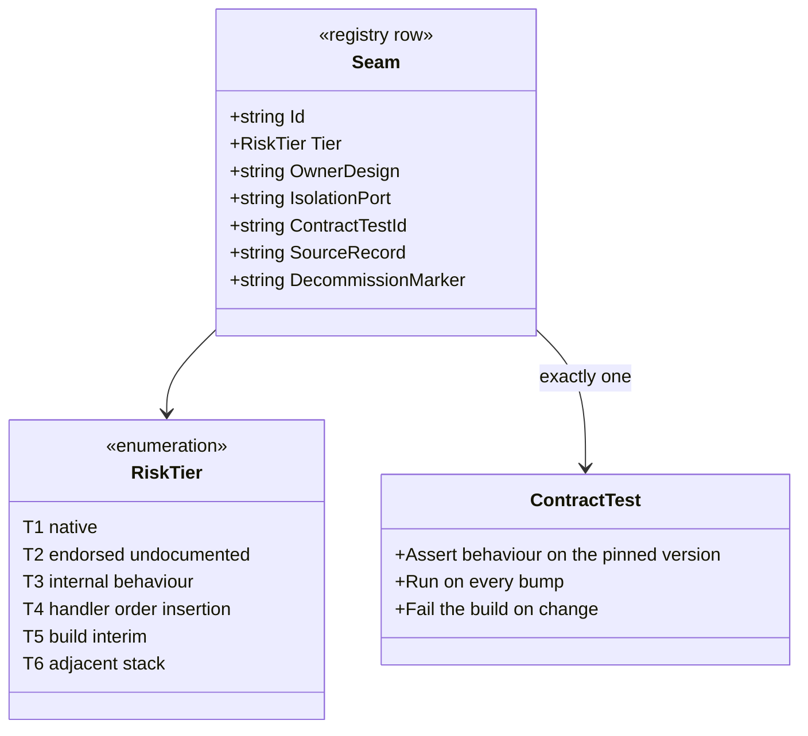
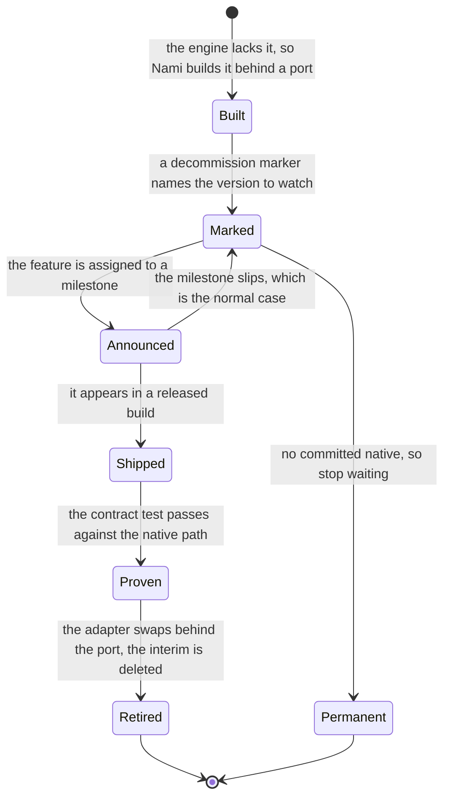
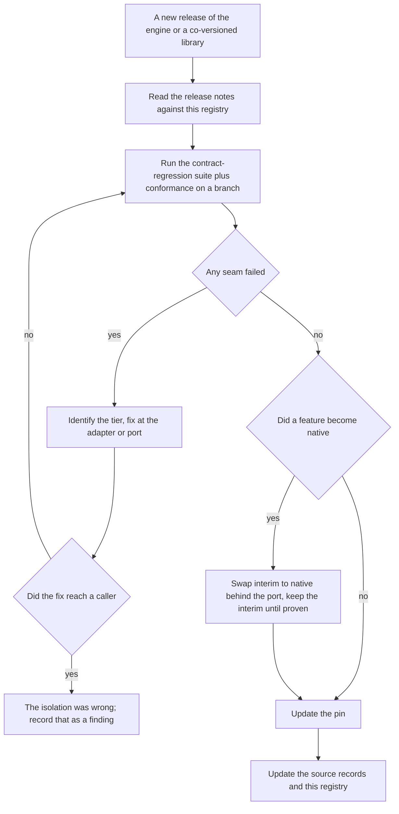

# The engine seam catalogue and version adaptation (detailed design)

> **Sits under:** [architecture: component view](../architecture/08-component-view.md) and
> [schema migration and evolution](../architecture/15-schema-migration-evolution.md).
> **Implementer source of record:** this document, for the seam registry, the risk tiers,
> the contract-regression mapping, and the per-bump playbook. The **mechanism** behind each
> seam belongs to its owning design, named in the registry; this document never restates a
> mechanism, it registers it.

ADR-0021 does not merely recommend a catalogue, it names one as a deliverable: *"Maintain
an OpenIddict seam catalogue (a deliverable design document) listing every dependency on
OpenIddict (numbered `S1` onward), each tagged with a risk tier ... pointing to a source-verify file, a
contract test, an isolation port, and a decommission marker."* This is that document.

The problem it solves is specific. Nami pins one engine version and depends on it in
thirty-seven distinct places, and those places are not equally safe. Some are documented API
that breaks loudly with a release note. Some are internal behaviour that breaks **silently**,
where a bump changes a sort order or removes an internal throw and nothing fails until a
token is wrong in production. A catalogue that does not distinguish those two is decoration.

## 1. Decisions realized

| Decision | What this design applies |
|---|---|
| ADR-0021 | The whole document: pin rather than float, the seam registry with risk tiers, per-bump contract regression, isolation ports, decommission markers, and the migration playbook |
| ADR-0024 | The two extension axes this catalogue presumes, adapter-behind-port and handler-at-named-position, detailed in [01](01-foundations.md) |
| ADR-0030 | The sibling upgrade playbook: a .NET major bump drags the engine and ORM with it, so both share one contract-regression suite |
| ADR-0011 | The rotation seam family, the archetypal endorsed-undocumented dependency |
| ADR-0014 | The sender-constraint seam family, all of it built rather than native |
| ADR-0018 | The multi-tenant composition seams, the highest-risk adjacent-stack group |
| ADR-0019 | The back-channel-logout interim and its decommission marker |
| ADR-0022 | The telemetry seam, built because the engine emits none |
| ADR-0075 | Why a security-sensitive seam's invariant survives an adapter swap |

## 2. Purpose and scope

In scope: the risk-tier taxonomy, the registry of all thirty-seven seams with owner and
contract test, the contract-regression mapping, the per-bump playbook, the decommission
rules, and the readiness work for the next major.

Out of scope, and this boundary is the document's discipline: **every seam mechanism**.
How the rotation monitor works is [12](12-key-management.md); how the sender-constraint
handlers work is [06](06-sender-constrained-tokens.md); the endpoint model is
[04](04-core-protocol.md); the multi-tenant composition is [02](02-data.md) and
[18](18-tenant-lifecycle.md); revocation and cache behaviour is
[13](13-revocation-propagation-and-caching.md); the extension axes and the port catalogue are
[01](01-foundations.md); the CI wiring is [21](21-cicd-and-deployment.md); the test
inventory is [20](20-testing.md). A registry that starts explaining mechanisms becomes a
second source of truth for ten designs, and then the two disagree.

**A naming warning that matters more than it looks.** The design corpus contains two
different tables both called the seam catalogue: one registers engine dependencies as
`S1`-`S34`, the other maps a commercial product's extensibility interfaces to equivalents
as `#1`-`#34`. They are unrelated: number fourteen is a cache-refresh interval in the first
and a proof-replay cache in the second. **ADR-0021 uses the `S`-numbering**, so this
document does too, and the extension-point material from the other table lives in
[01](01-foundations.md) restated as Nami's own surface.

## 3. Interfaces and contract

This design declares no new runtime interface. Its contract is a **registry schema**: what
a row must carry before a seam counts as registered.

A row is incomplete, and the seam therefore unregistered, unless it names an **owner
design**, a **contract test**, and a **source record**. The isolation port is required only
for a build-interim, and the decommission marker only where a native replacement is
plausible. An unregistered dependency is the failure this document exists to prevent,
because it is the one nobody re-verifies on a bump.

## 4. Data and structure

No relational table. The structure is the registry itself, in section 5.2.

## 5. Behaviour

### 5.1 Risk tiers, and why the tier picks the strategy

The tier is not a severity label. It answers one question: **how will this break, loudly or
silently?** That determines what a bump has to do about it.

| Tier | What it depends on | How it breaks | Required strategy |
|---|---|---|---|
| **T1** native | documented, versioned API | loudly, with a release note | read the changelog, keep a light contract test |
| **T2** endorsed-undocumented | a maintainer-endorsed pattern that carries no version guarantee | **silently** | a contract test is **mandatory**, and a fallback must already be recorded |
| **T3** internal behaviour | a sort order, an internal throw, an unfiltered iteration | **silently** | a contract test asserting the specific behaviour, not the feature |
| **T4** handler-order insertion | sitting a handler beside a built-in one | medium, an order can shift within a minor | anchor by named descriptor, and snapshot the resolved order |
| **T5** build-interim | something the engine does not provide yet | not at all technically; it accrues debt | isolate behind a port, carry a decommission marker |
| **T6** adjacent stack | a co-versioned library, not the engine | medium, the composition breaks | pin in lock-step, test the composition |

The distinction that pays for the whole taxonomy is **T1 against T2 and T3**. A T1 break
arrives with documentation. A T2 or T3 break arrives as a wrong token.

### 5.2 The registry

Thirty-seven seams. **Owner** is the design that holds the mechanism; **test** is the
contract test that must pass on every bump.

**Signing and key rotation** (owner [12](12-key-management.md), ADR-0011 and ADR-0012)

| # | Seam | Tier | Isolation | Test | Decommission |
|---|---|---|---|---|---|
| S1 | No-restart rotation rides the **framework** options monitor, driven by a custom `IConfigureOptions` and a custom change-token source (the #1434 seam); an endorsed pattern with no version guarantee. Nami must **not** build its own monitor: ADR-0011 lists the four things `OpenIddictServerConfiguration` does on every materialisation that one would skip | **T2** | `ISigningKeyStore` plus the key cache and the configure-options | rotation contract test | none, this is a permanent seam |
| S2 | The signer is whichever credential is **first** in the collection, with no selection logic in the engine | **T3** | follows S1 | rotation contract test (a) | none |
| S3 | The key-set endpoint iterates **every** credential with no validity-window filter | **T3** | follows S1 | rotation contract test (b) | none |
| S4 | `UseLocalServer` snapshots the keys into an **immutable** `StaticConfigurationManager`, so the change token does **not** refresh it and `RequestRefresh()` is a no-op against it | **T3** | none available at this seam; S4a is the fix | rotation contract test (c), which must sign with a freshly rotated key and self-validate | none |
| S4a | Replacing that manager through `IPostConfigureOptions<OpenIddictValidationOptions>` (setting `Configuration = null` and `ConfigurationManager` to ours). **Ordering is the fragile part**: ours must run *after* the engine's post-configure, or it is overwritten | **T4** | the custom `IConfigurationManager<OpenIddictConfiguration>` | the same test, plus a resolved-order snapshot | none |
| S4b | The issuer contract on that replacement manager: a null issuer outside a request context disables issuer validation entirely | **T3** | follows S4a | issuer-validation assertion in the same test | none |
| S5 | Loading a signing certificate from a stream accepts PKCS#12 only, not PEM | T1 | the adapter converts | key-load test | none |

**Sender-constrained tokens** (owner [06](06-sender-constrained-tokens.md), ADR-0014)

| # | Seam | Tier | Isolation | Test | Decommission |
|---|---|---|---|---|---|
| S6 | Stamping the confirmation claim at issuance, which the engine does not do for this mechanism | **T5** | the issuance handler | spike A-1 plus the contract test | no committed native |
| S7 | The serializer must emit a **nested** confirmation object from a principal claim | **T3** | the issuance handler | the highest-risk contract test of this group | none |
| S8 | The built-in token extractor is hard-coded to one scheme, so a sibling extractor is inserted beside it | **T4** | the sibling extractor, one order before the built-in | the sender-constraint contract test | no committed native |
| S9 | The built-in proof handler recognises only the certificate thumbprint and **throws** on a key thumbprint | **T3** | the custom proof handler, ordered before it | the same test, plus the throw-avoidance assertion | no committed native |
| S10 | Introspection returns the confirmation claim **claim-content-agnostically**, so the key thumbprint is surfaced natively once issuance stamps it; only the inactive-on-missing-binding policy is ours | **T3** | none, there is nothing to isolate | introspection contract test, asserting `cnf.jkt` in the response and the absent `token_type` node | none, this is native behaviour |

**Validation, revocation, and caching** (owner [13](13-revocation-propagation-and-caching.md) and [05](05-resource-server-validation.md))

| # | Seam | Tier | Isolation | Test | Decommission |
|---|---|---|---|---|---|
| S11 | The per-request entity cache: scoped, bounded, no time-to-live, invalidated locally | **T3** | none needed, there is no backplane | cache-behaviour test | none |
| S12 | Token-entry and authorization-entry validation are enabled on the **validation** builder, not the server builder | **T3**, and a wrong-API case | none | conformance test | none |
| S13 | The refresh reuse leeway defaults to 30 seconds | T1 | set the value explicitly | refresh-concurrency test | none |
| S14 | Family revoke happens **inside** entry validation and is on by default, so re-implementing it double-revokes | **T3** | none, and deliberately no re-implementation | default-on contract test | none |
| S15 | The key-refresh intervals of the token-validation library, a 12-hour automatic refresh with a 5-minute floor | **T6** | the distrusted-key set, and a shortened interval | propagation test | none |

**The endpoint model** (owner [04](04-core-protocol.md)), the wrong-API class

| # | Seam | Tier | Isolation | Test | Decommission |
|---|---|---|---|---|---|
| S16 | Which endpoints are pass-through and which are fully handled | **T1**, and the wrong-API class | none, confirm before writing code | conformance suite | none |
| S17 | Endpoint URIs must be set explicitly; only discovery and the key set are auto-pathed | T1 | configuration | conformance suite | none |
| S18 | The end-session rename, of both the configuration method and the permission constant | **T1**, historical rename | the descriptor mapper | mapper and constant test | already happened |
| S19 | The permission and descriptor constant families | **T1** | the client-definition mapper | mapper test | none |
| S20 | Introspection and revocation validate the authorized party **natively**, and neither is pass-through | **T3**, and the wrong-API class | none | conformance suite | none |
| S21 | Pushed authorization requests are native and configured, not built | T1 | configuration | conformance suite | none |

**Multi-tenant composition** (owner [02](02-data.md) and [18](18-tenant-lifecycle.md), ADR-0018)

| # | Seam | Tier | Isolation | Test | Decommission |
|---|---|---|---|---|---|
| S22 | The tenancy library and the engine both override model building and save, and must compose | **T6, the highest risk here** | the multi-tenant marking plus enforcement on tracking | spike A-4, tests T1 to T7 | none |
| S23 | Bulk update and delete **bypass** save, so the tenancy stamp and its throw never run | **T3** | the row-level-security backstop | spike A-4 plus the prune test | none |
| S24 | A pooled context with a mutable tenant identifier, rather than one captured at construction | **T6** | a pooled factory with a scoped identifier | spike A-4 test T7, which is the gate | none |
| S25 | Pruning deletes only expired, redeemed, or revoked entries, which is filter-agnostic and therefore safe for a pooled tenant | **T3** | none | prune test | none |
| S26 | The version quartet must be pinned in lock-step | **T6** | central package management | build | none |
| S27 | Migration behaviours of the ORM and driver, including the advisory lock, out-of-order migrations, and identifier generation on the pinned database | **T6** | the migration runner | migration CI test | none |

**Build-interims with a native replacement in view** (T5 throughout)

| # | Seam | Owner | Isolation | Decommission marker |
|---|---|---|---|---|
| S28 | Back-channel logout fan-out | [11](11-login-consent-ui.md), ADR-0019 | the logout fan-out service | targeted at the next major; **the marker trips only when native is proven on a released build**, not when an issue is assigned to a milestone |
| S29 | Dynamic client registration, if built as an interim | [15](15-admin-api.md) | the admin provisioning port | same condition, same major |
| S30 | The sender-constraint family, S6 to S9. **S10 was removed from this group on 2026-08-01**, because surfacing the binding at introspection turned out to be native already (section 5.3) | [06](06-sender-constrained-tokens.md) | the handler interfaces | **no committed native**; treat as owned indefinitely and monitor |
| S31 | Telemetry instruments, because the engine emits none | [19](19-observability-capacity-slo.md), ADR-0022 | Nami's own meter and activity source | open with no milestone; own it, and do not guess the native names |
| S32 | The actor claim and actor resolution, where the **grant itself is already native** | [14](14-advanced-flows.md) and [07](07-authorization.md) | the token-exchange handler | only the claim is interim |

**Pipeline stability** (owner this document and [01](01-foundations.md))

| # | Seam | Tier | Isolation | Test | Decommission |
|---|---|---|---|---|---|
| S33 | Every custom handler anchors by **named descriptor**, never a literal order number | **T4** | one file of order constants | the pipeline-order snapshot | none |
| S34 | Degraded mode is forbidden where real tokens are issued, enforced by a fail-fast startup guard | T1 | the startup guard, which also emits a security event | startup test | none |

**Private-claim carriage** (owner [04](04-core-protocol.md), ADR-0004 and ADR-0003)

| # | Seam | Tier | Isolation | Test | Decommission |
|---|---|---|---|---|---|
| S35 | Two engine-internal behaviours carry the refresh-ceiling anchor and the session gate: private claims are dropped from the access and id tokens **above and independently of** the destination check, and the refresh token includes **every** claim except six named ones, consulting no destinations at all | **T3** | one claim-name constant; and the anchor's fail-closed reject, which converts the second half of this seam from a silent break into a named one | the anchor and session-gate tests in [04](04-core-protocol.md) section 9, cases (b) and (e) in particular | none |

Registered 2026-08-01, when the anchor moved onto a private claim. The two halves fail
differently and that asymmetry is the whole reason this seam is cheap to hold. If the
**first** breaks, the anchor starts appearing in issued access tokens and nothing complains,
which is the classic T3 shape and is why a test asserts the claim's **absence** from both
tokens rather than only its presence on the refresh token. If the **second** breaks, the
anchor and `sid` stop arriving at the refresh grant, the fail-closed branch rejects with
"anchor missing", and the failure is loud and correctly named on the first request. A
design that had written `?? "0"` would have converted that same break into a silent
total outage, so the fail-closed rule is not only a correctness choice, it is what makes
half of this seam self-reporting.

### 5.3 What was read at source, and what was not

Six registry claims were re-read against the engine's own source at the pinned version, four
on 2026-07-27, S35 on 2026-08-01, and S10 on 2026-08-01, rather than carried on the corpus's
word. This is the standard the rest of the registry should reach before GA, not a claim that
it already has.

| Seam | Read at | What it says |
|---|---|---|
| S2 | the validation protection handlers | the signing credential is assigned as `SigningCredentials.First()`, with no selection logic, so **Nami controls the signer purely by controlling order** |
| S3 | the key-set discovery handler | the loop over credentials filters on **algorithm only**; there is no validity-window filter, which is exactly what makes publish-before-sign work |
| S9 | the validation protection handlers | the confirmation check reads only the certificate thumbprint and otherwise throws a specific internal error, which is why the custom handler must run first |
| S13 | the server options | the reuse leeway is initialized to 30 seconds and documented as the default, confirming ADR-0004's wording rather than assuming it |
| S10 | the introspection handlers | `OpenIddictServerHandlers.Introspection.cs:733-742` assigns the confirmation by reading `Claims.Confirmation` and parsing **the whole JSON object** through, with no mTLS branch and no filter on the key name; `:239-241` writes it to the response, and `:838` deliberately excludes `Confirmation` from the application-claims merge. So `cnf.jkt` is surfaced natively and **there was nothing to build**. Also read at `:762`: the engine emits `token_type: "Bearer"` only when the confirmation is **absent**, citing RFC 7662 section 2.2. **This row was previously tiered T5 build-interim on V14's word; the read is what retired it** |
| S35 | the server handlers and the constants file | the private prefix is `oi_` (`OpenIddictConstants.cs:121`); `PrepareAccessTokenPrincipal` (`:3571`) and `PrepareIdentityTokenPrincipal` (`:4557`) both drop private claims with a `return false` **above** the `HasDestination` check; `PrepareRefreshTokenPrincipal` (`:4374-4384`) excludes six claims by name and then returns true unconditionally, "other claims are always included in the refresh token, even private claims" (`:4383`); and the claim value-type switch (`:2846-2900`) ends in `_ => true`, so a name outside its well-known list never throws ID0424. **The corpus's citations for the third of these point at `:3675` and `:4333`, which are class declarations rather than the sentences; reading them is what surfaced the discrepancy** |

**Two mappings that are not registry seams were read on 2026-08-01, and one of them was
wrong.** They come from the corpus's parity table, which maps another product's extensibility
interfaces onto engine equivalents. That table's substance moved to
[01](01-foundations.md) section 3.2, restated as Nami's own extension surface, but the corpus
flagged two of its rows as cross-checked against that product's documentation rather than
against engine source, and section 10 held them open on the rule that a finding is not a
finding until read at source. Both are now read, in the checked-in 7.5.0 tree.

| Mapping | What the corpus claimed | What the source says |
|---|---|---|
| The **resource-and-scope-validation** extension point | `ValidateAuthorizationRequestContext`, plus a scope-validation handler | **Right about the context, and one handler short of the mechanism.** Four built-ins sit on that context across two independent axes. Existence: `ValidateScopes` (`oi_Authentication.cs:1496`) subtracts `context.Options.Scopes` first and asks `IOpenIddictScopeManager.FindByNamesAsync` only for what is left, rejecting `Errors.InvalidScope`; `ValidateResources` (`:1571`) is the options-only analogue, rejecting `Errors.InvalidTarget`. Permission: `ValidateScopePermissions` (`:1833`) calls `HasPermissionAsync(application, Permissions.Prefixes.Scope + scope)` and rejects `Errors.InvalidRequest`, **not** `InvalidScope`, skipping `openid` and `offline_access` as protocol scopes (`:1865-1870`); `ValidateResourcePermissions` (`:1894`) is its analogue. **The permission handler is the engine-level mechanism ADR-0001 rests on**, where a per-tenant difference is "a scope allowlist on the client grant" rather than a forked catalogue |
| The **authorize-interaction** extension point | `ProcessSignInContext`, plus `HandleAuthorizationRequestContext` | **Half right, and the wrong half is the half that would have been built.** `HandleAuthorizationRequestContext` is the decision (`oi_Authentication.cs:270`): a handler answers by setting handled, skipped, or rejected, or by supplying a `Principal`, and if none of those happens the engine throws (`:375`). Exactly one built-in sits on it, `AttachPrincipal` (`:2117`), which only forwards the identity-token-hint principal. `ProcessSignInContext` is **not** an interaction seam: it is constructed only once a principal exists (`:294`) and carries the token-minting chain (`OpenIddictServerHandlers.cs:3140`, `:3418`, `:3511`, `:4755`). Interaction logic placed there never runs in the three cases interaction exists for, a challenge, a consent screen, and a `prompt=none` refusal, because each of them resolves before that context is built |

**Neither correction propagated into this repository, which is why this closes an item rather
than fixing a defect.** `ProcessSignInContext` appears in one design,
[06](06-sender-constrained-tokens.md), where it is used correctly to stamp a confirmation at
issuance, and [04](04-core-protocol.md) section 3 already models the authorize endpoint as a
pass-through controller that "supplies the principal and nothing else". The wrong mapping was
declined at import rather than caught afterwards.

**What the second one is an instance of.** Naming a handler context for a decision the shipped
model leaves to application code is the pass-through-versus-fully-handled error already
registered as S16. That it recurred inside a parity table, produced by mapping another
product's interface list onto engine type names, is the argument for S16 carrying "confirm
before writing code" rather than a note.

**Not verified here**, and marked so deliberately: whether the server-side signing path has
a handler identical to S2's, because the checked-in source excerpt covers the validation
side; every roadmap statement in section 5.6, which is external and time-sensitive; and the
**bodies of the two descriptor filters** the scope handlers carry,
`RequireScopeValidationEnabled` and `RequireScopePermissionsEnabled`, because the filter file
is not among the twenty-five checked in. The options they are named after **are** read,
`DisableScopeValidation` (`OpenIddictServerOptions.cs:435`) and `IgnoreScopePermissions`
(`:643`), both `bool` with no initializer and therefore false **as declared**, the second
carrying an upstream remark that setting it is not recommended. That each filter binds to the
option sharing its name is the obvious reading, and it is not a read one.

**Completed 2026-08-01: the declared default is not the whole story for `IgnoreScopePermissions`,
because a second writer sets it.** The engine's `PostConfigure` assigns `true` to four of the six
per-client permission opt-outs whenever `EnableDegradedMode` is on, `IgnoreEndpointPermissions`
and `IgnoreGrantTypePermissions` on one line and `IgnoreResponseTypePermissions` and
`IgnoreScopePermissions` on the next (`OpenIddictServerConfiguration.cs:41-46`). The sentence
above was true about the field and incomplete about the effective value, which is the shape the
root instructions call out as a stated value read as a known default. The conclusion it was
supporting still holds, but for a reason that had to be checked rather than assumed:
ADR-0043's `no-degraded-mode-in-prod` blocks that path in token-issuing environments, and its
`client-permissions-enforced` row, **added the same day for this finding**, now asserts all six
switches directly, so the Development-only gap where the per-tenant scope allowlist would test
as passing while enforcing nothing is closed too. Note that degraded mode does **not** touch
`DisableScopeValidation`: scope *existence* validation survives it while scope *permission*
validation does not, and collapsing the two is the mistake this paragraph exists to prevent.

**Two rows were corrected on 2026-08-01, and the shape of both errors is worth keeping.**
S4 previously read "the local validation stack snapshots keys at startup and **refreshes on
a change token**", with a custom change-token source as its isolation. That is the mechanism
spike A-2 disproved (verification record V19): the snapshot goes into an **immutable**
`StaticConfigurationManager`, so the change token never reaches it and `RequestRefresh()` is
a no-op. The change token is the right mechanism on the **signing** side and the wrong one
on the **self-validation** side, and the old row collapsed that distinction. Four other
places in this repository already stated it correctly ([12](12-key-management.md) sections
3.1 and 5.2, ADR-0011, and the
[runtime flow views](../architecture/09-runtime-flow-views.md)), so this was one stale row
contradicting the rest of the corpus, in the one document ADR-0021 re-reads on every bump.
S4a and S4b were added because the seams the working fix actually depends on had **no row at
all**: without them, a 7.6 or 8.0 bump that reorders post-configure re-freezes self-validation
with nothing flagging it. S10 is the opposite error, a build scheduled for something already
native; both are recorded rather than quietly overwritten because a registry that hides its
own corrections cannot be audited.

### 5.4 The lifecycle of a build-interim

A build-interim is the only seam class that is supposed to disappear, and the rule for when
it may is the part that gets rushed.

**A milestone assignment is not a shipped feature.** The transition that matters is
`Shipped` to `Proven`, and it is a test run, not a reading of a roadmap. Two of the five
interims here are marked `Permanent` on purpose: nothing has been committed for them, and a
design that waits for a feature nobody promised waits forever while carrying the debt of
pretending otherwise.

### 5.5 The per-bump playbook

A version bump is a procedure, not a judgement call.

Step E carries the only diagnostic in the process worth stating out loud: **if fixing a
broken seam requires changing a caller, the isolation was wrong**, and that is a finding
about the design, not just about the bump.

### 5.6 Readiness for the next major

The engine's next major has announced breaking changes, and the work to absorb them is done
**now, on the pinned version**, so the bump is bounded.

| # | The change | Seams hit | Done now |
|---|---|---|---|
| R1 | The options pipeline is restructured, and validation moves to the options-validation interface with start-up validation | S1, S34 | isolate **all** options wiring into one module, so the blast radius is one file, with an architecture test keeping it there |
| R2 | An integration options type stops inheriting the authentication-scheme options base | S1 | forbid treating those options as scheme options, and record it as an invariant |
| R3 | Every obsolete member is removed | all | a zero-obsolete policy **now**: an obsolete warning from the engine's namespace is a build error, so nothing obsolete survives to the bump |
| R4 | Options validation moves to the validation interface with start-up validation | S34 and the invariant guards | pre-adopt on the pinned version, which already supports it, making the move a no-op |
| R5 | Client-secret hashing hardens | S19 and the secret store | do not hard-code hash parameters: store the algorithm and parameters **with** the hash and provide a re-hash-on-verify path |
| R6 | The precedent is that a major changes schema and API together | all | **run the suite and conformance against a preview in a spike branch now**, and find out what breaks instead of predicting it |

R6 and R3 are the priorities, for opposite reasons: R6 replaces speculation with a result,
and R3 is cheap and stops debt accumulating.

**One correction the corpus made against itself, kept here because it is the shape of the
error to avoid.** The scope of R1 and R2 is narrower than it first reads: the inheritance
change is announced for the **integration** options type, while the rotation seam hooks the
**core** options type. So the direct impact is **unconfirmed**, and the real risk is the
pipeline-wide restructure that the seam depends on. That must be settled by running the
rotation contract test against a preview, not by assuming either way.

**Roadmap provenance.** The statements above about which features are targeted at which
release come from the design corpus, verified there on 2026-07-04 and **not re-verified for
this document**. The corpus is careful about its own limit and that limit is carried
forward: what was verified is a **milestone assignment**, not a shipped feature, and the
released minor that some notes once credited with dynamic client registration does **not**
contain it. Re-verification is an open item in section 10.

## 6. Dependencies and wiring

This design adds **no dependency**. It registers dependencies that other designs already
take, which is why it has no library table of its own: a library appearing here for the
first time would mean a seam nobody owns.

What it does require in the build:

* one file of named pipeline-order constants, so every custom handler position is reviewable
  in one place (S33);
* the degraded-mode startup guard, expressed through options validation with start-up
  validation so it also satisfies R4 (S34);
* the contract-regression test project, wired to run on **every** dependency bump, with a
  failure blocking the build ([21](21-cicd-and-deployment.md));
* architecture tests keeping options wiring inside its one module (R1) and keeping the
  engine's types out of the domain ([01](01-foundations.md));
* the zero-obsolete policy as a compiler setting, not a review convention (R3).

> **Patterns applied** (ADR-0066). **Registry** for the catalogue itself, which is the whole
> artifact. **Adapter** for every build-interim, which is what makes an interim retirable at
> all: without a port, "swap to native" means editing call sites. **Template Method** for the
> per-bump playbook, in the weak sense that the steps are fixed and only the per-seam fix
> varies. No pattern is applied here for its own sake; the registry is a table because a
> table is what a reader needs at 2 a.m. during a bump.

## 7. Error handling, edge cases, invariants

* **A dependency without a registry row is the defect.** The row, not the code, is what a
  bump re-verifies.
* **A T2 or T3 seam without a behaviour-asserting contract test is unregistered in
  practice**, because those are precisely the seams that break without an error.
* **Order is anchored by named descriptor, never by a literal number.** The snapshot test
  blocks a silent reorder.
* **A broken contract fails the build.** The point of the suite is that the break is known
  before production, so a bump with a red suite is not a bump.
* **An interim retires only when native is proven on a released build.** Not on a milestone,
  not on a preview announcement, not on a maintainer's comment.
* **A fix that reaches a caller means the isolation failed**, and that is recorded as a
  finding rather than absorbed quietly.
* **Degraded mode is forbidden wherever real tokens are issued**, enforced fail-fast at
  start-up and audited when it is enabled anywhere else.
* **Confirm the endpoint model before writing code.** Hand-rolling something the engine does
  natively is the single most common error in this problem domain, and S16, S12, and S20 are
  its three usual shapes.

## 8. Security and multi-tenancy notes

Three seam groups are security seams rather than compatibility seams, and their tests are
not optional. The claim choke point is deny-by-default and a replacement adapter may not
weaken it (ADR-0075, mechanism in [09](09-federation-and-claims-profile.md) and
[04](04-core-protocol.md)). The audit lane never travels through the diagnostics pipeline,
which is a seam invariant as much as an audit one ([03](03-audit.md)). And the wrong-API
class is a security matter, not a style one: hand-rolling revocation, introspection party
validation, or a confirmation claim produces a **weaker** version of a control the engine
already implements correctly.

The multi-tenant composition group (S22 to S27) is the highest-risk group in the registry,
because it is the only one where two libraries both hook the same extension points, and
because a failure there is a cross-tenant leak rather than an outage. It is gated by spike
A-4 rather than by argument.

## 9. Testing

The contract-regression suite covers **thirty-three** of the thirty-seven registry rows, and it
runs on every bump of the engine or any co-versioned library. The scope is the thirty-two rows
that carry a **`Test` column**, plus **S31**. The other five rows sit in the build-interims
table, whose columns are owner, isolation, and decommission marker rather than tier and test,
because what a build-interim owes is a marker that trips when native arrives rather than a
behaviour contract on the current version.

**S31 is the one build-interim in the suite, and the reason is not that telemetry is special.**
ADR-0085 freezes the instrument names as public API, so there is a contract a test can pin;
the other four interims have no comparable surface, only a marker to watch.

**Corrected 2026-08-01: that sentence read "maps one to one onto section 5.2", and it did not.**
The table below covered thirty-two rows, and the registry carries exactly thirty-two rows with a
`Test` column, so **the two totals agreed while the two sets did not**: the table had dropped
S5 and added S31. Adding S31 was right, for the reason above; dropping S5 was the defect, and a
numeric coincidence is what let it survive every reading that checked a total. A one-to-one
claim of this shape describes the intention accurately, so the only way to catch it is to
enumerate both sides and compare them as sets.

| Group | Status |
|---|---|
| Rotation, S1 to S4b | specified; test (c) must sign with a freshly rotated key and then **self-validate**, or it passes without touching S4a |
| Sender constraint, S6 to S10 | specified, from spikes A-1 and A-3 |
| Multi-tenant composition, S22 to S24 | specified, from spike A-4 tests T1 to T7 |
| Endpoint model, S16, S17, S20, S21 | specified, through the conformance suite |
| Mapper and constants, S18, S19 | specified |
| Migration behaviour, S27 | specified |
| Pipeline order, S33 | specified, the snapshot test |
| Degraded mode, S34 | specified, the start-up test |
| Private-claim carriage, S35 | specified, in [04](04-core-protocol.md) section 9 |
| **Certificate loading, S5** | **to build**, and this is the row whose absence made the count below look wrong. Its registry entry names a "key-load test" and no design specifies one: [12](12-key-management.md) section 9 lists eight test groups to build and not one of them loads a certificate |
| **Cache, entry validation, leeway, family revoke, refresh interval, S11 to S15** | **to build** |
| **Prune scope S25, pin check S26, telemetry surface S31** | **to build** |

**Nine of the thirty-seven seams have no contract test yet**: the eight in the final two grouped
rows, plus S5 in the row above them. They are named rather than glossed, because a registry that
reported itself complete would be worse than one that reports its own gaps.

**The nine was right before this correction and the rows were not**, which is why a row was
added rather than the number lowered to eight. The count was reached by counting seams and the
rows by listing groups, so the S5 group was simply never written, and every reader who checked
the arithmetic instead of the coverage would have concluded the opposite.

**Where the remaining four rows are, and why none of them is a tenth.** S30 is a grouping over
S6 to S9 for decommission tracking, so its contract tests are the sender-constraint row's and a
row of its own would double-count. S29 is conditional and the condition is not met: ADR-0035
puts self-service client registration at v2.1 and chooses an Admin-API CRUD over the standard
registration endpoint, so there is no interim to test. S28 and S32 are both tested, just not by
this suite: S28's fan-out in [11](11-login-consent-ui.md) and [20](20-testing.md) section 5.7 as
an acceptance test, and S32's actor resolution in [07](07-authorization.md) section 9, where the
confused-deputy case is asserted in three parts. So the four are absent for four different
reasons and none of them is an uncounted gap, which is worth stating because "five seams appear
in no row" reads like one finding and is not.

## 10. Open and build-time items

* **Build the contract-regression project** covering all thirty-seven seams, extending the
  specified tests and adding the nine listed above.
* **Write the pipeline-order constants and the snapshot baseline** (S33), and attach the
  decommission markers in code as well as here (S28 to S32).
* **Not an open item, recorded because it was nearly filed as one on 2026-08-01.** While
  reconciling section 9's coverage, S32 looked like a seam with no test anywhere. It is not:
  [07](07-authorization.md) section 9 asserts the confused-deputy case in three parts, a
  self-issued cross-tenant token missing `act` giving 403, an on-behalf-of token with no `act`
  and a valid grant allowed, and a same-tenant call with no `act` allowed with the initiator
  taken from `sub`. The search that missed it looked for the word actor and for `act` followed
  by a space, and the assertion writes the claim in backticks under a "confused deputy" label.
  A grep narrow enough to miss the evidence reads exactly like a grep that proves absence,
  which is why this is written down rather than quietly dropped.
* **Run the readiness spike, R6**, against a preview of the next major, and report which
  seams break. This is the highest-value open item in this document.
* **Re-verify the roadmap quarterly**, on the same schedule as the runtime lifecycle watch
  (ADR-0030), since a runtime major drags the engine and ORM with it. The statements in 5.6
  carry the corpus's verification date, not this repository's.
* **Closed 2026-08-01: the two mappings the corpus flagged are read at source**, and the
  result is in section 5.3. One was right about its context and short of half its mechanism;
  the other named the token-minting context for a decision that resolves before that context
  exists. Both are recorded there rather than deleted, on the same rule that kept the S4 and
  S10 corrections visible. **This item said "neither may be coded against until that is
  done", and that sentence is why it is worth noting how it was closed**: the two mappings
  were never identified in this document, only described, so the item could not be actioned
  from inside the repository. Naming what an open item points at is part of writing one.
* **Closed 2026-08-01: the opt-out that the closure left behind is now a start-up assertion.**
  The scope half of that read gave ADR-0001's per-tenant allowlist a named engine handler,
  `ValidateScopePermissions`, and a named opt-out, `IgnoreScopePermissions`, and this item
  said that a default a single call can invert is the shape ADR-0043's self-check exists for,
  while leaving the choice between an assertion, a conformance case, and neither to
  [07](07-authorization.md). It became **both**: ADR-0043 carries a
  `client-permissions-enforced` row covering all six `Ignore*Permissions` switches, and 07
  section 9 carries the negative test. **Reading the switch at source is what settled it**,
  and it turned out to be worse than this item described: the opt-out is not only invertible
  by naming it, it is set as a side effect of `EnableDegradedMode` (section 5.3, and
  `OpenIddictServerConfiguration.cs:41-46`), so an assertion that only watched for the
  builder call would have missed the path a developer is more likely to take. An open item
  that describes a switch is worth less than one that has read it.
* **Reconcile the verification version gap**: [05](05-resource-server-validation.md) records
  an API verified at tenancy-library 10.1.2 while the pinned stack is 10.1.1. Harmless today,
  but verifying against a version the project does not pin is how a false confirmation gets
  in.

## 11. Sources

* **ADRs:** 0021 (the owning decision, and the source of the seam-registry scope and the tier
  vocabulary), 0024 (the extension axes), 0030 (the sibling runtime playbook), 0011, 0014,
  0018, 0019, 0022 (the seam owners), 0075 (the security-sensitive port invariants), 0004
  (the leeway value), 0026 (the license gate that a new dependency would trip), 0001 (the
  global scope catalogue and the client-grant allowlist the scope-permission handler
  enforces) and 0043 (the start-up self-check that the opt-out switch is a candidate for).
* **Architecture:** [component view](../architecture/08-component-view.md),
  [schema migration and evolution](../architecture/15-schema-migration-evolution.md).
* **Design:** [01](01-foundations.md) (the extension axes and the port catalogue),
  [04](04-core-protocol.md), [06](06-sender-constrained-tokens.md),
  [12](12-key-management.md), [13](13-revocation-propagation-and-caching.md), [02](02-data.md),
  [18](18-tenant-lifecycle.md), [19](19-observability-capacity-slo.md),
  [20](20-testing.md), [21](21-cicd-and-deployment.md).
* **External verification, 2026-07-27.** Seams S2, S3, S9, and S13 were read against the
  engine's upstream source at the pinned version, checked into the design corpus for exactly
  this purpose: the credential assignment and the confirmation-check throw in the validation
  protection handlers, the unfiltered credential loop in the key-set discovery handler, and
  the reuse-leeway initializer in the server options. The local package cache carries only
  the preceding patch line, so that checked-in tree is what made an offline read possible.
* **External verification, 2026-08-01.** The two extension-surface mappings held open in
  section 10 were read against the same tree: the four authorization-request validation
  handlers and their two rejection codes in the authorization handlers file, the interaction
  dispatch and its throw in the same file, the single built-in on the interaction context,
  the token-minting chain on the sign-in context in the server handlers file, the two opt-out
  properties in the server options. A sample authorization controller in the same tree shows
  the decision living in application code under pass-through, through `Challenge`, `Forbid`,
  and `SignIn`; it corroborates the engine read rather than carrying it, and it is described
  as a sample rather than as the upstream one because, unlike every engine file beside it, it
  carries no licence header naming its origin. The filter file those handlers depend on is
  **not** in the tree, and section 5.3 says so rather than inferring through it.
* Reconciled against the design corpus's seam catalogue and its extensibility design on
  2026-07-27, through the corpus's own five-part bundle: the root document, the mini-spec,
  the decision, the verification records, and the readiness register entry, which records
  this catalogue as complete with the readiness items outstanding. Divergences are stated
  where they occur: the `S`-numbering is used exclusively, the product-parity table is not
  imported and its substance is restated as Nami's own extension surface in
  [01](01-foundations.md), and the roadmap statements carry the corpus's verification date
  rather than this repository's.

[Prev: CI/CD and deployment](21-cicd-and-deployment.md) · [Index](README.md) · Next: [Configuration and client declaration](23-configuration-and-client-declaration.md)
