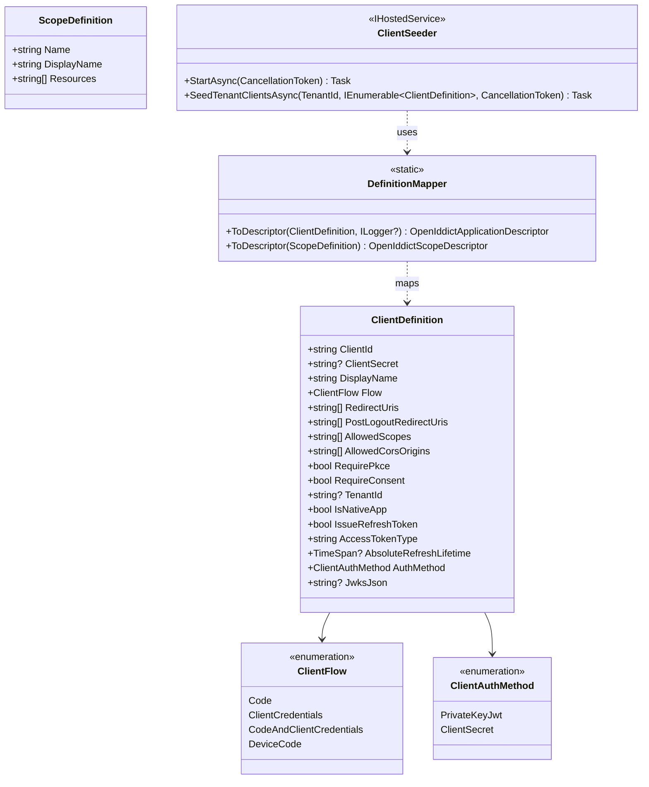
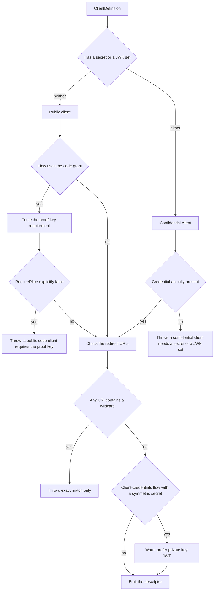
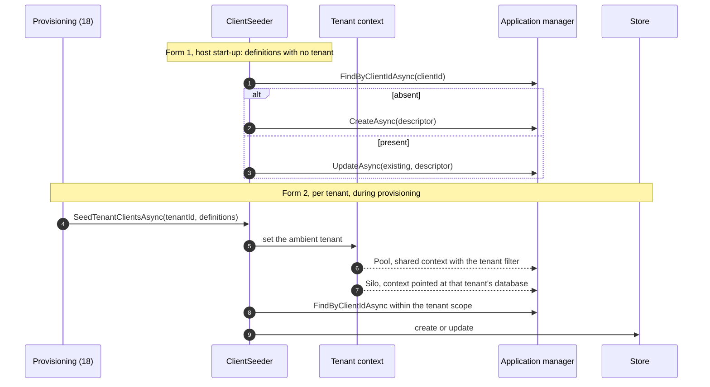

# Configuration and client declaration (detailed design)

> **Sits under:** [architecture: cross-cutting concepts](../architecture/11-cross-cutting-concepts.md)
> and [deployment and infrastructure](../architecture/10-deployment-infrastructure.md).
> **Implementer source of record:** this document, for the definition model, the mapper's
> translation table, and the seeder. ADR-0052 states in its own text that it records the
> decision and the fail-closed principle "not an exhaustive field list", so the field list
> is here. The **mechanisms** the definitions merely switch on belong elsewhere: the
> per-client token-type handler is ADR-0039 and [04](04-core-protocol.md), the CORS policy
> provider is ADR-0050 and [04](04-core-protocol.md), the startup self-check that
> re-verifies these invariants is ADR-0043 and [01](01-foundations.md).

Declaring a client on a deny-by-default engine means enumerating endpoints, grant types,
response types, every scope with the right prefix, and the proof-key requirement, by hand,
every time. That is roughly three to four times the surface of a concise declaration, and
the cost is not typing. It is that a verbose deny-by-default API is easy to misconfigure
into a client that **works and is insecure**: a public client with no proof key, a wildcard
redirect, a confidential client with no credential.

So the layer's job is not brevity. It is to make the insecure client **impossible to
construct** (ADR-0052), and to make the concise form the only form anyone writes.

## 1. Decisions realized

| Decision | What this design applies |
|---|---|
| ADR-0052 | The whole layer: the POCO model, the fail-closed mapper, the idempotent tenant-aware seeder, and the translation table |
| ADR-0043 | The same invariants re-checked at start-up, so a configuration that drifted after construction still cannot serve |
| ADR-0009 | `private_key_jwt` as the machine-to-machine default, with a symmetric secret as the warned fallback |
| ADR-0039 | `AccessTokenType` as a **built** per-client property, and what choosing `reference` costs the client's resource server |
| ADR-0050 | `AllowedCorsOrigins` as a definition field whose system of record is the application's property bag |
| ADR-0001 | Definitions carry a tenant, and seeding runs per tenant under that tenant's ambient context |
| ADR-0031 | Configuration precedence, and which values are per-deploy rather than per-release |
| ADR-0065 | The configuration-key shape, and the naming of the types this layer exposes |
| ADR-0044 | The definition model is public API, so adding a field is a versioned act |
| ADR-0021 | The permission and endpoint constants are a version-sensitive seam, re-verified per bump |

## 2. Purpose and scope

In scope: the `ClientDefinition` and `ScopeDefinition` field model, the enums, the mapper
and its complete flow-to-permission translation, the scope mapping rules, the fail-closed
invariants and exactly what each throws on, the idempotent seeder in both its forms, and
the configuration binding and precedence this layer relies on.

Out of scope, referenced not redefined: the **runtime** client-registration API, which is
[15](15-admin-api.md) and ADR-0035, and which reuses this mapper rather than duplicating
it; the token-type handler that acts on `AccessTokenType`, which is
[04](04-core-protocol.md); the CORS policy provider that acts on `AllowedCorsOrigins`,
which is [04](04-core-protocol.md); the start-up self-check, which is
[01](01-foundations.md); the package that ships these types, which is
[01](01-foundations.md); and the release gates that version them, which are
[21](21-cicd-and-deployment.md) under ADR-0044.

A note on provenance, because it affects how this document should be read: the design
corpus places this material in its **third** build phase, not its first. It appears here in
the foundations neighbourhood because this repository groups by concern rather than by the
corpus's phase order, so a reader should not infer a build sequence from the document
number.

## 3. Interfaces and contract



Defaults matter more than the shape, because a default is what a consumer gets when they do
not think about a field. `RequirePkce` defaults to **true** and a public code client is
forced to it regardless. `IssueRefreshToken` defaults to true and a machine-to-machine
client should set it false. `AccessTokenType` defaults to `jwt`. `AuthMethod` defaults to
**`PrivateKeyJwt`**, so the secure choice is the one you get by omission. `RequireConsent`
defaults to false. `IsNativeApp` defaults to false.

`ClientFlow` has **no password grant**. Resource-owner password credentials are deprecated
in the current OAuth best practice, and it is structurally incompatible with the rest of
this design: it cannot carry multi-factor or step-up (ADR-0013) and cannot carry a passkey
(ADR-0028). Omitting it from the enum means a consumer cannot request it, which is a
stronger guarantee than documenting that they should not.

## 4. Data and structure

This design owns no table. It writes into the engine's own application and scope stores,
and **where** a field lands is the part an implementer gets wrong.

| Definition field | Lands as | Why there |
|---|---|---|
| `ClientId`, `DisplayName` | descriptor properties | first-class on the descriptor |
| `ClientSecret` | a descriptor property, passed as **plaintext** and hashed by the manager | see section 5.6; it does **not** go to the secret store |
| `RedirectUris`, `PostLogoutRedirectUris` | descriptor URI collections | parsed to `Uri`, so a malformed value fails at mapping |
| `RequireConsent` | `ConsentType`, explicit or implicit | the engine models consent as a type, not a flag |
| derived from credentials | `ClientType`, public or confidential | **derived, never declared**: see section 5.1 |
| `IsNativeApp` | `ApplicationType`, native or web | the native value buys the built-in loopback relaxation, so no handler is written for it |
| `JwksJson` | **`descriptor.JsonWebKeySet`** | a first-class settable property, **not** the property bag; see section 5.5 |
| `Flow`, `AllowedScopes`, `RequirePkce` | `Permissions` and `Requirements` collections | the translation table, section 5.2 |
| `TenantId` | `Properties["tenant_id"]` | control metadata, not an engine concept |
| `AllowedCorsOrigins` | `Properties["cors_origins"]` | the system of record for ADR-0050; the policy provider reads a derived cache, never this, on a preflight |
| `AccessTokenType` | `Properties["access_token_type"]` | a built property, because the engine's own setting is global; see section 5.5 |
| `AbsoluteRefreshLifetime` | per-client policy read at issuance | bounded by the system ceiling in ADR-0004 |

Three of those land in the property bag rather than on the descriptor, and that is not a
workaround: the engine's descriptor models the protocol, and tenant, CORS, and token-type
are Nami's policy. The property bag is the engine's own extension point for exactly this.

## 5. Behaviour

### 5.1 The mapper is fail-closed by construction

Seven invariants, each of which either throws or forces a value. The first is not a check
at all but a derivation, and it is the one that makes the rest coherent.



1. **Public versus confidential is derived, not declared.** A client is confidential if it
   has a secret **or** a JWK set, and public otherwise. A consumer cannot mislabel a client
   because there is no label to set.
2. **A public code client is forced to the proof key**, and an explicit attempt to disable
   it throws rather than being quietly overridden. Silent correction would leave the
   declaration and the behaviour disagreeing, which is worse than a failure.
3. **A confidential client without a credential throws.** Neither a secret nor a JWK set is
   a configuration mistake with no safe interpretation.
4. **A wildcard redirect URI throws.** Exact match only.
5. **`openid` is skipped, never mapped to a permission.** This is worth stating precisely
   because an earlier draft mapped it to the profile permission, which is wrong twice over.
   Semantically, `openid` is the request marker for an OIDC flow, not a claim family. And
   structurally it cannot be mapped at all: the engine's permission constants for scopes
   are exactly five, address, email, phone, profile, and roles, with **no `openid` member**,
   while `openid` exists only in the separate scope-**name** constants. The engine handles
   the marker itself.
6. **A machine-to-machine client using a symmetric secret warns** rather than throws,
   because it is legal and sometimes unavoidable, but `private_key_jwt` is the default and
   the recommendation (ADR-0009).
7. **A native app sets the native application type**, which buys the framework's loopback
   relaxation. Writing a handler for loopback redirects instead would be reimplementing a
   native behaviour, the error class ADR-0021 calls out.

Invariants 2, 3, and 4 are also re-checked at start-up (ADR-0043). That is deliberate
duplication: the mapper stops a bad configuration being **built**, and the start-up check
stops a drifted one from **serving**, for instance after a direct database edit.

### 5.2 The flow-to-permission translation

Deny-by-default means nothing is granted unless enumerated. This table is that enumeration,
and it is the reason a consumer writes one enum value instead of nine lines.

| Flow | Endpoints | Grant types | Response types | Requirements |
|---|---|---|---|---|
| `Code` | authorization, end-session, token | authorization code, plus refresh when `IssueRefreshToken` | code | proof key, when public or requested |
| `ClientCredentials` | token | client credentials | none | none |
| `CodeAndClientCredentials` | the union of the two above | the union | code | as for `Code` |
| `DeviceCode` | token, device authorization | device code, plus refresh when `IssueRefreshToken` | **none** | none |

The device flow adds **no response type**, because it never travels through a browser
authorization response. Adding one is harmless-looking and wrong.

Scopes map in three ways: `openid` is skipped as above; the five standard scopes map to
their permission constants; anything else is a custom API scope and is prefixed with the
engine's scope prefix. Audience is not set on the client at all. It comes from the scope
side: a `ScopeDefinition`'s `Resources` become the access token's audience, which is why
audience is declared once per API rather than repeated on every client that calls it.

**These constants are a seam, not a stable vocabulary.** The end-session permission was
renamed from a logout name in an earlier engine version, and the descriptor and permission
families move across versions. The mapper is therefore a contract-regression item
(ADR-0021, registered in [22](22-openiddict-seam-catalogue.md)): a rename must fail the
build rather than silently mis-map a client into having no permissions.

### 5.3 Seeding, in two forms



Both forms are **find-or-upsert**, so re-running seeds nothing twice. The per-tenant form is
the one that matters for correctness: it runs inside the provisioning flow, once per tenant,
under that tenant's ambient context, because a client identifier is unique **per tenant**
and not globally (ADR-0001). Seeding globally and hoping the filter catches it inverts the
isolation model.

The Pool and Silo cases differ only in what the ambient context resolves to: a shared
context with the tenant filter applied, or a context pointed at that tenant's own database.
The seeder code is identical, which is the point of resolving tenancy below it.

Concurrency is not this design's to solve twice: seeding races between nodes are held by
the same single-run discipline as the other stateful work, clustered scheduling with an
advisory-lock barrier ([21](21-cicd-and-deployment.md), ADR-0031).

### 5.4 Where configuration comes from

Definitions can be bound from configuration for development and bootstrap, and managed
through the Admin API at runtime (ADR-0035, [15](15-admin-api.md)). Both paths go through
**the same mapper**, which is what stops the two surfaces drifting into different
validation.

Precedence, highest first: environment variables and mounted container secrets, then the
secret-store configuration source, then the environment-specific settings file, then the
base settings file (ADR-0031). Secrets come only from the first two. The secret-store
source is registered **after** the file sources, since the configuration system is
last-added-wins.

Required values are bound with validation on start, so a missing value crashes the host at
boot rather than surfacing on the first request that needs it.

### 5.5 Two places the engine's shape decides the design

**The JWK set is a first-class property.** Registering a `private_key_jwt` client assigns
the descriptor's own JSON-Web-Key-Set property; it does not go through the property bag.
This was once suspected to be a wrong-API case and the suspicion was refuted at source: the
descriptor declares a settable, nullable JSON-Web-Key-Set property directly.

**The per-client token type is not a native setting.** The engine has a reference-token
option, but it is a **single global flag**: the built-in handler assigns the token's
reference-ness and payload persistence straight from that one option. There is no per-client
form. So `AccessTokenType` is a built property enforced by a custom generation handler that
flips those two values per client, ordered before token generation and store persistence,
and pinned by the pipeline-order snapshot (ADR-0039, mechanism in
[04](04-core-protocol.md)).

The consequence belongs in the declaration's documentation, not buried in the handler:
**opting a client into reference tokens forces that client's resource server onto
introspection**, because an opaque token cannot be validated locally
([05](05-resource-server-validation.md)). The selection guide is therefore: JWT for
high-volume, first-party, backend-for-frontend, and machine-to-machine clients; reference
for admin, privileged, and high-assurance clients.

### 5.6 The client secret is the one credential that does not go to the secret store

Everywhere else in this repository a secret is resolved through the secret port (ADR-0009),
so the natural assumption here is wrong and worth stating as a rule. The engine's
application descriptor documents at its own `ClientSecret` property that the value **"may
be hashed or encrypted"** depending on the manager used to create it, and the default
manager hashes it on create. Three consequences follow, and only the first is obvious:

1. The secret is passed to the manager as **plaintext** and the manager stores the hash. It
   is **not** placed in the secret store, because the store would then hold a second copy of
   a credential whose only authoritative form is a hash the engine owns.
2. **Nothing may read a client secret back.** The stored form is manager-dependent **by
   contract**, so code that retrieves one is depending on an implementation detail that the
   engine reserves the right to change. Rotation is therefore *generate a new one and show
   it once*, never *retrieve the old one* (ADR-0035).
3. Where a secret is generated for a tenant admin, the plaintext is shown **exactly once**
   and never stored or logged ([15](15-admin-api.md), ADR-0035).

The distinction that makes this coherent: an **external identity provider's** secret does go
to the secret store (ADR-0009, [09](09-federation-and-claims-profile.md)), because there
Nami is the client and must present the secret. Here Nami is the server and only **verifies**
it. The two look alike and must not be conflated.

The same descriptor also records that shared-secret client authentication **is not
recommended** and exists mainly for legacy clients. That is the source-level reason behind
`AuthMethod` defaulting to `PrivateKeyJwt` in section 3, rather than a house preference.

## 6. Dependencies and wiring

```csharp
// Definitions bound from configuration, for development and bootstrap.
services.AddOptions<List<ClientDefinition>>().BindConfiguration("Nami:Clients")
        .ValidateDataAnnotations().ValidateOnStart();
services.AddOptions<List<ScopeDefinition>>().BindConfiguration("Nami:Scopes")
        .ValidateDataAnnotations().ValidateOnStart();

// The seeder runs at host start for untenanted definitions, and is called
// per tenant by the provisioning flow for the rest.
services.AddHostedService<ClientSeeder>();
services.AddScoped<ITenantClientSeeder, ClientSeeder>();
```

### Configuration keys

Following `Nami:Section:Key` with the `Nami__Section__Key` environment form (ADR-0065):

| Key | Purpose |
|---|---|
| `Nami:Clients` | The bound list of client definitions, for development and bootstrap |
| `Nami:Scopes` | The bound list of scope definitions |
| `Nami:Seeding:Enabled` | Whether the start-up seeder runs at all |

Per-client values are **not** configuration keys. They are fields on the definition, which
is the whole point: a client's policy travels with the client rather than being scattered
across a settings file where nothing ties it back.

### Key libraries and licenses

| Library | Purpose | License |
|---|---|---|
| `OpenIddict.Abstractions` | The application and scope descriptors, the permission and requirement constants | Apache-2.0 |
| `OpenIddict.Core` | The application and scope managers the seeder calls | Apache-2.0 |
| `Microsoft.IdentityModel.Tokens` | Parsing a JWK set for the `private_key_jwt` path | MIT |
| `Microsoft.Extensions.Options` | Binding, data-annotation validation, and validate-on-start | MIT |

No dependency is added for this layer. That is worth stating: no community facade exists
for this engine, which is why the layer is built rather than adopted (ADR-0052).

> **Patterns applied** (ADR-0066). **Mapper** for the definition-to-descriptor translation,
> which is the whole design and is fail-closed by construction rather than by convention.
> **Facade** in the weak sense for the definition model, hiding a deny-by-default permission
> vocabulary behind one enum. And a deliberate **absence**: there is no builder, no
> validator chain, and no strategy per flow, because a `switch` over four flows is
> readable and the pragmatic-use rule in ADR-0066 says not to dress that up.

## 7. Error handling, edge cases, invariants

* **The mapper throws rather than repairs.** A silently corrected declaration means the
  file and the behaviour disagree, and the reader believes the file.
* **Public versus confidential is derived from the credential**, never declared, so it
  cannot be mislabelled.
* **`openid` is never mapped to a permission**, and there is no permission constant for it
  to map to.
* **Exact-match redirect URIs only**, and a malformed URI fails at mapping because the value
  is parsed rather than stored as a string.
* **Seeding is idempotent and tenant-scoped.** A client identifier is unique per tenant, so
  a global seed with a filter applied afterwards is the wrong shape.
* **The device flow declares no response type.**
* **A field added to a definition is a public-API change** (ADR-0044): additive with a
  default is a minor version, and changing an existing default is a behaviour break even
  though the shape is unchanged.
* **The permission constants are version-sensitive.** A bump that renames one must fail the
  contract-regression suite, because the failure mode otherwise is a client seeded with
  fewer permissions than declared, which looks like a permissions bug for weeks.

## 8. Security and multi-tenancy notes

The security argument for this layer is entirely about the **default**. Every field whose
wrong value would weaken a client defaults to the safe value: the proof key on, the
authentication method asymmetric, consent explicit where it is requested, and the token type
the one that does not require an opaque-token infrastructure. A consumer who never reads
this document still gets a safe client, and a consumer who tries to build an unsafe one gets
an exception with the reason in it.

Multi-tenancy enters through the seeder rather than the model: a definition names a tenant,
and seeding happens under that tenant's ambient context so the isolation controls hold
(ADR-0001). The failure this prevents is subtle, because seeding under the wrong ambient
context does not error. It writes a perfectly valid client into the wrong tenant.

Secrets are never part of a definition that lives in a settings file. A secret arrives from
the environment or the secret store (ADR-0009, ADR-0031), and the declarative import path
carries no secrets at all (ADR-0027).

## 9. Testing

* **Fail-closed unit tests, one per invariant**: a public code client with the proof key
  disabled throws; a confidential client with neither credential throws; a wildcard redirect
  throws; a machine-to-machine client with a symmetric secret warns and still maps.
* **Translation tests, one per flow**: each flow produces exactly the expected endpoint,
  grant-type, and response-type permission set, and nothing more. The device flow's empty
  response-type set is asserted explicitly rather than by omission.
* **Scope mapping**: `openid` produces no permission; the five standard scopes produce their
  constants; a custom scope is prefixed.
* **Idempotence**: seeding twice produces one client and no duplicate-key error.
* **Tenant scoping**: two tenants seeding the same client identifier produce two clients,
  each visible only in its own tenant, and neither leaks under the other's context.
* **Constant pinning** (contract regression, [22](22-openiddict-seam-catalogue.md)): the
  permission and requirement constant names are asserted, so an engine rename fails the
  build.
* **Configuration binding**: a missing required value fails at start-up rather than on first
  use; no settings file contains a secret-shaped value.

## 10. Open and build-time items

* **The declarative import format**, JSON or YAML, is a build-time pick (ADR-0027 records it
  as a remaining sub-detail, not an open decision).
* **The final bound configuration-section names** for definitions are settled with the first
  code at M1; the shape is fixed by ADR-0065 but the section names are not yet in code.
* **The Admin API reuses this mapper** rather than reimplementing validation
  ([15](15-admin-api.md), ADR-0035). That is an obligation on the admin design, recorded
  here so it cannot be met by accident.

## 11. Sources

* **ADRs:** 0052 (the owning decision, which explicitly defers the field list here), 0043
  (the start-up re-check), 0009 (`private_key_jwt`), 0039 (the per-client token type and its
  consequences), 0050 (per-client CORS and the property-bag system of record), 0001
  (tenant-aware seeding), 0031 (configuration precedence), 0065 (key shape and naming), 0044
  (the model as public API), 0021 (the constant seam), 0035 (the runtime counterpart), 0004
  (the lifetime ceiling a per-client value is bounded by), 0013 and 0028 (why the password
  grant is absent).
* **Architecture:** [cross-cutting concepts](../architecture/11-cross-cutting-concepts.md),
  [deployment and infrastructure](../architecture/10-deployment-infrastructure.md).
* **Design:** [01](01-foundations.md) (the composition root and the start-up self-check),
  [04](04-core-protocol.md) (the token-type handler and the CORS provider),
  [05](05-resource-server-validation.md) (what a reference token costs the resource server),
  [15](15-admin-api.md) (the runtime path through the same mapper),
  [18](18-tenant-lifecycle.md) (the provisioning flow that calls the per-tenant seeder),
  [22](22-openiddict-seam-catalogue.md) (the constants as a registered seam),
  [21](21-cicd-and-deployment.md) (the release gates and the single-run job discipline).
* **External verification, 2026-07-27.** The permission and requirement constants were read
  against the engine's upstream source at the pinned version, checked into the design
  corpus. Three findings shaped this document rather than merely confirming it: the
  scope-permission family has exactly five members and **no `openid`**, which is why the
  `openid` case is skipped rather than mapped; the application descriptor declares a
  settable JSON-Web-Key-Set property directly, so the `private_key_jwt` path needs no
  property-bag workaround; and the built-in token generator assigns reference-ness from a
  single global option, which is why the per-client token type must be built.
* Reconciled against the design corpus's configuration-DX document on 2026-07-27, through
  the corpus's five-part bundle. Divergences are stated where they occur: the corpus frames
  the whole document as parity with a commercial product's client model and that framing is
  not carried over, only the substance; the corpus places this material in its third build
  phase, which this document notes rather than adopts; and two placeholder identifiers left
  unreplaced in the corpus are not imported.

[Prev: Engine seam catalogue](22-openiddict-seam-catalogue.md) · [Index](README.md)
