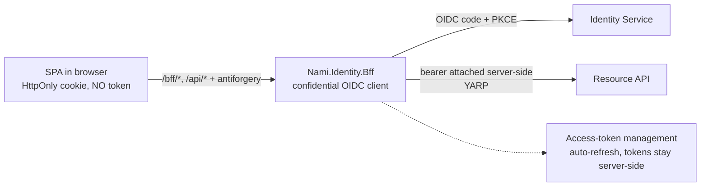

# Backend-for-frontend package (detailed design)

Sits under the [container view](../architecture/07-container-view.md), which places the
BFF **outside** Nami's system boundary, and the
[security architecture](../architecture/13-security-architecture.md).

## 1. Decisions realized

| Decision | What this design applies |
|---|---|
| ADR-0029 | `Nami.Identity.Bff` composed from permissive pieces; token never reaches the browser; two anti-forgery profiles; allow-listed proxy; the `.Bff` / `.Bff.Yarp` split |
| ADR-0024 | The declared composition-boundary exception: the proxy edge gets no port of ours |
| ADR-0027 | Packaging and the `AddNamiBff()` builder surface |
| ADR-0019 | The back-channel logout receiver, and `sid` as the correlation value |
| ADR-0026 | Every composed piece is permissive, with exact package identifiers for the licence gate |
| ADR-0003 (ref) | The **OP's** session, which this package consumes a `sid` from and does **not** share a store with (section 4) |
| ADR-0004 (ref) | The family-revoke and reuse detection that make a silent renew fail (section 5.4) |
| ADR-0009 (ref) | `private_key_jwt` where the infrastructure supports it |
| ADR-0021 (ref) | The contract-regression habit applied to a YARP or token-management bump |

## 2. Purpose and scope

`Nami.Identity.Bff` is a **backend-for-frontend**: a confidential OIDC **relying party**
that holds tokens server-side and hands the browser only an `HttpOnly` cookie. It exists
because a SPA holding tokens in JavaScript is XSS-readable, and a non-extractable key does
not fix that: an XSS payload can call `subtle.sign()` and use the key as a **signing
oracle**, so the key stops being exfiltratable without stopping being usable.

This is the one **adopter-facing** package in the repository whose security properties are
load-bearing for someone else's application, which is why it gets a design of its own
rather than living inside the Admin App's.

**In scope:** browser SPA and mobile-web, meaning any client running in a browser context
and therefore having cookies.

**Out of scope, deliberately, and not a gap:** **native mobile does not use the BFF.** A
native app is a public client going directly to the IdP with PKCE and DPoP
sender-constrained tokens ([06](06-sender-constrained-tokens.md)). This is a declared
parity boundary, stated so that its absence is not read as an omission.

**Owned elsewhere, referenced not redefined.** Everything on the **OP** side belongs to
other designs: session store and `sid` semantics to [11](11-login-consent-ui.md) and
[08](08-user-management.md); minting the `logout_token` and fanning it out to
[11](11-login-consent-ui.md); token issuance to [04](04-core-protocol.md). The Admin App's
own composition is [16](16-admin-app.md), which **consumes** this package rather than
defining it. This design carries the **RP-side** contract.

## 3. Interfaces and contract

### 3.1 Management endpoints

| Endpoint | Contract | Guard |
|---|---|---|
| `GET /bff/login` | OIDC challenge (authorization code + PKCE). `returnUrl` **allow-listed** | open-redirect guard, as [11](11-login-consent-ui.md) applies it on the OP side |
| `GET /bff/logout` | local sign-out, IdP end-session, drop the RP session | **requires a session-bound `sid` query parameter** (section 5.3) |
| `GET /bff/user` | the current session's claims as JSON, for the SPA to render its UI. **Never a token, in any field** | authenticated; `401` when the session is not renewable (section 5.4) |
| `/api/*` | YARP proxy to an **allow-listed** backend, bearer attached server-side | anti-forgery profile A (section 5.2); `401` per section 5.4 |
| back-channel logout receiver | accepts a `logout_token` from the IdP and ends the matching RP session | validates `iss`, `aud`, `sid` and the `events` member with a `jti` replay guard (ADR-0019) |

**Invariant on `GET /bff/user`: the claims projection is filtered by an allow-list, never
by a deny-list.** A deny-list on a claims projection leaks the next claim somebody adds,
and it does so silently, because nothing fails when a new claim appears.

### 3.2 Public builder surface

```csharp
services.AddNamiBff(o => { /* cookie, OIDC, RP ticket store, antiforgery, token mgmt */ })
        .AddRemoteApis(/* Nami.Identity.Bff.Yarp: routes, clusters, transforms */);
```

`AddNamiBff()` is the correct form; ADR-0029 records that the source corpus's
`AddNami.IdentityBff()` was an artifact of substituting a product-name placeholder, not a
naming choice. The split into `Nami.Identity.Bff` (core) and `Nami.Identity.Bff.Yarp`
(remote proxy, ADR-0065) keeps a consumer who does not proxy from taking a YARP dependency.

## 4. Data and structure

**The BFF owns no relational schema.** It holds exactly one piece of state, and getting
its ownership right is the whole of this section:

| State | Where it lives | Lifetime |
|---|---|---|
| RP session ticket, containing the user's access and refresh tokens | the BFF's **own** ticket store, backing chosen by the consumer (distributed cache or their database) | sliding `CookieLifetime` plus `AbsoluteSessionLifetime`, both consumer options |
| `sid` from the `id_token` | inside that ticket, as a **correlation value** | as the ticket |

### The RP session is not the ADR-0003 store

This is the correction that prompted this design. Several documents in this repository
described the BFF cookie as sitting "over the server-side session store (ADR-0003)". It
cannot, for four independent reasons, and any one of them is sufficient:

1. **That store is the OP's.** ADR-0003 defines `ServerSideSessions` as global, keyed by
   `sid`, hard-capped at **8 hours absolute** with a 1-hour sliding inactivity window, and
   living inside the IdP's own database.
2. **The BFF is outside the system boundary.** The
   [container view](../architecture/07-container-view.md) already states that the
   consumer-side BFF is the consumer's deployment and not Nami's. A third party
   self-hosting `Nami.Identity.Bff` has no access to that database, so a package whose
   session required it would not run for the audience it is built for.
3. **The lifetimes contradict.** This package gives the consumer a tunable cookie lifetime;
   ADR-0003 fixes 8 hours absolute. Two lifetime models cannot share one store, and any
   specific pair of numbers a deployment uses is a **deployment choice, never a package
   default** (section 10).
4. **An RP has no `sid` of its own to key on.** `sid` is minted by the OP. The BFF
   *consumes* it to correlate an incoming `logout_token` to one of its own sessions, which
   is a lookup, not ownership.

The cheapest confirmation is that this repository already contradicted itself: a component
whose session **is** a row in the OP's store would have nothing left to end when a
back-channel `logout_token` arrived. The existence of the receiver in section 3.1 is proof
that the two sessions are distinct objects, and it was described alongside the shared-store
claim for weeks without the pair being read together.

## 5. Behaviour



### 5.1 Token handling

The user's access and refresh tokens live **server-side inside the auth session** and are
never serialised to the browser. `AddOpenIdConnectAccessTokenManagement()` plus
`AddUserAccessTokenHttpClient(...)` hold and refresh them; a YARP transform attaches the
token to the proxied request. They are revoked at logout.

ADR-0040 rule A1 applies here and is easy to miss: the token-management package registers
its own retry-only pipeline on its own named clients, so the standard resilience handler
must **not** be layered on top of them.

### 5.2 Anti-forgery: two profiles, and why two is not redundancy

| Profile | Applies to | Control |
|---|---|---|
| **A. JS / SPA** | `/api/*` proxy routes reached by `fetch` or XHR | a **required static custom header** (`X-CSRF: 1`), **plus a strict CORS allow-list**, **plus rejecting CORS-simple content types on mutating routes** |
| **B. Server-rendered form POST** | the Admin App's `<form method="post">` ([16](16-admin-app.md)) | the ASP.NET antiforgery token (`[ValidateAntiForgeryToken]`) |

Both are required, and each fails exactly where the other works:

* **Header-only is bypassable.** `application/x-www-form-urlencoded`, `multipart/form-data`
  and `text/plain` are CORS-**simple** content types and trigger **no preflight**, so a
  cross-site form POST reaches the endpoint without the browser ever asking permission.
  Checking only that a header is *present* is therefore defeated by a plain cross-site
  form, which is why the content-type rejection and strict CORS sit alongside it rather
  than as extras.
* **Header-only also breaks the admin.** An HTML form cannot set a custom header; only JS
  can. Forcing profile A onto server-rendered routes breaks **every** admin form POST.

ADR-0029 sections A and B already record both profiles. This design is where the *reason*
for two lives, because a future reader who sees the redundancy and removes one will remove
whichever one their own routes do not use.

### 5.3 Logout is state-changing, so it is CSRF-guarded

`GET /bff/logout` **requires a session-bound, unguessable `sid` query parameter** matching
the current session; the server validates it against the session and rejects a missing or
mismatched value. Without this, `` on any page logs the
user out: cheap denial of service against a session, and during an incident a way to
disrupt a responder. `POST` plus an antiforgery token is the acceptable variant
(section 10).

### 5.4 Silent-renew failure contract

A refresh **will** fail: the 8-hour absolute ceiling, an operator revoking the refresh
token, or reuse-detection family-revoke (ADR-0004, native in the engine and default-on).
When it does, the BFF does **not** proxy with the old token:

1. `GET /bff/user` and every proxied `/api/*` answer **`401`**. The session is spent.
2. The SPA treats `401` as "do a **top-level redirect** to `/bff/login`", **not** a
   background `fetch` or XHR. The OIDC challenge must run as a full-page navigation, or the
   IdP cannot present a login UI and the redirect dies inside a hidden request.
3. After the redirect, if the IdP session is still alive the user is re-logged-in silently;
   if not, they authenticate again.

This contract is written down because the failure is otherwise silent: proxying with an
expired token produces backend 401s that read as a backend fault, so the symptom points
away from the cause.

## 6. Dependencies and wiring

| Package | Role | Licence | Read at | Date |
|---|---|---|---|---|
| `Yarp.ReverseProxy` | the `/api/*` remote proxy (`.Bff.Yarp` only) | MIT | `<license type="expression">MIT</license>` in the 2.3.0 `.nuspec` | 2026-08-01 |
| `Duende.AccessTokenManagement.OpenIdConnect` | server-side user tokens and silent renew | Apache-2.0 | [dependency licence record](../DEPENDENCY-LICENSES.md), ADR-0026 sections D and E | 2026-07-25 |
| ASP.NET Core cookie, OIDC and antiforgery | session, challenge, profile B | MIT | in-box with the runtime | |

The version read above is the one available to verify at authoring time, **not** a pin:
versions are ADR-0061's to record and land with the code at M1.

**Declared exception to ADR-0024, and the two reasons it requires.** The YARP plus
token-management boundary gets no port or adapter of ours, because (1) it is a
**composition** boundary whose replaceable seam **is** the route, cluster and transform
configuration, and (2) an abstraction of ours over YARP would add indirection without
adding real substitutability, since changing proxy means changing the composition rather
than swapping an adapter behind a port. ADR-0024 records this as an acknowledged exception.

The BFF is a **confidential** client of the IdP: `private_key_jwt` where the infrastructure
supports it (ADR-0009), a client secret otherwise.

## 7. Error handling, edge cases, invariants

* **No token reaches the browser**, in any response body, header, or cookie value.
* **Anti-forgery is mandatory on every mutation**, under whichever profile the route
  belongs to.
* **`returnUrl` and every redirect target are allow-listed.**
* **The proxy forwards only to allow-listed backends.** The SPA never names a backend.
  This is the SSRF guard, and it is the difference between a BFF and an open proxy.
* **`/bff/logout` without a valid session-bound `sid` is rejected.**
* **A failed renew produces `401`**, never a proxied call carrying a stale token.
* **The RP session store is the BFF's own** (section 4). A build that points it at the
  IdP's database has misread the boundary.
* **`Nami.Identity.Bff` and `.Bff.Yarp` must not depend on `Nami.Identity.Admin.*`.** The
  package is neutral between the admin console and a consumer SPA, and the dependency
  would quietly make every adopter take the admin assemblies.

## 8. Security and multi-tenancy notes

The BFF sits **outside** the trust boundary: it is a client, and it earns no more trust
than any other confidential client. It holds no signing key and no tenant data.

**It is not a tenant-aware component.** It is one RP against one tenant's IdP
configuration, so multi-tenancy is expressed by **deploying one BFF per tenant-facing
app**, not by resolving a tenant inside it. A reader arriving from
[02](02-data.md) should not look for a `TenantId` here.

The package exists to mitigate **token theft via XSS**. Its own additions to the attack
surface are the three guards above, CSRF on mutation, logout-CSRF, and proxy
allow-listing, each of which is a way the BFF could otherwise be turned against the
application it protects.

## 9. Testing

Listed in [20](20-testing.md) section 5.7 against this document. The obligations:

* **No token in the browser:** no response contains an `access_token`, asserted end to end
  with a real browser.
* **Anti-forgery profile A:** a cross-site `fetch` without `X-CSRF` is blocked, **and** a
  cross-site **simple-content-type** POST (`form-urlencoded` or `text/plain`) is rejected.
  The second is the bypass a presence-only check would have allowed, so a suite with only
  the first would pass against the vulnerable implementation.
* **Anti-forgery profile B:** a server-rendered admin form POST **with** an antiforgery
  token passes, proving profile A was not forced onto it.
* **Logout CSRF:** `GET /bff/logout` **without** `sid` is rejected; with the correct `sid`
  it logs out.
* **Proxy allow-list:** a request naming a backend that is not allow-listed is refused.
* **Silent renew:** the happy path renews; and past the absolute ceiling both `GET
  /bff/user` and `/api/*` return **`401`** (the section 5.4 contract).
* **Back-channel logout:** a valid `logout_token` ends the matching session, correlated by
  `sid`, and a replayed `jti` is rejected.
* **Architecture test:** no dependency from `.Bff` or `.Bff.Yarp` onto
  `Nami.Identity.Admin.*`.

**Not spiked.** No spike in the design corpus covers this package; the DPoP, issuer and
federation spikes do not touch it. Its regression basis is the list above and nothing
inherited, which is stated here so the absence is not mistaken for coverage elsewhere.

## 10. Open and build-time items

* **Security ratify:** the default cookie lifetimes the package ships, given that they are
  longer than the OP's own 8-hour absolute session. That is legitimate, because the two
  sessions are separate objects (section 4), but shipping a default is a policy choice and
  is therefore a ratification, not an implementation detail.
* **Security ratify:** whether `POST` plus an antiforgery token should replace the `sid`
  query parameter as the shipped default on `/bff/logout` (section 5.3).
* **Ops ratify:** the RP ticket-store backing the reference sample recommends, distributed
  cache versus database, since it decides whether a BFF restart drops every session.
* **Build-time:** contract regression on a YARP or token-management bump, the ADR-0021
  habit carried by ADR-0029.
* **Build-time:** the package split is finalized at M1 (ADR-0029 and ADR-0027), and the
  Admin App is refactored onto this package so there is one BFF with two consumers.

These are consolidated in the
[pre-GA ratification checklist](../PRE-GA-RATIFICATION-CHECKLIST.md).

## 11. Sources

* ADR-0029 (the decision and its component table), ADR-0024 (the declared composition
  boundary), ADR-0027 and ADR-0065 (packaging and the assembly names), ADR-0019 (the
  back-channel receiver), ADR-0026 (why every piece is permissive), ADR-0003 (the OP
  session this is **not**), ADR-0004 (the family-revoke behind a failed renew), ADR-0009
  (`private_key_jwt`), ADR-0040 (rule A1).
* [Container view](../architecture/07-container-view.md) for the boundary placement;
  [16](16-admin-app.md) for the first consumer.
* `Yarp.ReverseProxy` 2.3.0 `.nuspec`, read locally 2026-08-01.
* Authored 2026-08-01 from the **design corpus's** BFF design and its consolidated module
  contract, which were written to close that corpus's own finding that its
  security-load-bearing adopter-facing package had no module contract at all. The same gap
  existed here. The corpus's document and task numbers are its own and are deliberately not
  carried across (see [the ADR index](../adr/README.md)). The commercial BFF product this
  package replaces stays generalized; YARP, the ASP.NET components and the access-token
  management packages are named by their real identifiers per ADR-0026 section E.
